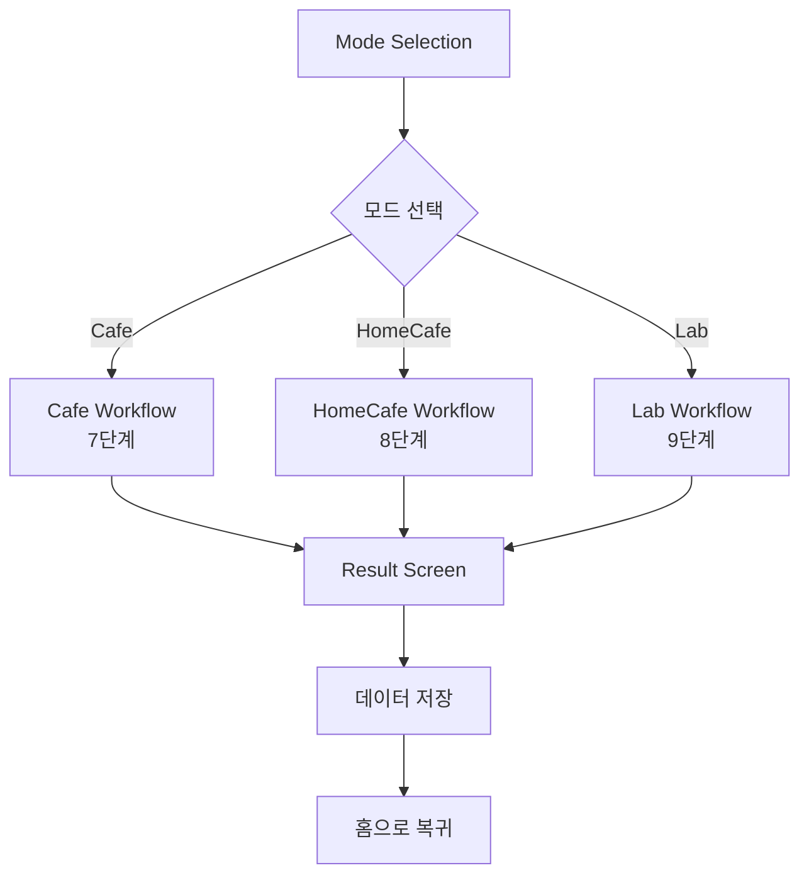

# TastingFlow Workflows - 모드별 워크플로우 문서

> 3가지 테이스팅 모드(Cafe/HomeCafe/Lab)의 단계별 워크플로우 명세

## 🔄 워크플로우 시스템 개요

**TastingFlow Workflows**는 사용자의 경험 수준과 상황에 맞는 **3-Tier 적응형 시스템**으로, 각 모드마다 최적화된 단계별 워크플로우를 제공합니다.

## 📂 모드별 워크플로우 문서

### ☕ **Cafe Mode** - 간편 테이스팅
- [`CAFE_MODE_WORKFLOW.md`](CAFE_MODE_WORKFLOW.md)
- **대상**: 카페 방문자, 커피 입문자
- **소요시간**: 3-5분
- **단계수**: 7단계
- **특징**: 필수 정보만 수집, 복잡한 설정 제외

### 🏠 **HomeCafe Mode** - 레시피 실험
- [`HOMECAFE_MODE_WORKFLOW.md`](HOMECAFE_MODE_WORKFLOW.md)  
- **대상**: 홈카페 애호가, 커피 추출 실험자
- **소요시간**: 5-8분
- **단계수**: 8단계
- **특징**: 다이얼 제어, 비율 프리셋, 개인화된 레시피 시스템

### 🔬 **Lab Mode** - 전문가 분석
- [`LAB_MODE_WORKFLOW.md`](LAB_MODE_WORKFLOW.md)
- **대상**: 커피 전문가, 바리스타, 큐핑 참가자
- **소요시간**: 8-12분
- **단계수**: 9단계
- **특징**: SCA 표준 준수, 정량적 평가, 과학적 데이터 수집

## 📊 모드별 비교 분석

| 특성 | Cafe Mode | HomeCafe Mode | Lab Mode |
|------|-----------|---------------|----------|
| **타겟 사용자** | 입문자 | 홈카페족 | 전문가 |
| **주요 목적** | 간편 기록 | 레시피 실험 | 전문 분석 |
| **소요시간** | 3-5분 | 5-8분 | 8-12분 |
| **화면 수** | 7단계 | 8단계 | 9단계 |
| **특화 기능** | 빠른 완료 | 다이얼 제어 | 과학적 측정 |
| **데이터 정밀도** | 기본 | 상세 | 전문가급 |
| **건너뛰는 화면** | 3개 | 2개 | 0개 |

## 🎯 각 워크플로우의 핵심 특징

### ☕ Cafe Mode 특징
```typescript
// 건너뛰는 화면들
const skippedScreens = [
  'HomeCafeScreen',      // 추출 레시피 불필요
  'ExperimentalData',    // 과학적 측정 불가
  'SensorySlider'        // 직관적 표현 우선
];

// 최적화 포인트
- 자동완성: 카페명, 커피명
- 기본값: Hot 온도 기본 선택
- 원터치: 자주 사용하는 향미/표현 상단 배치
```

### 🏠 HomeCafe Mode 특징
```typescript
// 핵심 혁신 기능
const innovations = {
  dialControl: '±1g 정밀 원두량 조정',
  ratioPresets: '1:15~1:18 7개 버튼',
  realTimeCalc: '비율 유지하며 물량 자동 계산',
  personalRecipe: '"나의 커피" 저장/재사용 시스템'
};

// 5-Field 간소화
const fields = [
  'dripper',    // 드리퍼 선택
  'recipe',     // 다이얼 + 비율
  'timer',      // 추출 시간
  'notes',      // 실험 노트
  'result'      // 레시피 성공도
];
```

### 🔬 Lab Mode 특징
```typescript
// SCA 표준 준수
const scaStandards = {
  sensoryScores: '6개 항목 6.0-10.0점',
  totalScore: '최대 100점 (Overall 포함)',
  tdsCalculation: 'TDS 측정 + 자동 수율 계산',
  cuppingProtocol: '전문 큐핑 프로토콜 준수'
};

// 전문가 도구
const professionalTools = [
  'RadarChart',         // 6개 항목 시각화
  'ExtractionChart',    // TDS vs 수율 분석
  'CalibrationScore',   // 전문가 대비 정확도
  'CuppingForm'         // 표준 큐핑 폼 출력
];
```

## 🔄 워크플로우 흐름도

### 전체 시스템 플로우


### 조건부 화면 표시 로직
```typescript
const getWorkflowScreens = (mode: TastingMode): string[] => {
  const baseScreens = [
    'ModeSelection',
    'CoffeeInfo'
  ];
  
  const modeSpecificScreens = {
    cafe: [
      'UnifiedFlavor',
      'SensoryExpression',
      'PersonalComment',
      'RoasterNotes',
      'Result'
    ],
    homecafe: [
      'HomeCafe',
      'UnifiedFlavor', 
      'SensoryExpression',
      'PersonalComment',
      'RoasterNotes',
      'Result'
    ],
    lab: [
      'ExperimentalData',
      'HomeCafe',        // 조건부
      'UnifiedFlavor',
      'SensorySlider',
      'SensoryExpression',
      'PersonalComment',
      'RoasterNotes',
      'Result'
    ]
  };
  
  return [...baseScreens, ...modeSpecificScreens[mode]];
};
```

## 📱 진행률 계산 시스템

### 모드별 진행률 계산
```typescript
const calculateProgress = (currentScreen: string, mode: TastingMode): number => {
  const screenCounts = {
    cafe: 7,
    homecafe: 8,
    lab: 9
  };
  
  const workflows = getWorkflowScreens(mode);
  const currentIndex = workflows.indexOf(currentScreen);
  
  return Math.round(((currentIndex + 1) / workflows.length) * 100);
};

// 예시 결과
// Cafe Mode - UnifiedFlavor: 43% (3/7)
// HomeCafe Mode - HomeCafe: 37.5% (3/8)
// Lab Mode - SensorySlider: 60% (6/10)
```

## 🎨 UI/UX 일관성 유지

### 공통 디자인 패턴
```typescript
// 모든 워크플로우에서 공통 사용
const CommonComponents = {
  ProgressBar: '상단 진행률 표시',
  NavigationButtons: '하단 이전/다음 버튼',
  ModeIndicator: '현재 모드 배지',
  StepCounter: '현재 단계 표시',
  SaveIndicator: '자동 저장 상태'
};

// 모드별 색상 시스템
const ModeColors = {
  cafe: '$cupBlue',      // 메인 브랜드 컬러
  homecafe: '$green8',   // 홈카페 친근함
  lab: '$purple8'        // 전문성 강조
};
```

### 적응형 UI 요소
- **단계 표시**: 모드별 총 단계 수에 맞춰 조정
- **필수 표시**: 모드별 필수/선택 필드 차별 표시  
- **도움말**: 모드별 맞춤 가이드 및 팁
- **완료 메시지**: 모드별 성취감 차별화

## 🧪 테스트 전략

### 모드별 테스트 시나리오
각 워크플로우 문서에는 다음 테스트 시나리오가 포함됩니다:

#### 1. **기본 시나리오** - 완전 입력
- 모든 단계를 거쳐 정상 완료하는 케이스
- 각 모드의 특화 기능을 모두 활용

#### 2. **최소 입력 시나리오** - 필수만 입력  
- 필수 정보만으로 최단 시간 완료
- 생략 가능한 단계들 건너뛰기

#### 3. **에러 케이스** - 예외 상황
- 필수 정보 누락시 처리
- 네트워크 오류 대응
- 중간 이탈시 데이터 보존

### 통합 테스트
```typescript
// 3가지 모드 모두 테스트하는 통합 시나리오
const fullWorkflowTest = async () => {
  for (const mode of ['cafe', 'homecafe', 'lab']) {
    await testWorkflow(mode, 'complete');
    await testWorkflow(mode, 'minimal');  
    await testWorkflow(mode, 'error');
  }
};
```

## 🚀 확장 계획

### Phase 2 개선사항
각 워크플로우는 다음과 같은 확장 계획을 가집니다:

#### 공통 개선
- **AI 가이드**: 실시간 입력 도움말
- **음성 입력**: 핸즈프리 테이스팅 기록
- **협업 기능**: 다중 사용자 동시 테이스팅

#### 모드별 특화 개선
- **Cafe**: 위치 기반 카페 추천
- **HomeCafe**: IoT 기기 연동 (스마트 스케일, 온도계)
- **Lab**: 전문가 네트워크 연결, 인증 시스템

### Phase 3 고급 기능
- **적응형 AI**: 사용자 패턴 학습으로 워크플로우 최적화
- **VR/AR**: 가상 큐핑 환경 제공
- **블록체인**: 커피 원산지 추적 및 인증

---

## 🔗 관련 문서

- **개별 화면**: [`../screens/`](../screens/) - 각 화면의 상세 기술 명세
- **상위 가이드**: [`../README.md`](../README.md) - TastingFlow 전체 시스템 개요

---

**문서 버전**: 1.0  
**최종 수정**: 2025-07-28  
**워크플로우 개수**: 3개 (Cafe/HomeCafe/Lab)  
**구현 상태**: ✅ 문서화 완료