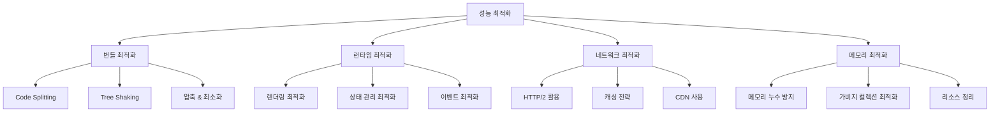

# ⚡ CupNote 성능 최적화 가이드

CupNote 애플리케이션의 성능 최적화 전략과 모니터링 방법에 대한 종합 가이드입니다.

## 📋 목차

1. [성능 최적화 개요](#성능-최적화-개요)
2. [번들 크기 최적화](#번들-크기-최적화)
3. [런타임 성능 최적화](#런타임-성능-최적화)
4. [네트워크 최적화](#네트워크-최적화)
5. [메모리 관리](#메모리-관리)
6. [성능 모니터링](#성능-모니터링)
7. [성능 측정 도구](#성능-측정-도구)

## 🎯 성능 최적화 개요

### 성능 목표

**Core Web Vitals 기준**:
- **LCP** (Largest Contentful Paint): < 2.5초
- **FID** (First Input Delay): < 100ms
- **CLS** (Cumulative Layout Shift): < 0.1

**CupNote 특화 지표**:
- **테이스팅 플로우 전환**: < 200ms
- **차트 렌더링**: < 500ms
- **데이터 로딩**: < 1초
- **오프라인 지원**: 캐시된 데이터 즉시 표시

### 최적화 전략



## 📦 번들 크기 최적화

### 1. Code Splitting 전략

**라우트 기반 분할**:
```typescript
// router/index.ts
const routes = [
  {
    path: '/',
    component: () => import('../views/HomeView.vue'), // 지연 로딩
    meta: { preload: true } // 중요한 라우트는 프리로드
  },
  {
    path: '/tasting-flow',
    component: () => import('../views/tasting-flow/ModeSelectionView.vue')
  },
  {
    path: '/stats',
    component: () => import('../views/StatsView.vue'),
    meta: { 
      chunk: 'analytics', // 관련 컴포넌트를 하나의 청크로 묶기
      preload: false 
    }
  }
]
```

**컴포넌트 기반 분할**:
```vue
<template>
  <div class="dashboard">
    <!-- 중요한 컴포넌트는 즉시 로드 -->
    <QuickActions />
    <RecentTastings />
    
    <!-- 부가적인 컴포넌트는 지연 로드 -->
    <Suspense>
      <template #default>
        <AsyncStatsChart />
      </template>
      <template #fallback>
        <SkeletonLoader type="chart" />
      </template>
    </Suspense>
  </div>
</template>

<script setup>
import QuickActions from '@/components/QuickActions.vue'
import RecentTastings from '@/components/RecentTastings.vue'

// 지연 로딩 컴포넌트
const AsyncStatsChart = defineAsyncComponent({
  loader: () => import('@/components/charts/StatsChart.vue'),
  delay: 200,
  timeout: 3000,
  errorComponent: ErrorComponent,
  loadingComponent: SkeletonLoader
})
</script>
```

### 2. 라이브러리 최적화

**Tree Shaking 활용**:
```typescript
// ❌ 잘못된 방법: 전체 라이브러리 import
import * as _ from 'lodash'
import moment from 'moment'

// ✅ 올바른 방법: 필요한 함수만 import
import { debounce, throttle } from 'lodash'
import { format, parseISO } from 'date-fns'

// Chart.js 최적화
import {
  Chart as ChartJS,
  CategoryScale,
  LinearScale,
  BarElement,
  Title,
  Tooltip,
  Legend,
} from 'chart.js'

ChartJS.register(
  CategoryScale,
  LinearScale,
  BarElement,
  Title,
  Tooltip,
  Legend
)
```

**번들 분석 및 최적화**:
```json
// package.json
{
  "scripts": {
    "build:analyze": "vite build --mode analyze",
    "bundle-analyzer": "npx vite-bundle-analyzer dist"
  }
}
```

**권장 설정** (현재 미적용):
```typescript
// vite.config.ts (성능 최적화 적용시)
import { defineConfig } from 'vite'
import { visualizer } from 'rollup-plugin-visualizer'

export default defineConfig({
  plugins: [
    // 번들 크기 시각화 (설치 필요: npm install rollup-plugin-visualizer)
    visualizer({
      filename: 'dist/stats.html',
      open: true,
      gzipSize: true
    })
  ],
  build: {
    rollupOptions: {
      output: {
        manualChunks: {
          // 벤더 라이브러리 분리
          vendor: ['vue', 'vue-router', 'pinia'],
          charts: ['chart.js'],
          supabase: ['@supabase/supabase-js']
        }
      }
    },
    // 압축 설정
    minify: 'terser', // 현재는 esbuild 사용중
    terserOptions: {
      compress: {
        drop_console: true,
        drop_debugger: true
      }
    }
  }
})
```

**현재 적용된 설정**:
```javascript
// 현재 vite.config.js
export default defineConfig({
  build: {
    minify: 'esbuild', // 빠른 빌드를 위해 esbuild 사용
    chunkSizeWarningLimit: 1000
  },
  optimizeDeps: {
    include: ['vue', 'vue-router', 'pinia', '@supabase/supabase-js']
  }
})
```

### 3. 이미지 최적화

```typescript
// utils/imageOptimization.ts
export const optimizeImage = (file: File, maxWidth = 800, quality = 0.8) => {
  return new Promise<string>((resolve) => {
    const canvas = document.createElement('canvas')
    const ctx = canvas.getContext('2d')
    const img = new Image()
    
    img.onload = () => {
      // 비율 유지하면서 리사이즈
      const ratio = Math.min(maxWidth / img.width, maxWidth / img.height)
      canvas.width = img.width * ratio
      canvas.height = img.height * ratio
      
      ctx?.drawImage(img, 0, 0, canvas.width, canvas.height)
      
      canvas.toBlob((blob) => {
        if (blob) {
          resolve(URL.createObjectURL(blob))
        }
      }, 'image/webp', quality)
    }
    
    img.src = URL.createObjectURL(file)
  })
}

// 이미지 지연 로딩 컴포넌트
const LazyImage = defineComponent({
  props: ['src', 'alt'],
  setup(props) {
    const imgRef = ref<HTMLImageElement>()
    const isLoaded = ref(false)
    const isInView = ref(false)
    
    onMounted(() => {
      const observer = new IntersectionObserver(
        ([entry]) => {
          if (entry.isIntersecting) {
            isInView.value = true
            observer.disconnect()
          }
        },
        { threshold: 0.1 }
      )
      
      if (imgRef.value) {
        observer.observe(imgRef.value)
      }
    })
    
    return { imgRef, isLoaded, isInView }
  },
  template: `
    <div ref="imgRef" class="lazy-image-container">
      
      <div v-else class="image-placeholder" />
    </div>
  `
})
```

## 🚀 런타임 성능 최적화

### 1. Vue 3 렌더링 최적화

**반응성 최적화**:
```vue
<template>
  <div class="tasting-session">
    <!-- v-show vs v-if 적절한 사용 -->
    <div v-show="isVisible">자주 토글되는 요소</div>
    <div v-if="shouldRender">조건부 렌더링</div>
    
    <!-- key를 이용한 효율적인 리스트 렌더링 -->
    <div 
      v-for="item in tastingRecords" 
      :key="item.id"
      class="record-item"
    >
      {{ item.coffee_name }}
    </div>
    
    <!-- 컴포넌트 메모이제이션 -->
    <KeepAlive>
      <ExpensiveChart v-if="showChart" :data="chartData" />
    </KeepAlive>
  </div>
</template>

<script setup>
import { shallowRef, readonly } from 'vue'

// 깊은 반응성이 필요없는 경우 shallowRef 사용
const chartData = shallowRef([])
const config = readonly({
  theme: 'coffee',
  locale: 'ko'
})

// computed 최적화
const expensiveComputation = computed(() => {
  // 의존성이 없으면 재계산하지 않음
  return heavyCalculation(props.data)
})

// 메모이제이션된 컴포넌트
const MemoizedChart = defineComponent({
  props: ['data'],
  setup(props) {
    const processedData = computed(() => {
      return expensiveDataProcessing(props.data)
    })
    
    return { processedData }
  }
})
</script>
```

**가상 스크롤링 구현**:
```vue
<!-- VirtualList.vue -->
<template>
  <div 
    ref="containerRef"
    class="virtual-list"
    :style="{ height: containerHeight + 'px' }"
    @scroll="handleScroll"
  >
    <div :style="{ height: totalHeight + 'px' }">
      <div 
        v-for="item in visibleItems" 
        :key="item.id"
        :style="{ 
          transform: `translateY(${item.offsetTop}px)`,
          position: 'absolute',
          width: '100%'
        }"
      >
        <slot :item="item.data" />
      </div>
    </div>
  </div>
</template>

<script setup>
interface Props {
  items: any[]
  itemHeight: number
  containerHeight: number
}

const props = defineProps<Props>()
const containerRef = ref<HTMLElement>()
const scrollTop = ref(0)

const totalHeight = computed(() => props.items.length * props.itemHeight)

const visibleItems = computed(() => {
  const start = Math.floor(scrollTop.value / props.itemHeight)
  const end = Math.min(
    start + Math.ceil(props.containerHeight / props.itemHeight) + 1,
    props.items.length
  )
  
  return props.items.slice(start, end).map((item, index) => ({
    id: item.id,
    data: item,
    offsetTop: (start + index) * props.itemHeight
  }))
})

const handleScroll = (event: Event) => {
  scrollTop.value = (event.target as HTMLElement).scrollTop
}
</script>
```

### 2. 상태 관리 최적화

**Pinia 성능 최적화**:
```typescript
// stores/optimizedStore.ts
export const useOptimizedStore = defineStore('optimized', () => {
  // 정확한 타입 지정으로 불필요한 반응성 방지
  const heavyData = shallowRef<ComplexData[]>([])
  const metadata = readonly({ version: '1.0' })
  
  // 배치 업데이트로 불필요한 반응성 트리거 방지
  const batchUpdate = (updates: Partial<State>) => {
    nextTick(() => {
      Object.assign(state, updates)
    })
  }
  
  // 메모이제이션된 getter
  const expensiveGetter = computed(() => {
    if (!heavyData.value.length) return null
    
    return heavyData.value.reduce((acc, item) => {
      // 복잡한 계산
      return acc + item.value
    }, 0)
  })
  
  // 효율적인 액션
  const optimizedAction = async (id: string) => {
    // 중복 요청 방지
    if (pendingRequests.has(id)) {
      return pendingRequests.get(id)
    }
    
    const promise = performAsyncOperation(id)
    pendingRequests.set(id, promise)
    
    try {
      const result = await promise
      return result
    } finally {
      pendingRequests.delete(id)
    }
  }
  
  return {
    heavyData: readonly(heavyData),
    expensiveGetter,
    batchUpdate,
    optimizedAction
  }
})
```

### 3. 이벤트 최적화

**디바운싱 및 스로틀링**:
```typescript
// composables/useOptimizedEvents.ts
import { debounce, throttle } from 'lodash'

export function useOptimizedEvents() {
  // 검색 입력 디바운싱
  const debouncedSearch = debounce((query: string) => {
    performSearch(query)
  }, 300)
  
  // 스크롤 이벤트 스로틀링
  const throttledScroll = throttle((event: Event) => {
    handleScrollEvent(event)
  }, 16) // 60fps
  
  // 패시브 이벤트 리스너
  const addPassiveListener = (element: HTMLElement, event: string, handler: Function) => {
    element.addEventListener(event as any, handler as any, { passive: true })
  }
  
  // 이벤트 위임
  const delegateEvent = (container: HTMLElement, selector: string, event: string, handler: Function) => {
    container.addEventListener(event, (e) => {
      const target = (e.target as HTMLElement).closest(selector)
      if (target) {
        handler(e, target)
      }
    })
  }
  
  return {
    debouncedSearch,
    throttledScroll,
    addPassiveListener,
    delegateEvent
  }
}
```

## 🌐 네트워크 최적화

### 1. API 최적화

**요청 최적화**:
```typescript
// services/optimizedApi.ts
class OptimizedApiService {
  private cache = new Map<string, { data: any; timestamp: number }>()
  private pendingRequests = new Map<string, Promise<any>>()
  
  // 캐시된 요청
  async cachedRequest<T>(key: string, fetcher: () => Promise<T>, ttl = 5 * 60 * 1000): Promise<T> {
    // 캐시 확인
    const cached = this.cache.get(key)
    if (cached && Date.now() - cached.timestamp < ttl) {
      return cached.data
    }
    
    // 중복 요청 방지
    if (this.pendingRequests.has(key)) {
      return this.pendingRequests.get(key)!
    }
    
    // 새 요청 실행
    const promise = fetcher()
    this.pendingRequests.set(key, promise)
    
    try {
      const data = await promise
      this.cache.set(key, { data, timestamp: Date.now() })
      return data
    } finally {
      this.pendingRequests.delete(key)
    }
  }
  
  // 배치 요청
  async batchRequest<T>(requests: Array<() => Promise<T>>): Promise<T[]> {
    return Promise.all(requests.map(req => req()))
  }
  
  // 우선순위 기반 요청
  async priorityRequest<T>(requests: Array<{ fetcher: () => Promise<T>; priority: number }>) {
    // 우선순위 정렬
    const sorted = requests.sort((a, b) => b.priority - a.priority)
    
    const results: T[] = []
    for (const request of sorted) {
      try {
        const result = await request.fetcher()
        results.push(result)
      } catch (error) {
        console.error('Priority request failed:', error)
      }
    }
    
    return results
  }
}

export const apiService = new OptimizedApiService()
```

**GraphQL 스타일 데이터 페칭**:
```typescript
// services/dataFetcher.ts
interface FieldSelection {
  [key: string]: boolean | FieldSelection
}

class SmartDataFetcher {
  async fetchTastingRecord(id: string, fields: FieldSelection) {
    const query = this.buildSelectQuery(fields)
    
    const { data, error } = await supabase
      .from('tastings')
      .select(query)
      .eq('id', id)
      .single()
    
    if (error) throw error
    return data
  }
  
  private buildSelectQuery(fields: FieldSelection): string {
    const parts: string[] = []
    
    for (const [key, value] of Object.entries(fields)) {
      if (value === true) {
        parts.push(key)
      } else if (typeof value === 'object') {
        const nested = this.buildSelectQuery(value)
        parts.push(`${key}(${nested})`)
      }
    }
    
    return parts.join(', ')
  }
}

// 사용 예제
const fields = {
  id: true,
  coffee_info: {
    coffee_name: true,
    cafe_name: true
  },
  selected_flavors: true
  // roaster_notes는 불필요하므로 제외
}

const record = await fetcher.fetchTastingRecord('123', fields)
```

### 2. 오프라인 지원

**Service Worker 캐싱**:
```typescript
// public/sw.js
const CACHE_NAME = 'cupnote-v1'
const STATIC_ASSETS = [
  '/',
  '/manifest.json',
  '/offline.html'
]

self.addEventListener('install', (event) => {
  event.waitUntil(
    caches.open(CACHE_NAME)
      .then(cache => cache.addAll(STATIC_ASSETS))
  )
})

self.addEventListener('fetch', (event) => {
  if (event.request.url.includes('/api/')) {
    // API 요청 - 네트워크 우선, 캐시 폴백
    event.respondWith(
      fetch(event.request)
        .then(response => {
          const responseClone = response.clone()
          caches.open(CACHE_NAME)
            .then(cache => cache.put(event.request, responseClone))
          return response
        })
        .catch(() => caches.match(event.request))
    )
  } else {
    // 정적 자산 - 캐시 우선
    event.respondWith(
      caches.match(event.request)
        .then(response => response || fetch(event.request))
    )
  }
})
```

## 🧠 메모리 관리

### 1. 메모리 누수 방지

```vue
<script setup>
import { onUnmounted } from 'vue'

// 타이머 정리
const timerId = setInterval(() => {
  // 주기적 작업
}, 1000)

onUnmounted(() => {
  clearInterval(timerId)
})

// 이벤트 리스너 정리
const handleResize = () => {
  // 리사이즈 처리
}

onMounted(() => {
  window.addEventListener('resize', handleResize)
})

onUnmounted(() => {
  window.removeEventListener('resize', handleResize)
})

// Observer 정리
const observer = new IntersectionObserver(/* ... */)

onMounted(() => {
  if (elementRef.value) {
    observer.observe(elementRef.value)
  }
})

onUnmounted(() => {
  observer.disconnect()
})

// Store 구독 정리
const unsubscribe = store.$subscribe((mutation, state) => {
  // 상태 변경 처리
})

onUnmounted(() => {
  unsubscribe()
})
</script>
```

### 2. 메모리 프로파일링

```typescript
// utils/memoryProfiler.ts
export class MemoryProfiler {
  private measurements: Array<{ timestamp: number; used: number; total: number }> = []
  
  startProfiling() {
    const measure = () => {
      if ('memory' in performance) {
        const memory = (performance as any).memory
        this.measurements.push({
          timestamp: Date.now(),
          used: memory.usedJSHeapSize,
          total: memory.totalJSHeapSize
        })
      }
    }
    
    const intervalId = setInterval(measure, 1000)
    
    return () => {
      clearInterval(intervalId)
      this.generateReport()
    }
  }
  
  private generateReport() {
    const start = this.measurements[0]
    const end = this.measurements[this.measurements.length - 1]
    
    console.log('Memory Usage Report:', {
      duration: end.timestamp - start.timestamp,
      startMemory: this.formatBytes(start.used),
      endMemory: this.formatBytes(end.used),
      peakMemory: this.formatBytes(Math.max(...this.measurements.map(m => m.used))),
      averageMemory: this.formatBytes(
        this.measurements.reduce((sum, m) => sum + m.used, 0) / this.measurements.length
      )
    })
  }
  
  private formatBytes(bytes: number): string {
    return (bytes / 1024 / 1024).toFixed(2) + ' MB'
  }
}

// 사용 예제
const profiler = new MemoryProfiler()
const stopProfiling = profiler.startProfiling()

// 테스트할 작업 수행
await performHeavyOperation()

stopProfiling()
```

## 📊 성능 모니터링

### 1. Web Vitals 측정

```typescript
// utils/performanceMonitor.ts
import { getCLS, getFID, getFCP, getLCP, getTTFB } from 'web-vitals'

export class PerformanceMonitor {
  private metrics: Map<string, number> = new Map()
  
  initializeWebVitals() {
    getCLS((metric) => {
      this.recordMetric('CLS', metric.value)
    })
    
    getFID((metric) => {
      this.recordMetric('FID', metric.value)
    })
    
    getFCP((metric) => {
      this.recordMetric('FCP', metric.value)
    })
    
    getLCP((metric) => {
      this.recordMetric('LCP', metric.value)
    })
    
    getTTFB((metric) => {
      this.recordMetric('TTFB', metric.value)
    })
  }
  
  // 커스텀 메트릭 측정
  measureCustomMetric(name: string, fn: () => Promise<void>) {
    const start = performance.now()
    
    return fn().finally(() => {
      const duration = performance.now() - start
      this.recordMetric(name, duration)
    })
  }
  
  // 사용자 인터랙션 측정
  measureUserAction(action: string, fn: () => void) {
    const start = performance.now()
    
    requestIdleCallback(() => {
      fn()
      const duration = performance.now() - start
      this.recordMetric(`user_action_${action}`, duration)
    })
  }
  
  private recordMetric(name: string, value: number) {
    this.metrics.set(name, value)
    
    // 임계값 확인
    this.checkThresholds(name, value)
    
    // 원격 모니터링 서비스로 전송 (옵션)
    if (this.shouldReportMetric(name, value)) {
      this.reportToAnalytics(name, value)
    }
  }
  
  private checkThresholds(name: string, value: number) {
    const thresholds = {
      LCP: 2500, // 2.5초
      FID: 100,  // 100ms
      CLS: 0.1   // 0.1
    }
    
    const threshold = thresholds[name as keyof typeof thresholds]
    if (threshold && value > threshold) {
      console.warn(`Performance threshold exceeded for ${name}: ${value}`)
    }
  }
  
  private shouldReportMetric(name: string, value: number): boolean {
    // 샘플링 로직 - 모든 메트릭을 전송하지 않음
    return Math.random() < 0.1 // 10% 샘플링
  }
  
  private async reportToAnalytics(name: string, value: number) {
    try {
      await fetch('/api/analytics/performance', {
        method: 'POST',
        headers: { 'Content-Type': 'application/json' },
        body: JSON.stringify({
          metric: name,
          value,
          timestamp: Date.now(),
          userAgent: navigator.userAgent,
          url: window.location.href
        })
      })
    } catch (error) {
      console.error('Failed to report performance metric:', error)
    }
  }
  
  getMetrics() {
    return Object.fromEntries(this.metrics)
  }
}

// main.ts에서 초기화
const performanceMonitor = new PerformanceMonitor()
performanceMonitor.initializeWebVitals()

// Vue 앱에서 사용
export { performanceMonitor }
```

### 2. 실시간 성능 대시보드

```vue
<!-- components/PerformanceDashboard.vue -->
<template>
  <div class="performance-dashboard">
    <h3>실시간 성능 모니터링</h3>
    
    <div class="metrics-grid">
      <MetricCard
        v-for="(value, name) in metrics"
        :key="name"
        :name="name"
        :value="value"
        :threshold="getThreshold(name)"
      />
    </div>
    
    <PerformanceChart :data="chartData" />
    
    <div class="actions">
      <button @click="runPerformanceTest">성능 테스트 실행</button>
      <button @click="optimizeApp">자동 최적화</button>
    </div>
  </div>
</template>

<script setup>
import { performanceMonitor } from '@/utils/performanceMonitor'

const metrics = ref({})
const chartData = ref([])

const updateMetrics = () => {
  metrics.value = performanceMonitor.getMetrics()
}

const runPerformanceTest = async () => {
  await performanceMonitor.measureCustomMetric('full_app_test', async () => {
    // 전체 앱 성능 테스트
    await simulateUserJourney()
  })
  
  updateMetrics()
}

const optimizeApp = () => {
  // 자동 최적화 로직
  enablePerformanceMode()
  updateMetrics()
}

onMounted(() => {
  // 주기적으로 메트릭 업데이트
  const interval = setInterval(updateMetrics, 5000)
  
  onUnmounted(() => {
    clearInterval(interval)
  })
})
</script>
```

## 🔧 성능 측정 도구

### 1. 개발 도구 통합

```typescript
// vite.config.ts - 개발 환경 성능 도구
export default defineConfig({
  plugins: [
    vue(),
    
    // 번들 분석기
    process.env.ANALYZE && visualizer({
      filename: 'dist/stats.html',
      open: true,
      gzipSize: true,
      brotliSize: true
    }),
    
    // 성능 플러그인
    {
      name: 'performance-tracker',
      buildStart() {
        this.startTime = Date.now()
      },
      generateBundle() {
        const duration = Date.now() - this.startTime
        console.log(`Build completed in ${duration}ms`)
      }
    }
  ],
  
  // 개발 서버 최적화
  server: {
    hmr: {
      overlay: false // HMR 오버레이 비활성화로 성능 향상
    }
  },
  
  // 빌드 최적화
  build: {
    sourcemap: process.env.NODE_ENV !== 'production',
    rollupOptions: {
      output: {
        experimentalMinChunkSize: 10000 // 최소 청크 크기 설정
      }
    }
  }
})
```

### 2. CI/CD 성능 테스트

```yaml
# .github/workflows/performance.yml
name: Performance Tests

on:
  pull_request:
    branches: [main]

jobs:
  performance:
    runs-on: ubuntu-latest
    
    steps:
      - uses: actions/checkout@v3
      
      - name: Setup Node.js
        uses: actions/setup-node@v3
        with:
          node-version: '18'
          cache: 'bun'
      
      - name: Install dependencies
        run: bun install
      
      - name: Build application
        run: bun run build
      
      - name: Run Lighthouse CI
        uses: treosh/lighthouse-ci-action@v9
        with:
          configPath: './lighthouserc.js'
          uploadArtifacts: true
          temporaryPublicStorage: true
      
      - name: Bundle size check
        run: |
          bun run build:analyze
          node scripts/check-bundle-size.js
```

```javascript
// lighthouserc.js
module.exports = {
  ci: {
    collect: {
      startServerCommand: 'bun run preview',
      url: ['http://localhost:4173'],
      numberOfRuns: 3
    },
    assert: {
      assertions: {
        'categories:performance': ['error', { minScore: 0.9 }],
        'categories:accessibility': ['error', { minScore: 0.9 }],
        'categories:best-practices': ['error', { minScore: 0.9 }],
        'categories:seo': ['error', { minScore: 0.9 }]
      }
    },
    upload: {
      target: 'temporary-public-storage'
    }
  }
}
```

---

이 성능 최적화 가이드는 CupNote 애플리케이션의 성능을 체계적으로 개선하고 모니터링하는 데 필요한 모든 전략과 도구를 제공합니다. 정기적인 성능 측정과 최적화를 통해 사용자 경험을 지속적으로 향상시킬 수 있습니다.