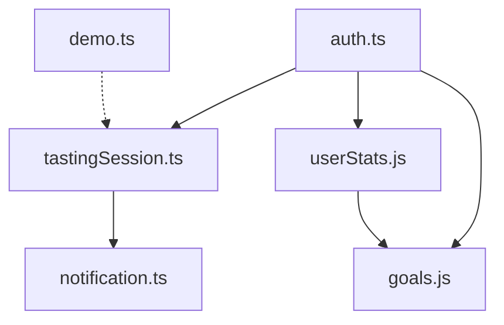

# 🗄️ CupNote 상태 관리 가이드

CupNote의 Pinia 기반 상태 관리 시스템에 대한 종합 가이드입니다.

## 📋 목차

1. [아키텍처 개요](#아키텍처-개요)
2. [스토어 구조](#스토어-구조)
3. [스토어별 상세 가이드](#스토어별-상세-가이드)
4. [사용 패턴](#사용-패턴)
5. [베스트 프랙티스](#베스트-프랙티스)
6. [테스팅 전략](#테스팅-전략)

## 🏗️ 아키텍처 개요

### 상태 관리 철학

**핵심 원칙**:

- **단일 진실 공급원**: 각 도메인의 상태는 해당 스토어에서만 관리
- **반응형 설계**: Vue 3 Composition API와 완벽한 통합
- **타입 안정성**: TypeScript를 통한 컴파일 타임 검증
- **모듈화**: 도메인별 스토어 분리로 유지보수성 확보

### 기술 스택

```typescript
// 핵심 기술
import { defineStore } from 'pinia' // 상태 관리
import { ref, computed } from 'vue' // 반응형 상태
import { supabase } from '../lib/supabase' // 데이터 영속성
import type { User, Session } from '@supabase/supabase-js' // 타입 정의
```

## 📁 스토어 구조

### 스토어 계층 구조

```
src/stores/
├── auth.ts              # 사용자 인증 및 프로필
├── tastingSession.ts    # 테이스팅 세션 관리 (핵심)
├── notification.ts      # 알림 시스템
├── userStats.js         # 사용자 통계 및 성과
├── goals.js            # 목표 설정 및 추적
├── demo.ts             # 데모 모드 관리
└── __tests__/          # 스토어 테스트
    ├── auth.test.ts
    ├── notification.test.ts
    ├── tastingSession.test.ts
    └── tastingSession.integration.test.ts
```

### 스토어 간 의존성



## 📊 스토어별 상세 가이드

### 1. Authentication Store (`auth.ts`)

**역할**: 사용자 인증, 세션 관리, 프로필 정보

**핵심 상태**:

```typescript
interface AuthState {
  user: User | null // Supabase 사용자 객체
  session: Session | null // 인증 세션
  userProfile: UserProfile | null // 확장 프로필 정보
  isLoading: boolean // 로딩 상태
  error: string | null // 에러 메시지
}
```

**주요 액션**:

```typescript
// 회원가입
const signUp = async (email: string, password: string, displayName?: string)

// 로그인
const signIn = async (email: string, password: string)

// 로그아웃
const signOut = async ()

// 프로필 업데이트
const updateProfile = async (updates: Partial<UserProfile>)

// 인증 상태 초기화
const initializeAuth = async ()
```

**사용 예제**:

```vue
<script setup>
import { useAuthStore } from '@/stores/auth'

const authStore = useAuthStore()

// 반응형 상태 접근
const { isAuthenticated, user, isLoading } = storeToRefs(authStore)

// 액션 호출
const handleLogin = async () => {
  try {
    await authStore.signIn(email.value, password.value)
    // 로그인 성공 처리
  } catch (error) {
    console.error('Login failed:', error)
  }
}
</script>
```

---

### 2. Tasting Session Store (`tastingSession.ts`)

**역할**: 테이스팅 세션의 핵심 상태 관리 (가장 중요한 스토어)

**데이터 구조**:

```typescript
interface TastingRecord {
  id?: string
  user_id: string
  mode: 'cafe' | 'homecafe' | 'pro'
  session_id?: string

  // JSONB 필드들
  coffee_info: {
    coffee_name: string
    cafe_name: string
    location: string
    brewing_method: string
    origin?: string | null
    variety?: string | null
    // ... 추가 커피 정보
  }

  brew_settings?: {
    dripper?: string
    recipe?: {
      coffee_amount: number
      water_amount: number
      ratio: number
      water_temp: number
      brew_time: number
      lap_times: number[]
    }
    quick_notes?: string
  } | null

  experimental_data?: {
    extraction_method?: string
    grind_size?: string
    tds?: number
    extraction_yield?: number
    water_tds?: number
    water_ph?: number
    // ... Pro 모드 실험 데이터
  } | null

  selected_flavors: Array<{ id: string; text: string }>
  sensory_expressions: Array<{ id: string; category: string; text: string }>
  personal_comment?: string | null
  roaster_notes?: string | null
  match_score?: {
    overall: number
    breakdown: Record<string, number>
  } | null
}
```

**핵심 상태**:

```typescript
const currentSession = ref<TastingRecord>({
  user_id: '',
  mode: 'cafe',
  coffee_info: {
    coffee_name: '',
    cafe_name: '',
    location: '',
    brewing_method: '',
  },
  selected_flavors: [],
  sensory_expressions: [],
})

const isSessionActive = ref(false)
const sessionProgress = ref(0)
const completedSessions = ref<TastingRecord[]>([])
```

**주요 액션**:

```typescript
// 세션 시작
const startSession = (mode: 'cafe' | 'homecafe' | 'pro') => {
  // 새 세션 초기화
  resetSession()
  currentSession.value.mode = mode
  currentSession.value.session_id = generateSessionId()
  isSessionActive.value = true
}

// 세션 데이터 업데이트
const updateSessionData = <K extends keyof TastingRecord>(field: K, data: TastingRecord[K]) => {
  currentSession.value[field] = data
  calculateProgress()
}

// 세션 저장
const saveSession = async (): Promise<string | null> => {
  try {
    const { data, error } = await supabase
      .from('tastings')
      .insert([currentSession.value])
      .select()
      .single()

    if (error) throw error

    completedSessions.value.push(data)
    resetSession()
    return data.id
  } catch (error) {
    console.error('Failed to save session:', error)
    throw error
  }
}

// 진행도 계산
const calculateProgress = () => {
  const requiredFields = getRequiredFieldsByMode(currentSession.value.mode)
  const completedFields = requiredFields.filter((field) =>
    hasValidData(currentSession.value, field),
  )
  sessionProgress.value = (completedFields.length / requiredFields.length) * 100
}
```

**모드별 플로우 관리**:

```typescript
const FLOW_STEPS = {
  cafe: [
    'coffee_info',
    'selected_flavors',
    'sensory_expressions',
    'personal_comment',
    'roaster_notes',
  ],
  homecafe: [
    'coffee_info',
    'brew_settings',
    'selected_flavors',
    'sensory_expressions',
    'personal_comment',
    'roaster_notes',
  ],
  pro: [
    'coffee_info',
    'brew_settings',
    'experimental_data',
    'qc_measurements',
    'selected_flavors',
    'sensory_expressions',
    'sensory_slider',
    'personal_comment',
    'roaster_notes',
  ],
}
```

---

### 3. Notification Store (`notification.ts`)

**역할**: 시스템 전반의 알림 관리

**알림 타입**:

```typescript
interface Notification {
  id: string
  type: 'success' | 'error' | 'warning' | 'info' | 'coffee' | 'achievement' | 'tip'
  title?: string
  message: string
  duration?: number
  dismissible?: boolean
  actions?: NotificationAction[]
}
```

**특화된 알림 메서드**:

```typescript
// 테이스팅 관련
const showTastingStart = (coffeeName: string)
const showTastingComplete = (coffeeName: string, matchScore: number)
const showScoreImprovement = (previousScore: number, currentScore: number)

// 성취 관련
const showNewBadge = (badgeName: string)
const showDailyStreak = (streakDays: number)

// 커피 팁
const showTip = (message: string, title?: string)
```

**전역 헬퍼 사용**:

```typescript
import { notify } from '@/stores/notification'

// 컴포지션 API 외부에서도 사용 가능
notify.success('테이스팅이 저장되었습니다!')
notify.achievement('새로운 배지를 획득했습니다!')
```

---

### 4. User Statistics Store (`userStats.js`)

**역할**: 사용자 통계, 성취, 진행도 추적

**핵심 통계**:

```javascript
const computed = {
  totalTastings: computed(() => stats.value?.total_tastings || 0),
  totalProSessions: computed(() => stats.value?.total_pro_sessions || 0),
  averageScaScore: computed(() => stats.value?.average_sca_score || 0),
  currentStreak: computed(() => stats.value?.streak_days || 0),
  longestStreak: computed(() => stats.value?.longest_streak || 0),

  // 향미 분석
  favoriteOrigins: computed(() => stats.value?.favorite_origins || []),
  tastingFrequency: computed(() => stats.value?.weekly_frequency || 0),
  skillLevel: computed(() => calculateSkillLevel(stats.value)),
}
```

**성취 시스템**:

```javascript
const achievements = ref([
  {
    id: 'first_tasting',
    name: '첫 테이스팅',
    description: '첫 번째 커피 테이스팅 완료',
    icon: '☕',
    condition: { total_tastings: 1 },
  },
  {
    id: 'streak_7',
    name: '일주일 연속',
    description: '7일 연속 테이스팅',
    icon: '🔥',
    condition: { streak_days: 7 },
  },
  // ... 더 많은 성취
])
```

---

### 5. Goals Store (`goals.js`)

**역할**: 개인 목표 설정 및 추적

**목표 타입**:

```javascript
const GOAL_TYPES = {
  TASTINGS: 'tastings', // 테이스팅 횟수
  STREAK: 'streak', // 연속 기록
  SCORE: 'score', // 점수 향상
  EXPLORATION: 'exploration', // 새로운 원두 탐색
  SKILL: 'skill', // 기술 향상
  TIME: 'time', // 시간별 목표
}
```

**목표 생성 및 추적**:

```javascript
const createGoal = async (goalData) => {
  const goal = {
    user_id: authStore.userId,
    type: goalData.type,
    target_value: goalData.target,
    current_value: 0,
    deadline: goalData.deadline,
    status: 'active',
  }

  // DB에 저장 및 상태 업데이트
}

const updateGoalProgress = async (goalId, progress) => {
  // 자동 목표 진행도 업데이트
  // 완료시 알림 발송
}
```

## 🎯 사용 패턴

### 1. 컴포넌트에서 스토어 사용

```vue
<template>
  <div class="tasting-progress">
    <h2>{{ currentSession.coffee_info.coffee_name }}</h2>
    <progress :value="sessionProgress" max="100">{{ sessionProgress }}%</progress>

    <button @click="saveCurrentSession" :disabled="!canSave">저장하기</button>
  </div>
</template>

<script setup>
import { storeToRefs } from 'pinia'
import { useTastingSessionStore } from '@/stores/tastingSession'
import { useNotificationStore } from '@/stores/notification'

// 스토어 인스턴스
const sessionStore = useTastingSessionStore()
const notificationStore = useNotificationStore()

// 반응형 상태 구조분해 (반응성 유지)
const { currentSession, sessionProgress, isSessionActive } = storeToRefs(sessionStore)

// 계산된 속성
const canSave = computed(() => sessionProgress.value >= 80 && isSessionActive.value)

// 액션 호출
const saveCurrentSession = async () => {
  try {
    const sessionId = await sessionStore.saveSession()
    notificationStore.showSuccess('테이스팅이 저장되었습니다!')

    // 페이지 이동 등 후속 처리
    router.push('/result')
  } catch (error) {
    notificationStore.showError('저장에 실패했습니다. 다시 시도해주세요.')
  }
}
</script>
```

### 2. 여러 스토어 조합 사용

```vue
<script setup>
import { useAuthStore } from '@/stores/auth'
import { useTastingSessionStore } from '@/stores/tastingSession'
import { useUserStatsStore } from '@/stores/userStats'
import { useNotificationStore } from '@/stores/notification'

const authStore = useAuthStore()
const sessionStore = useTastingSessionStore()
const statsStore = useUserStatsStore()
const notificationStore = useNotificationStore()

// 통합 워크플로우
const completeTasting = async () => {
  // 1. 세션 저장
  const sessionId = await sessionStore.saveSession()

  // 2. 통계 데이터 다시 로드
  await statsStore.fetchUserStats(authStore.userId)

  // 3. 성취 데이터 다시 로드 및 확인
  await statsStore.fetchUserAchievements(authStore.userId)
  const newAchievements = statsStore.earnedAchievements

  // 4. 알림 발송
  if (newAchievements.length > 0) {
    notificationStore.showNewBadge('새로운 성취를 달성했습니다!')
  }

  notificationStore.showTastingComplete(
    sessionStore.currentSession.coffee_info.coffee_name,
    sessionStore.currentSession.match_score?.overall || 0,
  )
}
</script>
```

### 3. 컴포저블에서 스토어 사용

```typescript
// composables/useTastingFlow.ts
import { useTastingSessionStore } from '@/stores/tastingSession'
import { useRouter } from 'vue-router'

export function useTastingFlow() {
  const sessionStore = useTastingSessionStore()
  const router = useRouter()

  const navigateNext = (currentStep: string) => {
    const mode = sessionStore.currentSession.mode
    const nextStep = getNextStep(currentStep, mode)

    if (nextStep) {
      router.push(`/${nextStep}`)
    } else {
      // 플로우 완료
      router.push('/result')
    }
  }

  const canNavigateNext = (requiredFields: string[]) => {
    return requiredFields.every((field) => hasValidData(sessionStore.currentSession, field))
  }

  return {
    navigateNext,
    canNavigateNext,
    currentSession: readonly(sessionStore.currentSession),
    sessionProgress: readonly(sessionStore.sessionProgress),
  }
}
```

## ✅ 베스트 프랙티스

### 1. 상태 변경 규칙

```typescript
// ✅ 올바른 방법: 액션을 통한 상태 변경
const updateCoffeeInfo = (coffeeData) => {
  sessionStore.updateSessionData('coffee_info', {
    ...sessionStore.currentSession.coffee_info,
    ...coffeeData,
  })
}

// ❌ 잘못된 방법: 직접 상태 변경
sessionStore.currentSession.coffee_info.coffee_name = 'New Name'
```

### 2. 반응성 유지

```vue
<script setup>
import { storeToRefs } from 'pinia'

// ✅ 올바른 방법: storeToRefs 사용
const { user, isLoading } = storeToRefs(useAuthStore())

// ❌ 잘못된 방법: 구조분해시 반응성 손실
const { user, isLoading } = useAuthStore()
</script>
```

### 3. 에러 처리

```typescript
const handleAsyncAction = async () => {
  try {
    loading.value = true
    error.value = null

    const result = await someAsyncOperation()

    // 성공 처리
    return result
  } catch (err) {
    error.value = err.message
    notificationStore.showError('작업에 실패했습니다.')
    throw err
  } finally {
    loading.value = false
  }
}
```

### 4. 타입 안정성

```typescript
// interfaces/tasting.ts
export interface CoffeeInfo {
  coffee_name: string
  cafe_name: string
  location: string
  brewing_method: string
  origin?: string | null
}

// stores/tastingSession.ts
import type { CoffeeInfo } from '@/interfaces/tasting'

const updateCoffeeInfo = (coffeeInfo: Partial<CoffeeInfo>) => {
  currentSession.value.coffee_info = {
    ...currentSession.value.coffee_info,
    ...coffeeInfo,
  }
}
```

### 5. 퍼포먼스 최적화

```typescript
// computed를 활용한 파생 상태
const expensiveCalculation = computed(() => {
  if (!currentSession.value.selected_flavors.length) return null

  return complexFlavorAnalysis(currentSession.value.selected_flavors)
})

// 필요시에만 데이터 로드
const loadUserStats = async () => {
  if (stats.value) return // 이미 로드됨

  // 데이터 로드 로직
}
```

## 🧪 테스팅 전략

### 1. 단위 테스트

```typescript
// __tests__/tastingSession.test.ts
import { setActivePinia, createPinia } from 'pinia'
import { useTastingSessionStore } from '@/stores/tastingSession'

describe('TastingSession Store', () => {
  beforeEach(() => {
    setActivePinia(createPinia())
  })

  it('should initialize with default state', () => {
    const store = useTastingSessionStore()

    expect(store.currentSession.mode).toBe('cafe')
    expect(store.isSessionActive).toBe(false)
    expect(store.sessionProgress).toBe(0)
  })

  it('should start session correctly', () => {
    const store = useTastingSessionStore()

    store.startSession('pro')

    expect(store.currentSession.mode).toBe('pro')
    expect(store.isSessionActive).toBe(true)
    expect(store.currentSession.session_id).toBeDefined()
  })

  it('should calculate progress correctly', () => {
    const store = useTastingSessionStore()

    store.startSession('cafe')
    store.updateSessionData('coffee_info', {
      coffee_name: 'Test Coffee',
      cafe_name: 'Test Cafe',
      location: 'Seoul',
      brewing_method: 'V60',
    })

    expect(store.sessionProgress).toBeGreaterThan(0)
  })
})
```

### 2. 통합 테스트

```typescript
// __tests__/tastingSession.integration.test.ts
import { createPinia, setActivePinia } from 'pinia'
import { useTastingSessionStore } from '@/stores/tastingSession'
import { useNotificationStore } from '@/stores/notification'

describe('Tasting Session Integration', () => {
  let sessionStore
  let notificationStore

  beforeEach(() => {
    setActivePinia(createPinia())
    sessionStore = useTastingSessionStore()
    notificationStore = useNotificationStore()
  })

  it('should complete full tasting flow', async () => {
    // 세션 시작
    sessionStore.startSession('cafe')

    // 단계별 데이터 입력
    sessionStore.updateSessionData('coffee_info', mockCoffeeInfo)
    sessionStore.updateSessionData('selected_flavors', mockFlavors)
    sessionStore.updateSessionData('sensory_expressions', mockExpressions)

    // 세션 저장
    const sessionId = await sessionStore.saveSession()

    expect(sessionId).toBeTruthy()
    expect(sessionStore.isSessionActive).toBe(false)
  })
})
```

### 3. 목킹 전략

```typescript
// __tests__/mocks/supabase.ts
export const mockSupabase = {
  from: jest.fn(() => ({
    insert: jest.fn(() => ({
      select: jest.fn(() => ({
        single: jest.fn(() =>
          Promise.resolve({
            data: mockTastingRecord,
            error: null,
          }),
        ),
      })),
    })),
    select: jest.fn(() =>
      Promise.resolve({
        data: [mockTastingRecord],
        error: null,
      }),
    ),
  })),
}

// 테스트에서 사용
jest.mock('@/lib/supabase', () => ({
  supabase: mockSupabase,
}))
```

## 🔧 디버깅 도구

### 1. Pinia DevTools

```typescript
// main.ts
import { createPinia } from 'pinia'

const pinia = createPinia()

// 개발 모드에서 DevTools 활성화
if (process.env.NODE_ENV === 'development') {
  pinia.use(({ store }) => {
    store.$subscribe((mutation, state) => {
      console.log(`[${mutation.storeId}] ${mutation.type}`, mutation.payload)
    })
  })
}

app.use(pinia)
```

### 2. 상태 로깅

```typescript
// stores/tastingSession.ts
const updateSessionData = <K extends keyof TastingRecord>(field: K, data: TastingRecord[K]) => {
  const oldValue = currentSession.value[field]
  currentSession.value[field] = data

  // 개발 모드에서 변경사항 로깅
  if (process.env.NODE_ENV === 'development') {
    console.log(`Session updated: ${String(field)}`, {
      from: oldValue,
      to: data,
    })
  }

  calculateProgress()
}
```

---

이 가이드는 CupNote의 상태 관리 시스템을 효과적으로 사용하고 확장하는 데 필요한 모든 정보를 제공합니다. 새로운 기능을 추가하거나 기존 상태 로직을 수정할 때 이 문서를 참조해 주세요.
