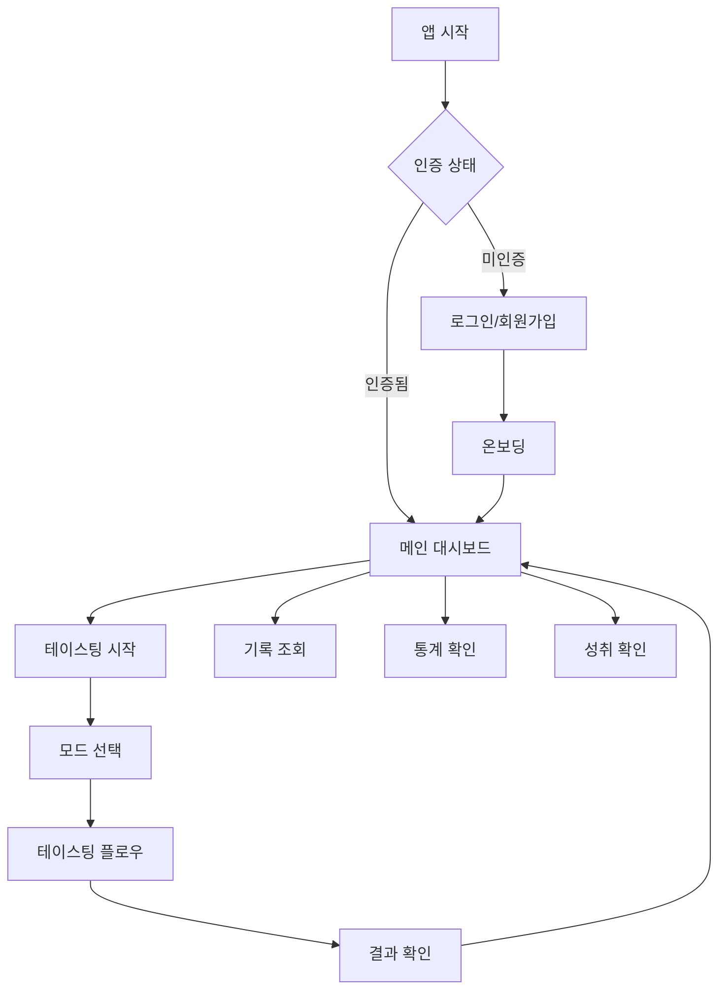
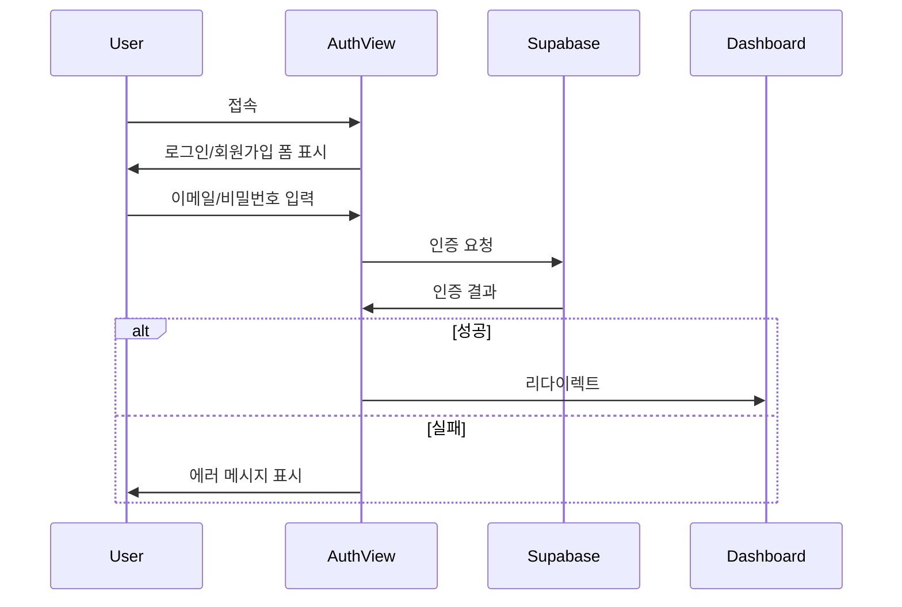

# 🚀 CupNote 사용자 플로우 가이드

CupNote의 모든 사용자 여정과 워크플로우에 대한 종합 가이드입니다.

## 📋 목차

1. [플로우 개요](#플로우-개요)
2. [인증 및 온보딩](#인증-및-온보딩)
3. [테이스팅 플로우](#테이스팅-플로우)
4. [대시보드 및 통계](#대시보드-및-통계)
5. [관리 기능](#관리-기능)
6. [플로우 간 전환](#플로우-간-전환)

## 🎯 플로우 개요

### 주요 사용자 여정



### 플로우 분류

1. **Core Flows**: 핵심 테이스팅 기능
2. **Management Flows**: 데이터 관리 및 조회
3. **Engagement Flows**: 성취, 목표, 통계
4. **Admin Flows**: 관리자 기능

## 🔐 인증 및 온보딩

### 1. 인증 플로우

**라우트**: `/auth`, `/auth/callback`



**단계별 상세**:

1. **AuthView.vue** (`/auth`)
   - 로그인/회원가입 탭 전환
   - 이메일/비밀번호 검증
   - 소셜 로그인 옵션 (추후 확장)
   - 비밀번호 재설정 링크

2. **CallbackView.vue** (`/auth/callback`)
   - OAuth 콜백 처리
   - 토큰 검증 및 세션 설정
   - 사용자 프로필 초기화

**상태 관리**:
```typescript
// stores/auth.ts 사용
const handleLogin = async (email: string, password: string) => {
  await authStore.signIn(email, password)
  // 성공시 자동 리다이렉트
}
```

### 2. 온보딩 플로우

**라우트**: `/onboarding`

**단계**:
1. **환영 메시지**: CupNote 소개
2. **경험 수준 설정**: 초보자/중급자/전문가
3. **선호도 조사**: 선호하는 추출 방법, 향미 성향
4. **목표 설정**: 주간/월간 테이스팅 목표
5. **첫 테이스팅 가이드**: 데모 모드 안내

**실제 구현**:
```vue
<!-- OnboardingView.vue -->
<template>
  <div class="onboarding-container">
    <!-- 온보딩 단계 표시 -->
    <div class="onboarding-steps">
      <div v-for="(step, index) in onboardingSteps" :key="index" 
           :class="['step-card', { active: currentStep === index }]">
        <div class="step-icon">{{ step.icon }}</div>
        <h3 class="step-title">{{ step.title }}</h3>
        <p class="step-description">{{ step.description }}</p>
      </div>
    </div>
    
    <!-- 단계 인디케이터 -->
    <div class="step-indicators">
      <div v-for="(_, index) in onboardingSteps" :key="index"
           :class="['step-dot', { active: currentStep === index }]">
      </div>
    </div>
  </div>
</template>

<script setup>
import { useTastingSessionStore } from '@/stores/tastingSession'

const onboardingSteps = [
  {
    icon: '👋',
    title: 'CupNote에 오신 걸 환영합니다!',
    description: '커피의 향미와 감각을 기록하고 분석하는 개인 맞춤 커피 저널입니다.'
  }
  // ... 더 많은 단계들
]

const startTasting = () => {
  router.push('/mode-selection')
}
</script>
```

## ☕ 테이스팅 플로우

### 플로우 구조 개요

**3가지 모드별 단계**:

| 단계 | Cafe (7단계) | HomeCafe (8단계) | Pro (12단계) |
|------|-------------|-----------------|-------------|
| 1 | Mode Selection | Mode Selection | Mode Selection |
| 2 | Coffee Info | Coffee Info | Coffee Info |
| 3 | Flavor Selection | HomeCafe Settings | HomeCafe Settings |
| 4 | Sensory Expression | Flavor Selection | Pro Brewing |
| 5 | Personal Comment | Sensory Expression | QC Measurement |
| 6 | Roaster Notes | Personal Comment | Pro QC Report |
| 7 | Result | Roaster Notes | Flavor Selection |
| 8 | - | Result | Sensory Expression |
| 9 | - | - | Sensory Slider |
| 10 | - | - | Personal Comment |
| 11 | - | - | Roaster Notes |
| 12 | - | - | Result |

### 1. 모드 선택 (ModeSelectionView)

**라우트**: `/mode-selection`

**기능**:
- 3가지 테이스팅 모드 소개
- 사용자 경험 수준 기반 추천
- 각 모드별 예상 소요 시간 표시
- 데모 모드 진입 옵션

```vue
<!-- ModeSelectionView.vue -->
<template>
  <div class="mode-selection">
    <h1>테이스팅 모드를 선택해주세요</h1>
    
    <div class="mode-cards">
      <ModeCard
        v-for="mode in modes"
        :key="mode.id"
        :mode="mode"
        :recommended="mode.id === recommendedMode"
        @select="selectMode"
      />
    </div>
    
    <DemoModeButton @click="startDemo" />
  </div>
</template>

<script setup>
import { useTastingSessionStore } from '@/stores/tastingSession'

const modes = [
  {
    id: 'cafe',
    name: 'Cafe Mode',
    description: '카페에서 마시는 커피',
    duration: '3-5분',
    steps: 7,
    features: ['기본 향미 분석', '간단한 기록']
  },
  {
    id: 'homecafe', 
    name: 'HomeCafe Mode',
    description: '집에서 내려 마시는 커피',
    duration: '5-8분', 
    steps: 8,
    features: ['추출 설정 기록', '상세 향미 분석']
  },
  {
    id: 'pro',
    name: 'Pro Mode',
    description: 'SCA 표준 전문 품질 평가',
    duration: '8-12분',
    steps: 12,
    features: ['QC 측정', '전문 감각 평가', '과학적 분석']
  }
]

const sessionStore = useTastingSessionStore()

const selectMode = (modeId: string) => {
  sessionStore.startSession(modeId)
  router.push('/coffee-info')
}
</script>
```

### 2. 커피 정보 입력 (CoffeeInfoView)

**라우트**: `/coffee-info`

**공통 필드**:
- 커피명 (필수)
- 카페명/브랜드명 (필수)
- 위치 (필수)
- 추출 방법 (필수)

**선택 필드** (Pro 모드):
- 원산지, 품종, 고도
- 가공 방식, 로스팅 레벨

```typescript
// 데이터 구조
interface CoffeeInfo {
  coffee_name: string
  cafe_name: string  
  location: string
  brewing_method: string
  // Pro 모드 추가 필드
  origin?: string
  variety?: string
  altitude?: string
  process?: string
  roast_level?: string
}
```

### 3. HomeCafe 설정 (HomeCafeView)

**라우트**: `/home-cafe`
**조건**: HomeCafe, Pro 모드만

**입력 정보**:
- 드리퍼 종류
- 레시피 (커피량, 물량, 비율, 수온, 시간)
- 랩타임 기록
- 간단한 메모

### 4. Pro 브루잉 데이터 (ProBrewingView)

**라우트**: `/pro-brewing`  
**조건**: Pro 모드만

**실험 데이터**:
- 추출 방식 세부사항
- 그라인드 사이즈
- 블룸 시간, 총 시간
- 실험 노트

### 5. QC 측정 (QcMeasurementView)

**라우트**: `/qc-measurement`
**조건**: Pro 모드만

**측정 항목**:
- TDS (Total Dissolved Solids)
- 추출율 (Extraction Yield)
- 물 TDS, 물 pH
- 기타 품질 지표

```vue
<!-- QcMeasurementView.vue -->
<template>
  <div class="qc-measurement">
    <h2>QC 측정값을 입력해주세요</h2>
    
    <div class="measurement-grid">
      <MeasurementInput
        v-model="measurements.tds"
        label="TDS (%)"
        :min="0.8"
        :max="1.8" 
        :step="0.01"
        suffix="%"
      />
      
      <MeasurementInput
        v-model="measurements.extraction_yield"
        label="추출율 (%)"
        :min="15"
        :max="25"
        :step="0.1"
        suffix="%"
      />
    </div>
    
    <BrewingChart 
      :tds="measurements.tds"
      :yield="measurements.extraction_yield"
    />
  </div>
</template>
```

### 6. Pro QC 리포트 (ProQcReportView)

**라우트**: `/pro-qc-report`
**조건**: Pro 모드만

**리포트 내용**:
- Golden Cup 범위 분석
- 품질 등급 평가
- 개선 제안사항
- 시각적 차트

### 7. 향미 선택 (FlavorSelectionView)

**라우트**: `/flavor-selection`

**SCA Flavor Wheel 기반**:
- 카테고리별 향미 선택
- 다중 선택 가능
- 검색 및 필터링 기능
- 개인 커스텀 향미 추가

```vue
<!-- FlavorSelectionView.vue -->
<template>
  <div class="flavor-selection">
    <FlavorWheel
      :categories="flavorCategories"
      :selected="selectedFlavors"
      @select="handleFlavorSelect"
    />
    
    <SelectedFlavors
      :flavors="selectedFlavors"
      @remove="removeFlavor"
    />
    
    <CustomFlavorInput @add="addCustomFlavor" />
  </div>
</template>

<script setup>
const flavorCategories = [
  {
    name: '과일향',
    subcategories: ['베리', '감귤', '열대과일']
  },
  {
    name: '꽃향', 
    subcategories: ['장미', '재스민', '허브']
  }
  // ... 더 많은 카테고리
]
</script>
```

### 8. 감각 표현 (SensoryExpressionView)

**라우트**: `/sensory-expression`

**표현 요소**:
- 단맛, 산미, 쓴맛 강도
- 바디감, 마우스필
- 후미, 밸런스
- 전체적인 인상

### 9. 감각 슬라이더 (SensorySliderView)

**라우트**: `/sensory-slider`
**조건**: Pro 모드만

**정밀 평가**:
- 0.5 단위 정밀 조정
- SCA 평가 기준 적용
- 실시간 점수 계산
- 비교 차트 표시

### 10. 개인 코멘트 (PersonalCommentView)

**라우트**: `/personal-comment`

**자유 텍스트 입력**:
- 개인적인 느낌
- 추억이나 연상
- 개선점이나 특이사항
- 다음에 시도해볼 점

### 11. 로스터 노트 비교 (RoasterNotesView)

**라우트**: `/roaster-notes`

**매칭 시스템**:
- 로스터 제공 정보 입력
- AI 기반 매칭 점수 계산
- 차이점 분석
- 감각 발전 피드백

### 12. 결과 확인 (ResultView)

**라우트**: `/result`

**종합 결과**:
- 매칭 점수
- 향미 프로필 차트  
- 개선 제안
- 성취 배지
- 소셜 공유 옵션

```vue
<!-- ResultView.vue -->
<template>
  <div class="result-view">
    <ScoreCard :score="matchScore" />
    
    <FlavorProfile :flavors="selectedFlavors" />
    
    <ImprovementSuggestions :suggestions="suggestions" />
    
    <AchievementBadges :new-badges="newBadges" />
    
    <ActionButtons>
      <BaseButton @click="saveAndExit">저장하고 나가기</BaseButton>
      <BaseButton @click="startAnother" variant="outline">
        다른 커피 테이스팅
      </BaseButton>
      <BaseButton @click="shareResult" variant="secondary">
        결과 공유
      </BaseButton>
    </ActionButtons>
  </div>
</template>
```

## 📊 대시보드 및 통계

### 1. 메인 대시보드 (HomeView)

**라우트**: `/`

**주요 위젯**:
- 오늘의 테이스팅 현황
- 주간/월간 통계 요약
- 최근 테이스팅 기록
- 성취 진행도
- 개인화된 추천

```vue
<!-- HomeView.vue -->
<template>
  <div class="dashboard">
    <WelcomeHeader :user="user" />
    
    <QuickActions>
      <ActionCard
        title="새 테이스팅 시작"
        icon="coffee"
        color="primary"
        @click="startTasting"
      />
      <ActionCard
        title="기록 보기"
        icon="list"
        @click="viewRecords"
      />
    </QuickActions>
    
    <StatsOverview :stats="userStats" />
    
    <RecentTastings :records="recentRecords" />
    
    <AchievementProgress :achievements="achievements" />
    
    <PersonalizedTips :tips="dailyTips" />
  </div>
</template>
```

### 2. 통계 페이지 (StatsView)

**라우트**: `/stats`

**통계 섹션**:
- 테이스팅 빈도 차트
- 향미 선호도 분포
- 점수 변화 추이
- 모드별 활동 분석
- 월별/주별 활동

### 3. 성취 페이지 (AchievementsView)

**라우트**: `/achievements`

**성취 시스템**:
- 획득한 배지 목록
- 진행 중인 도전과제
- 다음 목표까지의 진행도
- 희귀 배지 및 특별 성취

### 4. 기록 목록 (RecordsListView)

**라우트**: `/records`

**기능**:
- 테이스팅 기록 목록
- 검색 및 필터링
- 정렬 옵션
- 상세 보기
- 편집/삭제

```vue
<!-- RecordsListView.vue -->
<template>
  <div class="records-list">
    <!-- 검색 및 필터링 영역 -->
    <div class="filters-section">
      <input 
        v-model="searchQuery" 
        type="text" 
        placeholder="검색어를 입력하세요..."
        class="search-input"
      />
      
      <select v-model="activeFilters.mode" class="filter-select">
        <option value="">모든 모드</option>
        <option value="cafe">Cafe</option>
        <option value="homecafe">HomeCafe</option>
        <option value="pro">Pro</option>
      </select>
      
      <select v-model="activeFilters.origin" class="filter-select">
        <option value="">모든 원산지</option>
        <!-- 동적으로 생성되는 원산지 옵션들 -->
      </select>
    </div>
    
    <!-- 기록 목록 표시 -->
    <div class="records-grid" v-if="!loading">
      <div 
        v-for="record in filteredRecords" 
        :key="record.id"
        class="record-card"
        @click="viewRecord(record.id)"
      >
        <h3>{{ record.coffee_info.coffee_name }}</h3>
        <p>{{ record.coffee_info.cafe_name }}</p>
        <div class="record-meta">
          <span class="mode-badge">{{ record.mode }}</span>
          <span class="date">{{ formatDate(record.created_at) }}</span>
        </div>
      </div>
    </div>
    
    <!-- 로딩 상태 -->
    <LoadingSpinner v-else />
    
    <!-- 페이지네이션 -->
    <div class="pagination" v-if="totalPages > 1">
      <button 
        v-for="page in totalPages" 
        :key="page"
        :class="['page-btn', { active: currentPage === page }]"
        @click="currentPage = page"
      >
        {{ page }}
      </button>
    </div>
  </div>
</template>
```

## 👤 관리 기능

### 1. 프로필 관리 (ProfileView)

**라우트**: `/profile`

**설정 항목**:
- 개인 정보 수정
- 경험 수준 업데이트
- 알림 설정
- 데이터 내보내기
- 계정 삭제

### 2. 관리자 대시보드 (AdminDashboard)

**라우트**: `/admin`
**권한**: 관리자만

**관리 기능**:
- 사용자 통계
- 시스템 모니터링
- 콘텐츠 관리
- 피드백 관리

## 🔄 플로우 간 전환

### 네비게이션 가드

```typescript
// router/index.ts
router.beforeEach(async (to, from, next) => {
  const authStore = useAuthStore()
  const sessionStore = useTastingSessionStore()
  
  // 인증 확인
  if (to.meta.requiresAuth && !authStore.isAuthenticated) {
    return next('/auth')
  }
  
  // 세션 상태 확인
  if (to.meta.requiresSession && !sessionStore.isSessionActive) {
    return next('/mode-selection')
  }
  
  // 모드별 접근 제한
  const allowedModes = to.meta.allowedModes
  if (allowedModes && !allowedModes.includes(sessionStore.currentSession.mode)) {
    return next('/mode-selection')
  }
  
  next()
})
```

### 플로우 네비게이션 헬퍼

```typescript
// composables/useFlowNavigation.ts
export function useFlowNavigation() {
  const router = useRouter()
  const sessionStore = useTastingSessionStore()
  
  const FLOW_STEPS = {
    cafe: [
      'coffee-info', 'flavor-selection', 'sensory-expression',
      'personal-comment', 'roaster-notes', 'result'
    ],
    homecafe: [
      'coffee-info', 'home-cafe', 'flavor-selection', 
      'sensory-expression', 'personal-comment', 'roaster-notes', 'result'
    ],
    pro: [
      'coffee-info', 'home-cafe', 'pro-brewing', 'qc-measurement',
      'pro-qc-report', 'flavor-selection', 'sensory-expression',
      'sensory-slider', 'personal-comment', 'roaster-notes', 'result'
    ]
  }
  
  const navigateNext = (currentStep: string) => {
    const mode = sessionStore.currentSession.mode
    const steps = FLOW_STEPS[mode]
    const currentIndex = steps.indexOf(currentStep)
    
    if (currentIndex < steps.length - 1) {
      const nextStep = steps[currentIndex + 1]
      router.push(`/${nextStep}`)
    }
  }
  
  const navigatePrevious = (currentStep: string) => {
    const mode = sessionStore.currentSession.mode
    const steps = FLOW_STEPS[mode]
    const currentIndex = steps.indexOf(currentStep)
    
    if (currentIndex > 0) {
      const prevStep = steps[currentIndex - 1]
      router.push(`/${prevStep}`)
    } else {
      router.push('/mode-selection')
    }
  }
  
  const getProgressPercentage = (currentStep: string) => {
    const mode = sessionStore.currentSession.mode
    const steps = FLOW_STEPS[mode]
    const currentIndex = steps.indexOf(currentStep)
    
    return ((currentIndex + 1) / steps.length) * 100
  }
  
  return {
    navigateNext,
    navigatePrevious,
    getProgressPercentage,
    FLOW_STEPS
  }
}
```

### 중단 및 재개 처리

```typescript
// 세션 중단시 처리
const handleSessionInterruption = () => {
  // 현재 상태 로컬 저장
  sessionStore.saveTemporarySession()
  
  // 사용자에게 알림
  notificationStore.showWarning(
    '세션이 임시 저장되었습니다. 나중에 이어서 진행할 수 있습니다.',
    '세션 저장됨'
  )
}

// 세션 재개
const resumeSession = () => {
  const savedSession = sessionStore.loadTemporarySession()
  if (savedSession) {
    sessionStore.restoreSession(savedSession)
    const currentStep = getCurrentStep(savedSession)
    router.push(`/${currentStep}`)
  }
}
```

---

이 사용자 플로우 가이드는 CupNote의 모든 사용자 여정을 상세히 설명하며, 개발자가 새로운 기능을 추가하거나 기존 플로우를 수정할 때 참조할 수 있는 완전한 문서입니다.