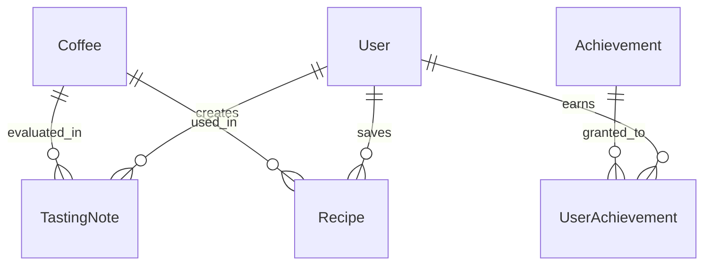

# CupNote Data Model Design

## 🎯 Overview

CupNote의 데이터 모델 설계 - BMAD Method의 Model 단계 적용

## 📊 Core Entities

### 1. User (사용자)
```typescript
interface User {
  id: string;                    // UUID
  email: string;                 // Unique
  password_hash: string;
  username: string;
  profile_image?: string;
  preferred_mode: 'cafe' | 'brew' | 'lab';
  created_at: Date;
  updated_at: Date;
}
```

### 2. Coffee (커피)
```typescript
interface Coffee {
  id: string;                    // UUID
  name: string;                  // 커피 이름
  roaster: string;               // 로스터리
  origin?: string;               // 원산지
  process?: string;              // 가공법
  roast_date?: Date;             // 로스팅 날짜
  variety?: string;              // 품종
  altitude?: string;             // 고도
  tasting_notes?: string[];      // 로스터 테이스팅 노트
  created_at: Date;
  updated_at: Date;
}
```

### 3. TastingNote (테이스팅 노트)
```typescript
interface TastingNote {
  id: string;                    // UUID
  user_id: string;               // FK → User
  coffee_id: string;             // FK → Coffee
  mode: 'cafe' | 'brew' | 'lab';
  
  // Cafe Mode specific
  cafe_name?: string;
  cafe_location?: string;
  menu_item?: string;
  
  // Brew Mode specific
  brew_method?: string;          // V60, Chemex, etc.
  water_temp?: number;           // 물 온도
  grind_size?: string;           // 분쇄도
  brew_time?: string;            // 추출 시간
  coffee_weight?: number;        // 원두량(g)
  water_weight?: number;         // 물량(g)
  brew_ratio?: string;           // 비율 (1:15 등)
  timer_laps?: TimerLap[];      // 추출 단계별 시간
  
  // Lab Mode specific
  equipment?: string[];
  detailed_process?: string;
  
  // Common fields
  overall_score: number;         // 1-5
  flavor_notes: string[];        // 선택한 향미
  aroma: number;                 // 1-5
  acidity: number;               // 1-5
  body: number;                  // 1-5
  aftertaste: number;            // 1-5
  balance: number;               // 1-5
  
  // Sensory evaluation
  mouthfeel: number;             // 1-10
  
  // Text notes
  personal_notes?: string;
  roaster_notes?: string;
  
  // Metadata
  photos?: string[];             // Photo URLs
  is_public: boolean;
  created_at: Date;
  updated_at: Date;
}

interface TimerLap {
  lap_number: number;
  label: string;                 // '뜸들이기', '1차 추출' 등
  duration: number;              // milliseconds
  total_time: number;            // milliseconds
}
```

### 4. Recipe (레시피)
```typescript
interface Recipe {
  id: string;                    // UUID
  user_id: string;               // FK → User
  coffee_id?: string;            // FK → Coffee (optional)
  name: string;
  description?: string;
  
  // Brew parameters
  brew_method: string;
  water_temp: number;
  grind_size: string;
  coffee_weight: number;
  water_weight: number;
  brew_ratio: string;
  brew_time: string;
  brew_steps?: BrewStep[];
  
  // Metadata
  is_public: boolean;
  is_favorite: boolean;
  usage_count: number;
  created_at: Date;
  updated_at: Date;
}

interface BrewStep {
  step_number: number;
  description: string;
  duration?: number;
  water_amount?: number;
}
```

### 5. Achievement (업적)
```typescript
interface Achievement {
  id: string;
  name: string;
  description: string;
  icon: string;
  category: 'tasting' | 'brewing' | 'exploration' | 'social';
  requirement_type: string;      // 'count', 'streak', 'variety'
  requirement_value: number;
  points: number;
  created_at: Date;
}
```

### 6. UserAchievement (사용자 업적)
```typescript
interface UserAchievement {
  id: string;
  user_id: string;               // FK → User
  achievement_id: string;        // FK → Achievement
  earned_at: Date;
  progress: number;              // Current progress
}
```

## 🔗 Entity Relationships



## 💾 Database Schema (PostgreSQL)

### Users Table
```sql
CREATE TABLE users (
  id UUID PRIMARY KEY DEFAULT gen_random_uuid(),
  email VARCHAR(255) UNIQUE NOT NULL,
  password_hash VARCHAR(255) NOT NULL,
  username VARCHAR(50) NOT NULL,
  profile_image TEXT,
  preferred_mode VARCHAR(10) DEFAULT 'cafe',
  created_at TIMESTAMP DEFAULT CURRENT_TIMESTAMP,
  updated_at TIMESTAMP DEFAULT CURRENT_TIMESTAMP
);

CREATE INDEX idx_users_email ON users(email);
```

### Coffees Table
```sql
CREATE TABLE coffees (
  id UUID PRIMARY KEY DEFAULT gen_random_uuid(),
  name VARCHAR(255) NOT NULL,
  roaster VARCHAR(255) NOT NULL,
  origin VARCHAR(100),
  process VARCHAR(50),
  roast_date DATE,
  variety VARCHAR(100),
  altitude VARCHAR(50),
  tasting_notes TEXT[],
  created_at TIMESTAMP DEFAULT CURRENT_TIMESTAMP,
  updated_at TIMESTAMP DEFAULT CURRENT_TIMESTAMP
);

CREATE INDEX idx_coffees_roaster ON coffees(roaster);
CREATE INDEX idx_coffees_name ON coffees(name);
```

### Tasting Notes Table
```sql
CREATE TABLE tasting_notes (
  id UUID PRIMARY KEY DEFAULT gen_random_uuid(),
  user_id UUID REFERENCES users(id) ON DELETE CASCADE,
  coffee_id UUID REFERENCES coffees(id) ON DELETE SET NULL,
  mode VARCHAR(10) NOT NULL,
  
  -- Cafe mode fields
  cafe_name VARCHAR(255),
  cafe_location VARCHAR(255),
  menu_item VARCHAR(100),
  
  -- Brew mode fields
  brew_method VARCHAR(50),
  water_temp INTEGER,
  grind_size VARCHAR(50),
  brew_time VARCHAR(20),
  coffee_weight DECIMAL(5,1),
  water_weight DECIMAL(6,1),
  brew_ratio VARCHAR(10),
  timer_laps JSONB,
  
  -- Lab mode fields
  equipment TEXT[],
  detailed_process TEXT,
  
  -- Common evaluation fields
  overall_score INTEGER CHECK (overall_score >= 1 AND overall_score <= 5),
  flavor_notes TEXT[],
  aroma INTEGER CHECK (aroma >= 1 AND aroma <= 5),
  acidity INTEGER CHECK (acidity >= 1 AND acidity <= 5),
  body INTEGER CHECK (body >= 1 AND body <= 5),
  aftertaste INTEGER CHECK (aftertaste >= 1 AND aftertaste <= 5),
  balance INTEGER CHECK (balance >= 1 AND balance <= 5),
  mouthfeel INTEGER CHECK (mouthfeel >= 1 AND mouthfeel <= 10),
  
  -- Notes
  personal_notes TEXT,
  roaster_notes TEXT,
  
  -- Metadata
  photos TEXT[],
  is_public BOOLEAN DEFAULT false,
  created_at TIMESTAMP DEFAULT CURRENT_TIMESTAMP,
  updated_at TIMESTAMP DEFAULT CURRENT_TIMESTAMP
);

CREATE INDEX idx_tasting_notes_user ON tasting_notes(user_id);
CREATE INDEX idx_tasting_notes_coffee ON tasting_notes(coffee_id);
CREATE INDEX idx_tasting_notes_created ON tasting_notes(created_at DESC);
```

### Recipes Table
```sql
CREATE TABLE recipes (
  id UUID PRIMARY KEY DEFAULT gen_random_uuid(),
  user_id UUID REFERENCES users(id) ON DELETE CASCADE,
  coffee_id UUID REFERENCES coffees(id) ON DELETE SET NULL,
  name VARCHAR(255) NOT NULL,
  description TEXT,
  
  -- Brew parameters
  brew_method VARCHAR(50) NOT NULL,
  water_temp INTEGER NOT NULL,
  grind_size VARCHAR(50) NOT NULL,
  coffee_weight DECIMAL(5,1) NOT NULL,
  water_weight DECIMAL(6,1) NOT NULL,
  brew_ratio VARCHAR(10) NOT NULL,
  brew_time VARCHAR(20) NOT NULL,
  brew_steps JSONB,
  
  -- Metadata
  is_public BOOLEAN DEFAULT false,
  is_favorite BOOLEAN DEFAULT false,
  usage_count INTEGER DEFAULT 0,
  created_at TIMESTAMP DEFAULT CURRENT_TIMESTAMP,
  updated_at TIMESTAMP DEFAULT CURRENT_TIMESTAMP
);

CREATE INDEX idx_recipes_user ON recipes(user_id);
CREATE INDEX idx_recipes_favorite ON recipes(user_id, is_favorite) WHERE is_favorite = true;
```

## 🔄 Data Migration Strategy

### Initial Migration
```javascript
// migrations/001_initial_schema.js
exports.up = async (db) => {
  // Create users table
  await db.createTable('users', {
    id: { type: 'uuid', primaryKey: true, defaultValue: 'gen_random_uuid()' },
    email: { type: 'string', unique: true, notNull: true },
    // ... other fields
  });
  
  // Create other tables
  // ...
};

exports.down = async (db) => {
  await db.dropTable('tasting_notes');
  await db.dropTable('recipes');
  await db.dropTable('coffees');
  await db.dropTable('users');
};
```

## 📐 Best Practices Applied

1. **Naming Convention**: snake_case for all database objects
2. **Indexes**: Added for foreign keys and commonly queried fields
3. **Constraints**: CHECK constraints for valid ranges
4. **JSONB**: Used for flexible nested data (timer_laps, brew_steps)
5. **Soft Delete**: Using deleted_at pattern for important data
6. **Timestamps**: created_at and updated_at on all tables

## 🎯 Next Steps

1. Set up PostgreSQL database
2. Create migration files
3. Implement ORM models (Prisma/TypeORM)
4. Create seed data for development
5. Design API endpoints based on these models