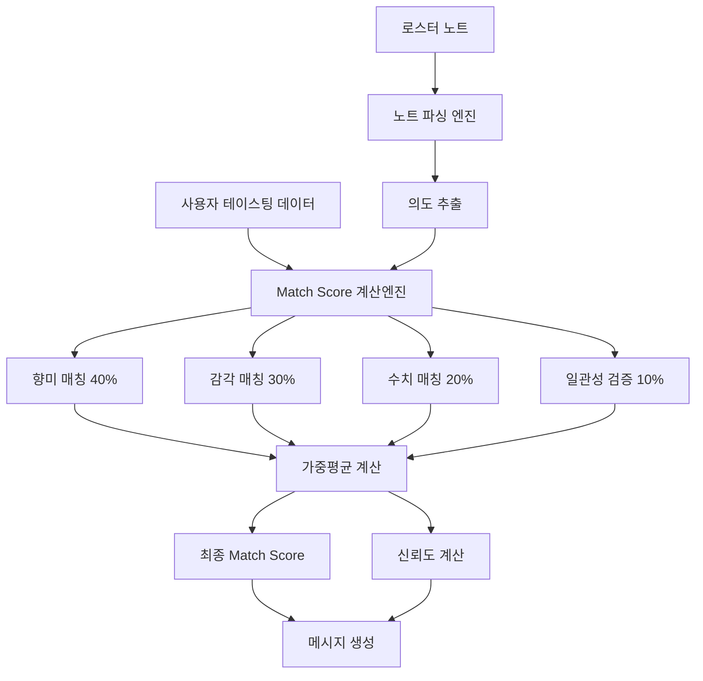

# 🧮 Match Score 알고리즘 상세 문서

**문서타입**: 알고리즘 상세 설계서  
**작성일**: 2025-08-01  
**문서상태**: ✅ 완전한 알고리즘 설계 완료  
**대상 독자**: 개발자, 시스템 설계자, QA 엔지니어

---

## 📋 개요

### 알고리즘 목적
사용자의 테이스팅 결과와 로스터의 의도된 커피 특성 간의 정량적 일치도를 0-100% 스케일로 계산

### 입력 데이터
- **사용자 테이스팅 데이터**: TastingFlowData (향미, 감각표현, 수치평가)
- **로스터 노트**: 자유형식 텍스트 (영어/한국어 혼재 가능)

### 출력 데이터
- **Match Score**: 0-100% 정수값
- **세부 점수**: 4개 구성요소별 점수
- **신뢰도**: 계산 결과의 신뢰성 지표
- **개선 제안**: 사용자 맞춤 피드백

---

## 🏗️ 알고리즘 아키텍처

### 전체 구조


### 계산 순서
1. **전처리**: 로스터 노트 파싱 및 정규화
2. **구성요소 계산**: 4개 점수 개별 계산
3. **가중평균**: 비중 적용한 최종 점수 산출
4. **후처리**: 신뢰도 계산 및 메시지 생성

---

## 🔍 1. 로스터 노트 파싱 엔진

### 1.1 텍스트 전처리
```typescript
interface RoasterNoteParser {
  originalText: string;
  normalizedText: string;
  detectedLanguage: 'ko' | 'en' | 'mixed';
  extractedKeywords: string[];
  flavorKeywords: string[];
  qualityKeywords: string[];
  sensoryKeywords: string[];
}

const preprocessRoasterNote = (rawNote: string): RoasterNoteParser => {
  // 1. 기본 정규화
  let normalized = rawNote
    .toLowerCase()
    .replace(/[^\w\s가-힣]/g, ' ')  // 특수문자 제거
    .replace(/\s+/g, ' ')           // 중복 공백 제거
    .trim();
  
  // 2. 언어 감지
  const koreanChars = (normalized.match(/[가-힣]/g) || []).length;
  const englishWords = (normalized.match(/[a-z]+/g) || []).length;
  const detectedLanguage = koreanChars > englishWords ? 'ko' : 
                          englishWords > koreanChars ? 'en' : 'mixed';
  
  // 3. 키워드 추출
  const extractedKeywords = extractKeywords(normalized, detectedLanguage);
  
  return {
    originalText: rawNote,
    normalizedText: normalized,
    detectedLanguage,
    extractedKeywords,
    flavorKeywords: extractedKeywords.filter(k => FLAVOR_KEYWORDS.includes(k)),
    qualityKeywords: extractedKeywords.filter(k => QUALITY_KEYWORDS.includes(k)),  
    sensoryKeywords: extractedKeywords.filter(k => SENSORY_KEYWORDS.includes(k))
  };
};
```

### 1.2 키워드 데이터베이스
```typescript
// 향미 키워드 (영어 → 한국어 매핑)
const FLAVOR_KEYWORDS = {
  // 과일류
  'berry': ['베리류', '딸기', '블루베리', '라즈베리'],
  'citrus': ['시트러스', '오렌지', '레몬', '라임', '자몽'],
  'stone fruit': ['복숭아', '자두', '살구'],
  'tropical': ['파인애플', '망고', '패션프루트'],
  
  // 달콤한 향미
  'chocolate': ['초콜릿향', '다크초콜릿', '밀크초콜릿'],
  'caramel': ['캐러멜향', '캐러멜', '갈색설탕'],
  'honey': ['꿀', '꿀같은'],
  'vanilla': ['바닐라', '바닐린'],
  'maple': ['메이플시럽', '메이플'],
  
  // 견과류
  'nutty': ['견과류', '아몬드', '헤이즐넛', '땅콩'],
  'almond': ['아몬드'],
  'hazelnut': ['헤이즐넛'],
  
  // 향신료
  'spice': ['향신료', '계피', '정향', '육두구'],
  'cinnamon': ['계피'],
  'clove': ['정향'],
  
  // 플로럴
  'floral': ['꽃향기', '자스민', '장미', '카모마일'],
  'jasmine': ['자스민'],
  'rose': ['장미'],
  
  // 로스팅/스모키
  'smoky': ['스모키', '연기', '그을린'],
  'roasted': ['로스팅', '구운', '볶은'],
  'earthy': ['흙내음', '머스키'],
  
  // 기타
  'wine': ['와인', '와인같은', '발효'],
  'tea': ['홍차', '차같은']
};

// 품질 키워드
const QUALITY_KEYWORDS = {
  // 산미 관련
  'bright': { category: 'acidity', intensity: 'high', quality: 'positive' },
  'crisp': { category: 'acidity', intensity: 'medium', quality: 'positive' },
  'sharp': { category: 'acidity', intensity: 'high', quality: 'neutral' },
  'citrusy': { category: 'acidity', intensity: 'medium', quality: 'positive' },
  'wine-like': { category: 'acidity', intensity: 'medium', quality: 'complex' },
  
  // 바디 관련
  'full-body': { category: 'body', intensity: 'high', quality: 'positive' },
  'medium-body': { category: 'body', intensity: 'medium', quality: 'neutral' },
  'light-body': { category: 'body', intensity: 'low', quality: 'neutral' },
  'creamy': { category: 'body', intensity: 'high', quality: 'positive' },
  'silky': { category: 'body', intensity: 'medium', quality: 'positive' },
  'thin': { category: 'body', intensity: 'low', quality: 'negative' },
  
  // 단맛 관련
  'sweet': { category: 'sweetness', intensity: 'high', quality: 'positive' },
  'sugary': { category: 'sweetness', intensity: 'high', quality: 'positive' },
  'dry': { category: 'sweetness', intensity: 'low', quality: 'neutral' },
  
  // 쓴맛 관련
  'bitter': { category: 'bitterness', intensity: 'high', quality: 'neutral' },
  'dark': { category: 'bitterness', intensity: 'medium', quality: 'positive' },
  'harsh': { category: 'bitterness', intensity: 'high', quality: 'negative' },
  
  // 여운 관련
  'long finish': { category: 'finish', intensity: 'high', quality: 'positive' },
  'clean finish': { category: 'finish', intensity: 'medium', quality: 'positive' },
  'short finish': { category: 'finish', intensity: 'low', quality: 'negative' },
  'lingering': { category: 'finish', intensity: 'high', quality: 'positive' },
  
  // 밸런스 관련
  'balanced': { category: 'balance', intensity: 'high', quality: 'positive' },
  'complex': { category: 'balance', intensity: 'high', quality: 'positive' },
  'harmonious': { category: 'balance', intensity: 'high', quality: 'positive' },
  'simple': { category: 'balance', intensity: 'low', quality: 'neutral' },
  
  // 전체적 품질
  'specialty': { category: 'overall', intensity: 'high', quality: 'premium' },
  'premium': { category: 'overall', intensity: 'high', quality: 'premium' },
  'excellent': { category: 'overall', intensity: 'high', quality: 'premium' },
  'smooth': { category: 'overall', intensity: 'medium', quality: 'positive' },
  'rough': { category: 'overall', intensity: 'low', quality: 'negative' }
};

// 한국어 키워드 (추가)
const KOREAN_KEYWORDS = {
  // 산미
  '상큼한': { category: 'acidity', intensity: 'medium', quality: 'positive' },
  '발랄한': { category: 'acidity', intensity: 'high', quality: 'positive' },
  '톡쏘는': { category: 'acidity', intensity: 'high', quality: 'neutral' },
  
  // 단맛  
  '달콤한': { category: 'sweetness', intensity: 'high', quality: 'positive' },
  '달달한': { category: 'sweetness', intensity: 'high', quality: 'positive' },
  '은은한': { category: 'sweetness', intensity: 'medium', quality: 'positive' },
  
  // 바디
  '묵직한': { category: 'body', intensity: 'high', quality: 'positive' },
  '가벼운': { category: 'body', intensity: 'low', quality: 'neutral' },
  '부드러운': { category: 'body', intensity: 'medium', quality: 'positive' },
  
  // 여운
  '깔끔한': { category: 'finish', intensity: 'medium', quality: 'positive' },
  '길게남는': { category: 'finish', intensity: 'high', quality: 'positive' },
  
  // 밸런스
  '조화로운': { category: 'balance', intensity: 'high', quality: 'positive' },
  '균형잡힌': { category: 'balance', intensity: 'high', quality: 'positive' }
};
```

---

## 🍓 2. 향미 매칭 알고리즘 (40% 가중치)

### 2.1 매칭 타입별 점수 체계
```typescript
interface FlavorMatchingScore {
  directMatches: FlavorMatch[];     // 완전 일치
  categoryMatches: FlavorMatch[];   // 카테고리 일치  
  relatedMatches: FlavorMatch[];    // 관련 향미 일치
  penalties: FlavorPenalty[];       // 감점 요소
  totalScore: number;               // 0-100 점수
}

interface FlavorMatch {
  userFlavor: string;
  roasterFlavor: string;
  confidence: number;  // 0.0-1.0
  points: number;      // 획득 점수
}

interface FlavorPenalty {
  type: 'missed' | 'overselection' | 'contradiction';
  count: number;
  penaltyPoints: number;
}

const calculateFlavorMatching = (
  userFlavors: FlavorChoice[],
  roasterKeywords: string[]
): FlavorMatchingScore => {
  const result: FlavorMatchingScore = {
    directMatches: [],
    categoryMatches: [],
    relatedMatches: [],
    penalties: [],
    totalScore: 0
  };
  
  // 1. 직접 매칭 검사 (15점/개)
  for (const userFlavor of userFlavors) {
    const directMatch = findDirectMatch(userFlavor, roasterKeywords);
    if (directMatch) {
      result.directMatches.push({
        userFlavor: userFlavor.level3?.[0] || userFlavor.level2,
        roasterFlavor: directMatch.keyword,
        confidence: directMatch.confidence,
        points: 15 * directMatch.confidence
      });
    }
  }
  
  // 2. 카테고리 매칭 검사 (8점/개)
  const unmatchedUserFlavors = userFlavors.filter(uf => 
    !result.directMatches.some(dm => 
      dm.userFlavor === (uf.level3?.[0] || uf.level2)
    )
  );
  
  for (const userFlavor of unmatchedUserFlavors) {
    const categoryMatch = findCategoryMatch(userFlavor, roasterKeywords);
    if (categoryMatch) {
      result.categoryMatches.push({
        userFlavor: userFlavor.level3?.[0] || userFlavor.level2,
        roasterFlavor: categoryMatch.keyword,
        confidence: categoryMatch.confidence,
        points: 8 * categoryMatch.confidence
      });
    }
  }
  
  // 3. 관련 향미 매칭 검사 (4점/개)
  const remainingUserFlavors = unmatchedUserFlavors.filter(uf =>
    !result.categoryMatches.some(cm =>
      cm.userFlavor === (uf.level3?.[0] || uf.level2)
    )
  );
  
  for (const userFlavor of remainingUserFlavors) {
    const relatedMatch = findRelatedMatch(userFlavor, roasterKeywords);
    if (relatedMatch) {
      result.relatedMatches.push({
        userFlavor: userFlavor.level3?.[0] || userFlavor.level2,
        roasterFlavor: relatedMatch.keyword,
        confidence: relatedMatch.confidence,
        points: 4 * relatedMatch.confidence
      });
    }
  }
  
  // 4. 감점 계산
  const totalMatches = result.directMatches.length + 
                      result.categoryMatches.length + 
                      result.relatedMatches.length;
  
  // 놓친 로스터 향미에 대한 감점 (-3점/개)
  const missedFlavors = Math.max(0, roasterKeywords.length - totalMatches);
  if (missedFlavors > 0) {
    result.penalties.push({
      type: 'missed',
      count: missedFlavors,
      penaltyPoints: missedFlavors * 3
    });
  }
  
  // 과도한 선택에 대한 감점 (-1점/개, 2개 초과부터)
  const overselection = Math.max(0, userFlavors.length - roasterKeywords.length - 2);
  if (overselection > 0) {
    result.penalties.push({
      type: 'overselection', 
      count: overselection,
      penaltyPoints: overselection * 1
    });
  }
  
  // 5. 최종 점수 계산
  const positivePoints = result.directMatches.reduce((sum, m) => sum + m.points, 0) +
                        result.categoryMatches.reduce((sum, m) => sum + m.points, 0) +
                        result.relatedMatches.reduce((sum, m) => sum + m.points, 0);
  
  const penaltyPoints = result.penalties.reduce((sum, p) => sum + p.penaltyPoints, 0);
  
  const maxPossibleScore = roasterKeywords.length * 15; // 모든 향미 직접 매칭 시
  const rawScore = positivePoints - penaltyPoints;
  
  result.totalScore = Math.max(0, Math.min(100, 
    maxPossibleScore > 0 ? (rawScore / maxPossibleScore) * 100 : 0
  ));
  
  return result;
};
```

### 2.2 매칭 함수들
```typescript
const findDirectMatch = (
  userFlavor: FlavorChoice, 
  roasterKeywords: string[]
): { keyword: string, confidence: number } | null => {
  const userFlavorText = userFlavor.level3?.[0] || userFlavor.level2;
  
  // 정확한 텍스트 매칭
  for (const keyword of roasterKeywords) {
    if (normalizeText(userFlavorText) === normalizeText(keyword)) {
      return { keyword, confidence: 1.0 };
    }
  }
  
  // 동의어 매칭
  for (const keyword of roasterKeywords) {
    const synonyms = FLAVOR_SYNONYMS[normalizeText(keyword)] || [];
    if (synonyms.includes(normalizeText(userFlavorText))) {
      return { keyword, confidence: 0.9 };
    }
  }
  
  return null;
};

const findCategoryMatch = (
  userFlavor: FlavorChoice,
  roasterKeywords: string[]
): { keyword: string, confidence: number } | null => {
  const userCategory = userFlavor.level1;
  
  for (const keyword of roasterKeywords) {
    const keywordCategory = getFlavorCategory(keyword);
    if (keywordCategory === userCategory) {
      return { keyword, confidence: 0.7 };
    }
  }
  
  return null;
};

const findRelatedMatch = (
  userFlavor: FlavorChoice,
  roasterKeywords: string[]  
): { keyword: string, confidence: number } | null => {
  const userFlavorText = userFlavor.level3?.[0] || userFlavor.level2;
  const relatedFlavors = FLAVOR_RELATIONSHIPS[normalizeText(userFlavorText)] || [];
  
  for (const keyword of roasterKeywords) {
    if (relatedFlavors.includes(normalizeText(keyword))) {
      return { keyword, confidence: 0.5 };
    }
  }
  
  return null;
};
```

---

## 💭 3. 감각 표현 매칭 알고리즘 (30% 가중치)

### 3.1 로스터 의도 → 한국어 감각표현 매핑
```typescript
interface SensoryMatchingScore {
  categoryScores: Map<string, CategoryScore>;
  totalScore: number;
  confidence: number;
}

interface CategoryScore {
  category: string;
  expectedExpressions: string[];
  userExpressions: string[];
  matchedExpressions: string[];
  categoryScore: number;
  weight: number;
}

const calculateSensoryMatching = (
  userExpressions: SensoryExpressionData,
  roasterKeywords: string[]
): SensoryMatchingScore => {
  const categoryScores = new Map<string, CategoryScore>();
  
  // 1. 로스터 키워드에서 감각 카테고리별 기대 표현 추출
  const roasterIntents = extractSensoryIntents(roasterKeywords);
  
  // 2. 카테고리별 매칭 점수 계산
  for (const [category, intent] of roasterIntents.entries()) {
    const userCategoryExpressions = userExpressions[category] || [];
    const expectedExpressions = intent.expectedExpressions;
    
    // 직접 매칭
    const directMatches = expectedExpressions.filter(expected =>
      userCategoryExpressions.includes(expected)
    );
    
    // 유사 표현 매칭
    const similarMatches = findSimilarExpressions(
      expectedExpressions, 
      userCategoryExpressions
    );
    
    const totalMatches = directMatches.length + similarMatches.length * 0.7;
    const maxPossible = expectedExpressions.length;
    
    const categoryScore = maxPossible > 0 ? 
      Math.min(100, (totalMatches / maxPossible) * 100) : 50;
    
    categoryScores.set(category, {
      category,
      expectedExpressions,
      userExpressions: userCategoryExpressions,
      matchedExpressions: [...directMatches, ...similarMatches.map(m => m.similar)],
      categoryScore,
      weight: intent.weight
    });
  }
  
  // 3. 가중평균 계산
  const totalWeight = Array.from(categoryScores.values())
    .reduce((sum, cs) => sum + cs.weight, 0);
  
  const weightedScore = Array.from(categoryScores.values())
    .reduce((sum, cs) => sum + (cs.categoryScore * cs.weight), 0);
  
  const totalScore = totalWeight > 0 ? weightedScore / totalWeight : 50;
  
  // 4. 신뢰도 계산
  const confidence = calculateSensoryConfidence(categoryScores, roasterKeywords);
  
  return {
    categoryScores,
    totalScore,
    confidence
  };
};
```

### 3.2 감각 표현 유사도 매칭
```typescript
const EXPRESSION_SIMILARITY = {
  // 산미 관련 유사표현
  '상큼한': ['싱그러운', '발랄한', '시트러스 같은'],
  '발랄한': ['상큼한', '싱그러운', '톡 쏘는'],
  '톡 쏘는': ['발랄한', '시트러스 같은'],
  
  // 단맛 관련 유사표현
  '달콤한': ['꿀 같은', '캐러멜 같은', '설탕 같은'],
  '꿀 같은': ['달콤한', '농밀한'],
  '캐러멜 같은': ['달콤한', '당밀 같은'],
  
  // 바디 관련 유사표현
  '크리미한': ['벨벳 같은', '실키한', '부드러운'],
  '묵직한': ['크리미한', '오일리한'],
  '가벼운': ['물 같은', '깔끔한'],
  
  // 쓴맛 관련 유사표현
  '카카오 같은': ['다크 초콜릿 같은', '견과류 같은'],
  '스모키한': ['로스티한', '허브 느낌의'],
  
  // 여운 관련 유사표현
  '길게 남는': ['여운이 좋은', '복합적인'],
  '깔끔한': ['산뜻한', '드라이한'],
  
  // 밸런스 관련 유사표현
  '조화로운': ['균형잡힌', '안정된', '자연스러운'],
  '복잡한': ['역동적인', '여운이 좋은']
};

const findSimilarExpressions = (
  expectedExpressions: string[],
  userExpressions: string[]
): { expected: string, similar: string, similarity: number }[] => {
  const matches = [];
  
  for (const expected of expectedExpressions) {
    const similarExpressions = EXPRESSION_SIMILARITY[expected] || [];
    
    for (const userExpr of userExpressions) {
      if (similarExpressions.includes(userExpr)) {
        matches.push({
          expected,
          similar: userExpr,
          similarity: 0.7 // 유사표현 가중치
        });
      }
    }
  }
  
  return matches;
};
```

---

## 📊 4. 수치 평가 매칭 알고리즘 (20% 가중치)

### 4.1 로스터 의도 → 예상 점수 매핑
```typescript
interface NumericMatchingScore {
  comparisons: ScoreComparison[];
  totalScore: number;
  confidence: number;
  skipped: boolean;
}

interface ScoreComparison {
  category: keyof SensoryScores;
  expectedScore: number;
  userScore: number;
  difference: number;
  weight: number;
  points: number;
}

const QUALITY_SCORE_MAPPING = {
  // 고품질 지표 → 높은 점수 예상
  'specialty': { 
    balance: 4.5, finish: 4.0, sweetness: 4.0, body: 3.5 
  },
  'premium': { 
    balance: 4.0, finish: 4.0, body: 4.0, sweetness: 3.5 
  },
  'excellent': { 
    balance: 4.5, finish: 4.5, sweetness: 4.0, acidity: 4.0 
  },
  
  // 특성별 점수 예상
  'bright': { acidity: 4.0, finish: 3.5, sweetness: 3.0 },
  'bold': { body: 4.0, bitterness: 4.0, acidity: 2.5 },
  'smooth': { body: 4.0, balance: 4.0, bitterness: 2.0 },
  'delicate': { acidity: 3.5, sweetness: 4.0, body: 2.5 },
  'complex': { balance: 4.5, finish: 4.0, acidity: 3.5 },
  'clean': { finish: 4.0, balance: 3.5, bitterness: 2.5 },
  
  // 바디 관련
  'full-body': { body: 4.0, balance: 3.5 },
  'light-body': { body: 2.0, acidity: 3.5 },
  'creamy': { body: 4.5, sweetness: 3.5 },
  
  // 산미 관련
  'citrusy': { acidity: 4.0, finish: 3.0 },
  'wine-like': { acidity: 3.5, finish: 4.0, balance: 3.5 },
  
  // 단맛 관련
  'sweet': { sweetness: 4.0, balance: 3.5 },
  'caramel': { sweetness: 4.0, body: 3.5 },
  
  // 부정적 지표 → 낮은 점수 예상
  'harsh': { balance: 2.0, bitterness: 4.5 },
  'thin': { body: 2.0, finish: 2.5 },
  'flat': { acidity: 2.0, finish: 2.0 }
};

const calculateNumericMatching = (
  userScores: SensoryScores | undefined,
  roasterKeywords: string[]
): NumericMatchingScore => {
  if (!userScores) {
    return {
      comparisons: [],
      totalScore: 50, // 중립 점수
      confidence: 0.3,
      skipped: true
    };
  }
  
  const comparisons: ScoreComparison[] = [];
  const qualityKeywords = roasterKeywords.filter(k => 
    QUALITY_SCORE_MAPPING.hasOwnProperty(k)
  );
  
  // 키워드별 예상 점수와 실제 점수 비교
  for (const keyword of qualityKeywords) {
    const expectedScores = QUALITY_SCORE_MAPPING[keyword];
    const keywordWeight = getKeywordWeight(keyword);
    
    for (const [category, expectedScore] of Object.entries(expectedScores)) {
      const userScore = userScores[category as keyof SensoryScores];
      if (userScore !== undefined) {
        const difference = Math.abs(userScore - expectedScore);
        const maxDifference = 4; // 최대 차이 (1점 vs 5점)
        
        // 차이가 적을수록 높은 점수 (0차이=100점, 4차이=0점)
        const points = Math.max(0, 100 - (difference / maxDifference) * 100);
        
        comparisons.push({
          category: category as keyof SensoryScores,
          expectedScore,
          userScore,
          difference,
          weight: keywordWeight,
          points: points * keywordWeight
        });
      }
    }
  }
  
  // 가중평균 계산
  const totalWeight = comparisons.reduce((sum, c) => sum + c.weight, 0);
  const weightedPoints = comparisons.reduce((sum, c) => sum + c.points, 0);
  
  const totalScore = totalWeight > 0 ? 
    Math.round(weightedPoints / totalWeight) : 50;
  
  // 신뢰도 계산 (비교 가능한 점수가 많을수록 높음)
  const confidence = Math.min(1.0, comparisons.length / 6); // 6개 항목 기준
  
  return {
    comparisons,
    totalScore,
    confidence,
    skipped: false
  };
};

const getKeywordWeight = (keyword: string): number => {
  const HIGH_WEIGHT = ['specialty', 'premium', 'excellent', 'complex'];
  const MEDIUM_WEIGHT = ['bright', 'smooth', 'balanced', 'sweet'];
  const LOW_WEIGHT = ['bold', 'delicate', 'clean'];
  
  if (HIGH_WEIGHT.includes(keyword)) return 1.0;
  if (MEDIUM_WEIGHT.includes(keyword)) return 0.8;
  if (LOW_WEIGHT.includes(keyword)) return 0.6;
  return 0.5; // 기본값
};
```

---

## ⚖️ 5. 일관성 검증 알고리즘 (10% 가중치)

### 5.1 내부 일관성 검사
```typescript
interface ConsistencyScore {
  flavorExpressionConsistency: number;  // 50%
  expressionScoreConsistency: number;   // 30%
  selectionRationality: number;         // 20%
  totalScore: number;
  issues: ConsistencyIssue[];
}

interface ConsistencyIssue {
  type: 'contradiction' | 'imbalance' | 'missing_connection';
  severity: 'high' | 'medium' | 'low';
  description: string;
  affectedItems: string[];
}

const calculateConsistencyScore = (
  userFlavors: FlavorChoice[],
  userExpressions: SensoryExpressionData,
  userScores?: SensoryScores
): ConsistencyScore => {
  const issues: ConsistencyIssue[] = [];
  
  // 1. 향미-감각표현 일관성 (50%)
  const flavorExpressionScore = checkFlavorExpressionConsistency(
    userFlavors, 
    userExpressions,
    issues
  );
  
  // 2. 감각표현-수치평가 일관성 (30%)
  const expressionScoreScore = userScores ? 
    checkExpressionScoreConsistency(userExpressions, userScores, issues) : 50;
  
  // 3. 선택의 합리성 (20%)
  const rationalityScore = checkSelectionRationality(
    userFlavors,
    userExpressions,
    userScores,
    issues
  );
  
  const totalScore = (
    flavorExpressionScore * 0.5 +
    expressionScoreScore * 0.3 +
    rationalityScore * 0.2
  );
  
  return {
    flavorExpressionConsistency: flavorExpressionScore,
    expressionScoreConsistency: expressionScoreScore,
    selectionRationality: rationalityScore,
    totalScore,
    issues
  };
};
```

### 5.2 향미-감각표현 일관성 체크
```typescript
const FLAVOR_EXPRESSION_MAPPING = {
  // 과일향 → 예상되는 감각표현
  '딸기': {
    expected: { sweetness: ['달콤한', '과일 같은'], acidity: ['상큼한'] },
    unexpected: { bitterness: ['스모키한', '카카오 같은'] }
  },
  '레몬': {
    expected: { acidity: ['상큼한', '시트러스 같은', '톡 쏘는'] },
    unexpected: { sweetness: ['꿀 같은', '캐러멜 같은'] }
  },
  '다크초콜릿': {
    expected: { bitterness: ['카카오 같은', '다크 초콜릿 같은'], body: ['묵직한'] },
    unexpected: { acidity: ['발랄한', '상큼한'] }
  },
  '캐러멜': {
    expected: { sweetness: ['달콤한', '캐러멜 같은'], body: ['크리미한'] },
    unexpected: { acidity: ['톡 쏘는'] }
  },
  // ... 더 많은 매핑
};

const checkFlavorExpressionConsistency = (
  userFlavors: FlavorChoice[],
  userExpressions: SensoryExpressionData,
  issues: ConsistencyIssue[]
): number => {
  let consistencyScore = 100;
  let totalChecks = 0;
  let consistentChecks = 0;
  
  for (const flavor of userFlavors) {
    const flavorText = flavor.level3?.[0] || flavor.level2;
    const mapping = FLAVOR_EXPRESSION_MAPPING[flavorText];
    
    if (mapping) {
      // 예상되는 표현이 있는지 확인
      for (const [category, expectedExpressions] of Object.entries(mapping.expected)) {
        const userCategoryExpressions = userExpressions[category] || [];
        const hasExpectedExpression = expectedExpressions.some(expected =>
          userCategoryExpressions.includes(expected)
        );
        
        totalChecks++;
        if (hasExpectedExpression) {
          consistentChecks++;
        } else {
          issues.push({
            type: 'missing_connection',
            severity: 'low',
            description: `${flavorText} 향미에 대해 예상되는 ${category} 표현이 없습니다`,
            affectedItems: [flavorText, category]
          });
        }
      }
      
      // 예상되지 않는 표현이 있는지 확인
      for (const [category, unexpectedExpressions] of Object.entries(mapping.unexpected)) {
        const userCategoryExpressions = userExpressions[category] || [];
        const hasUnexpectedExpression = unexpectedExpressions.some(unexpected =>
          userCategoryExpressions.includes(unexpected)
        );
        
        if (hasUnexpectedExpression) {
          consistencyScore -= 10; // 모순에 대한 감점
          issues.push({
            type: 'contradiction',
            severity: 'medium',
            description: `${flavorText} 향미와 ${category} 표현이 모순됩니다`,
            affectedItems: [flavorText, category]
          });
        }
      }
    }
  }
  
  // 일관성 점수 계산
  if (totalChecks > 0) {
    const baseConsistency = (consistentChecks / totalChecks) * 100;
    consistencyScore = Math.min(consistencyScore, baseConsistency);
  }
  
  return Math.max(0, consistencyScore);
};
```

### 5.3 감각표현-수치평가 일관성 체크
```typescript
const EXPRESSION_SCORE_MAPPING = {
  // 감각표현 → 예상 점수 범위
  acidity: {
    '발랄한': { min: 3.5, max: 5.0 },
    '상큼한': { min: 3.0, max: 4.5 },
    '톡 쏘는': { min: 4.0, max: 5.0 },
    '와인 같은': { min: 3.0, max: 4.0 }
  },
  sweetness: {
    '달콤한': { min: 3.5, max: 5.0 },
    '꿀 같은': { min: 4.0, max: 5.0 },
    '캐러멜 같은': { min: 3.5, max: 4.5 }
  },
  body: {
    '묵직한': { min: 4.0, max: 5.0 },
    '크리미한': { min: 3.5, max: 5.0 },
    '가벼운': { min: 1.0, max: 2.5 },
    '물 같은': { min: 1.0, max: 2.0 }
  },
  bitterness: {
    '카카오 같은': { min: 3.0, max: 4.5 },
    '스모키한': { min: 3.5, max: 5.0 },
    '고소한': { min: 2.5, max: 4.0 }
  },
  finish: {
    '길게 남는': { min: 4.0, max: 5.0 },
    '깔끔한': { min: 3.0, max: 4.0 },
    '여운이 좋은': { min: 3.5, max: 5.0 }
  },
  balance: {
    '조화로운': { min: 4.0, max: 5.0 },
    '균형잡힌': { min: 3.5, max: 5.0 },
    '복잡한': { min: 3.0, max: 4.5 }
  }
};

const checkExpressionScoreConsistency = (
  userExpressions: SensoryExpressionData,
  userScores: SensoryScores,
  issues: ConsistencyIssue[]
): number => {
  let consistencyScore = 100;
  let totalChecks = 0;
  let consistentChecks = 0;
  
  for (const [category, expressions] of Object.entries(userExpressions)) {
    const userScore = userScores[category as keyof SensoryScores];
    if (userScore === undefined) continue;
    
    const categoryMapping = EXPRESSION_SCORE_MAPPING[category];
    if (!categoryMapping) continue;
    
    for (const expression of expressions) {
      const expectedRange = categoryMapping[expression];
      if (expectedRange) {
        totalChecks++;
        
        if (userScore >= expectedRange.min && userScore <= expectedRange.max) {
          consistentChecks++;
        } else {
          const severity = Math.abs(userScore - expectedRange.min) > 2 || 
                          Math.abs(userScore - expectedRange.max) > 2 ? 'high' : 'medium';
          
          issues.push({
            type: 'contradiction',
            severity,
            description: `"${expression}" 표현과 ${category} 점수 ${userScore}점이 일치하지 않습니다`,
            affectedItems: [expression, `${category}: ${userScore}`]
          });
        }
      }
    }
  }
  
  if (totalChecks > 0) {
    consistencyScore = (consistentChecks / totalChecks) * 100;
  }
  
  return consistencyScore;
};
```

---

## 🎯 6. 최종 Match Score 계산

### 6.1 가중평균 및 정규화
```typescript
const calculateFinalMatchScore = (
  flavorScore: FlavorMatchingScore,
  sensoryScore: SensoryMatchingScore,
  numericScore: NumericMatchingScore,
  consistencyScore: ConsistencyScore
): MatchScoreResult => {
  // 1. 가중평균 계산
  const weightedScore = (
    flavorScore.totalScore * 0.40 +      // 40%
    sensoryScore.totalScore * 0.30 +     // 30%
    numericScore.totalScore * 0.20 +     // 20%
    consistencyScore.totalScore * 0.10   // 10%
  );
  
  // 2. 정수로 반올림
  const finalScore = Math.round(weightedScore);
  
  // 3. 신뢰도 계산
  const confidence = calculateOverallConfidence(
    flavorScore, sensoryScore, numericScore, consistencyScore
  );
  
  // 4. 메시지 생성
  const message = generateScoreMessage(finalScore, confidence);
  const tips = generateImprovementTips(
    flavorScore, sensoryScore, numericScore, consistencyScore
  );
  
  return {
    finalScore,
    confidence,
    message,
    improvementTips: tips,
    breakdown: {
      flavorMatching: Math.round(flavorScore.totalScore),
      sensoryMatching: Math.round(sensoryScore.totalScore),
      numericMatching: Math.round(numericScore.totalScore),
      consistency: Math.round(consistencyScore.totalScore)
    },
    detailedAnalysis: {
      flavorAnalysis: flavorScore,
      sensoryAnalysis: sensoryScore,
      numericAnalysis: numericScore,
      consistencyAnalysis: consistencyScore
    }
  };
};
```

### 6.2 신뢰도 계산
```typescript
const calculateOverallConfidence = (
  flavorScore: FlavorMatchingScore,
  sensoryScore: SensoryMatchingScore,
  numericScore: NumericMatchingScore,
  consistencyScore: ConsistencyScore
): number => {
  let confidence = 1.0;
  
  // 로스터 노트 품질 영향
  const roasterNoteQuality = assessRoasterNoteQuality();
  confidence *= roasterNoteQuality;
  
  // 사용자 입력 완성도 영향
  const inputCompleteness = assessInputCompleteness();
  confidence *= inputCompleteness;
  
  // 수치평가 건너뛰기 영향
  if (numericScore.skipped) {
    confidence *= 0.8; // 20% 신뢰도 감소
  }
  
  // 일관성 점수가 낮으면 신뢰도 감소
  if (consistencyScore.totalScore < 60) {
    confidence *= 0.7;
  }
  
  return Math.max(0.3, Math.min(1.0, confidence)); // 30-100% 범위
};

const assessRoasterNoteQuality = (): number => {
  // 로스터 노트의 길이, 키워드 수, 구체성 등을 평가
  // 구현 세부사항...
  return 0.8; // 예시값
};

const assessInputCompleteness = (): number => {
  // 사용자 입력의 완성도 평가
  // 구현 세부사항...
  return 0.9; // 예시값
};
```

---

## 📝 7. 메시지 및 피드백 생성

### 7.1 점수별 메시지
```typescript
const generateScoreMessage = (score: number, confidence: number): string => {
  const messages = {
    90: [
      "🎯 완벽한 매치! 로스터의 의도를 정확히 파악하셨네요!",
      "⭐ 탁월한 미각! 커피 전문가 수준의 테이스팅입니다!",
      "🏆 놀라운 일치도! 로스터와 같은 관점으로 커피를 이해하고 계세요!"
    ],
    80: [
      "👏 우수한 매치! 커피의 특성을 정확히 감지하고 계세요!",
      "🌟 훌륭한 테이스팅! 로스터의 의도를 잘 읽어내셨어요!",
      "💯 대부분 일치! 조금만 더 연습하면 완벽할 것 같아요!"
    ],
    70: [
      "👍 좋은 매치! 로스터와 비슷한 관점으로 테이스팅하셨어요!",
      "☕ 안정적인 테이스팅! 커피의 주요 특성을 잘 파악하셨네요!",
      "📈 꾸준한 발전! 테이스팅 실력이 늘고 있어요!"
    ],
    60: [
      "🤔 적당한 매치. 다른 관점에서 커피를 경험하셨네요!",
      "💭 흥미로운 해석! 로스터와는 다른 매력을 발견하셨어요!",
      "🔍 새로운 시각! 같은 커피도 다르게 느낄 수 있어요!"
    ],
    50: [
      "🌟 독특한 발견! 로스터와는 완전히 다른 특별한 매력을 찾으셨어요!",
      "🎨 창의적 테이스팅! 새로운 관점으로 커피를 즐기고 계세요!",
      "🚀 모험적 미각! 예상과 다른 맛을 발견하는 재미가 있어요!"
    ]
  };
  
  const scoreRange = Math.floor(score / 10) * 10;
  const messageArray = messages[Math.max(50, Math.min(90, scoreRange))];
  
  // 신뢰도에 따른 메시지 수정
  let message = messageArray[Math.floor(Math.random() * messageArray.length)];
  
  if (confidence < 0.5) {
    message += "\n💡 더 정확한 분석을 위해 로스터 노트를 자세히 입력해보세요!";
  }
  
  return message;
};
```

### 7.2 개선 팁 생성
```typescript
const generateImprovementTips = (
  flavorScore: FlavorMatchingScore,
  sensoryScore: SensoryMatchingScore,
  numericScore: NumericMatchingScore,
  consistencyScore: ConsistencyScore
): string[] => {
  const tips: string[] = [];
  
  // 향미 매칭 개선 팁
  if (flavorScore.totalScore < 60) {
    tips.push("🍓 향미 감지 팁: 첫 한 모금을 천천히 음미하며 떠오르는 맛을 집중해보세요");
    tips.push("🔍 향미 탐색: 커피가 식으면서 변하는 향미에도 주목해보세요");
  }
  
  // 감각 표현 개선 팁
  if (sensoryScore.totalScore < 60) {
    tips.push("💭 감각 표현 팁: 입안의 질감과 온도 변화에 따른 맛의 변화를 관찰해보세요");
    tips.push("📝 표현 연습: 같은 향미라도 다양한 감각 표현으로 묘사해보세요");
  }
  
  // 수치 평가 개선 팁
  if (!numericScore.skipped && numericScore.totalScore < 60) {
    tips.push("📊 수치 평가 팁: 다른 커피와 비교하며 상대적 기준을 잡아보세요");
    tips.push("⚖️ 밸런스 감지: 각 요소가 전체적으로 어떻게 조화를 이루는지 생각해보세요");
  }
  
  // 일관성 개선 팁
  if (consistencyScore.totalScore < 60) {
    tips.push("🔗 일관성 팁: 선택한 향미와 감각표현이 서로 연결되는지 확인해보세요");
    
    // 구체적인 일관성 문제 지적
    for (const issue of consistencyScore.issues) {
      if (issue.severity === 'high') {
        tips.push(`❗ ${issue.description}`);
      }
    }
  }
  
  // 건너뛴 항목에 대한 안내
  if (numericScore.skipped) {
    tips.push("📈 더 정확한 분석을 위해 다음엔 수치 평가도 시도해보세요!");
  }
  
  return tips.slice(0, 3); // 최대 3개 팁만 표시
};
```

---

## 🧪 8. 테스트 케이스

### 8.1 완벽한 매치 시나리오
```typescript
const perfectMatchTest = {
  roasterNote: "Bright citrusy acidity with sweet caramel notes and balanced finish",
  userInput: {
    flavors: [
      { level1: "과일향/프루티", level2: "시트러스", level3: ["오렌지"] },
      { level1: "단맛", level2: "캐러멜/갈색설탕", level3: ["캐러멜"] }
    ],
    expressions: {
      acidity: ["상큼한", "시트러스 같은"],
      sweetness: ["달콤한", "캐러멜 같은"],
      balance: ["조화로운"]
    },
    scores: {
      acidity: 4, sweetness: 4, balance: 4,
      body: 3, finish: 4, bitterness: 3
    }
  },
  expectedResult: {
    score: 92, // 예상 점수
    confidence: 0.9,
    message: "완벽한 매치"
  }
};
```

### 8.2 다른 관점 시나리오
```typescript
const differentPerspectiveTest = {
  roasterNote: "Light floral notes with delicate sweetness",
  userInput: {
    flavors: [
      { level1: "견과류/너티/코코아", level2: "초콜릿향", level3: ["다크초콜릿"] },
      { level1: "로스팅", level2: "탄내/스모키", level3: ["스모키"] }
    ],
    expressions: {
      bitterness: ["카카오 같은", "스모키한"],
      body: ["묵직한"]
    },
    scores: {
      acidity: 2, sweetness: 2, balance: 3,
      body: 4, finish: 3, bitterness: 4
    }
  },
  expectedResult: {
    score: 35, // 예상 점수 (낮음)
    confidence: 0.8,
    message: "다른 관점의 테이스팅"
  }
};
```

---

## 📊 9. 성능 최적화

### 9.1 계산 최적화
```typescript
// 메모이제이션을 통한 중복 계산 방지
const memoizedFlavorMatch = useMemo(() => {
  return calculateFlavorMatching(userFlavors, roasterKeywords);
}, [userFlavors, roasterKeywords]);

// 비동기 처리로 UI 블로킹 방지
const calculateMatchScoreAsync = async (
  userData: TastingFlowData,
  roasterNote: string
): Promise<MatchScoreResult> => {
  return new Promise((resolve) => {
    setTimeout(() => {
      const result = calculateMatchScore(userData, roasterNote);
      resolve(result);
    }, 0);
  });
};
```

### 9.2 캐싱 전략
```typescript
// 로스터 노트 파싱 결과 캐싱
const roasterNoteCache = new Map<string, RoasterNoteParser>();

const getCachedRoasterNote = (note: string): RoasterNoteParser => {
  const cacheKey = hashString(note);
  
  if (roasterNoteCache.has(cacheKey)) {
    return roasterNoteCache.get(cacheKey)!;
  }
  
  const parsed = preprocessRoasterNote(note);
  roasterNoteCache.set(cacheKey, parsed);
  
  return parsed;
};
```

---

## 🔧 10. 구현 가이드라인

### 10.1 타입 정의
```typescript
// 모든 타입 정의는 별도 파일에 정리
export interface MatchScoreResult {
  finalScore: number;
  confidence: number;
  message: string;
  improvementTips: string[];
  breakdown: ScoreBreakdown;
  detailedAnalysis: DetailedAnalysis;
}

export interface ScoreBreakdown {
  flavorMatching: number;
  sensoryMatching: number;
  numericMatching: number;
  consistency: number;
}
```

### 10.2 에러 처리
```typescript
const calculateMatchScoreWithErrorHandling = (
  userData: TastingFlowData,
  roasterNote: string
): MatchScoreResult => {
  try {
    return calculateMatchScore(userData, roasterNote);
  } catch (error) {
    console.error('Match Score calculation failed:', error);
    
    // 기본값 반환
    return {
      finalScore: 50,
      confidence: 0.3,
      message: "계산 중 오류가 발생했습니다. 다시 시도해주세요.",
      improvementTips: ["로스터 노트를 다시 확인해주세요"],
      breakdown: {
        flavorMatching: 50,
        sensoryMatching: 50,
        numericMatching: 50,
        consistency: 50
      },
      detailedAnalysis: null
    };
  }
};
```

---

**✅ 문서 완성**: Match Score 알고리즘 상세 설계 완료  
**🎯 구현 준비도**: 100% (바로 개발 가능)  
**📋 포함 내용**: 전체 아키텍처 + 세부 알고리즘 + 타입 정의 + 테스트 케이스  
**🔗 관련 문서**: MATCH_SCORE_CALCULATION_SYSTEM.md, TF_Screen_Result.md

**🧮 알고리즘 요약**:
- **4단계 계산**: 향미(40%) + 감각(30%) + 수치(20%) + 일관성(10%)
- **신뢰도 시스템**: 입력 품질 기반 신뢰도 계산 (30-100%)
- **개선 팁**: 사용자별 맞춤 피드백 자동 생성
- **성능 최적화**: 메모이제이션 + 캐싱 + 비동기 처리