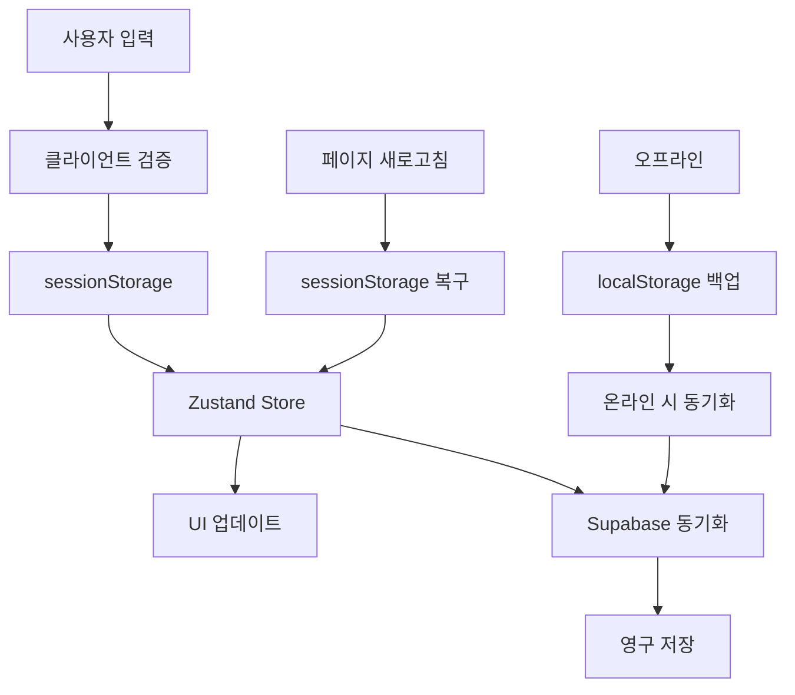

# 데이터 흐름

## 🌊 전체 데이터 아키텍처

TastingFlow는 다층 데이터 저장과 실시간 동기화를 통해 안정적이고 빠른 사용자 경험을 제공합니다.

### 데이터 흐름 개요



## 📊 데이터 구조

### 통합 데이터 타입 (v1.0.0-rc 기준)

```typescript
// src/types/coffee.ts
export type CoffeeMode = 'cafe' | 'homecafe' | 'pro'

export interface CoffeeRecord {
  id?: string
  user_id?: string
  created_at?: string
  
  // 공통 기본 정보
  mode: CoffeeMode
  coffee_name: string
  roastery?: string
  date: string
  
  // 모드별 특화 데이터
  cafe_data?: CafeData
  homecafe_data?: HomeCafeData
  pro_data?: ProData
  
  // 공통 평가 데이터
  flavor_data?: FlavorData
  sensory_expression?: SensoryExpression
  personal_notes?: PersonalNotes
  roaster_notes?: string
  
  // 메타데이터
  match_score?: number
  completed_at?: string
}

// Cafe Mode 데이터
export interface CafeData {
  cafe_name: string
  temperature: 'hot' | 'iced'
  rating?: number
  quick_tags?: string[]
}

// HomeCafe Mode 데이터
export interface HomeCafeData {
  dripper: 'v60' | 'kalita' | 'origami' | 'april'
  recipe: {
    coffee_amount: number  // g
    water_amount: number   // ml
    ratio: number         // 1:15, 1:16 등
    water_temp: number    // °C
    brew_time?: number    // 초
    lap_times?: number[]  // 랩타임 배열
  }
  quick_notes?: string
}

// Pro Mode 데이터
export interface ProData {
  // SCA 표준 측정
  tds?: number              // %
  extraction_yield?: number // %
  sca_score?: number        // 1-5
  
  // 원산지 상세 정보
  farm_name?: string
  region?: string
  altitude?: number
  variety?: string
  process?: string
  roast_date?: string
  
  // 추출 프로토콜
  grind_size?: number       // 1-10
  water_quality?: {
    tds_ppm: number
    ph: number
  }
  brewing_notes?: string
}

// 공통 평가 데이터
export interface FlavorData {
  selected_flavors: string[]
}

export interface SensoryExpression {
  acidity?: string[]
  sweetness?: string[]
  bitterness?: string[]
  body?: string[]
  aftertaste?: string[]
  balance?: string[]
}

export interface PersonalNotes {
  quick_tags?: string[]
  free_text?: string
}
```

## 🔄 상태 관리 (Zustand + Context)

### 메인 스토어 구조

```typescript
// src/stores/useCoffeeRecordStore.ts
interface CoffeeRecordStore {
  // 현재 세션 데이터
  currentSession: Partial<CoffeeRecord>
  
  // UI 상태
  currentStep: number
  isLoading: boolean
  errors: Record<string, string>
  
  // 액션들
  initializeSession: (mode: CoffeeMode) => void
  updateStep1: (data: Partial<CoffeeRecord>) => void
  updateStep2: (data: Partial<CoffeeRecord>) => void
  updateStep3: (data: Partial<CoffeeRecord>) => void
  updateStep4: (data: Partial<CoffeeRecord>) => void
  
  // 저장 및 로드
  saveToSession: () => void
  loadFromSession: () => void
  saveToSupabase: () => Promise<void>
  
  // 유틸리티
  validateCurrentStep: () => boolean
  calculateProgress: () => number
  reset: () => void
}

export const useCoffeeRecordStore = create<CoffeeRecordStore>()(
  devtools(
    persist(
      (set, get) => ({
        currentSession: {},
        currentStep: 1,
        isLoading: false,
        errors: {},

        initializeSession: (mode) => {
          const session: Partial<CoffeeRecord> = {
            mode,
            date: new Date().toISOString().split('T')[0],
            created_at: new Date().toISOString()
          }
          
          set({ currentSession: session, currentStep: 1 })
          
          // sessionStorage에 저장
          sessionStorage.setItem('coffee-record-session', JSON.stringify(session))
        },

        updateStep1: (data) => {
          const updated = { ...get().currentSession, ...data }
          set({ currentSession: updated })
          get().saveToSession()
        },

        updateStep2: (data) => {
          const current = get().currentSession
          const updated = {
            ...current,
            ...data,
            // 모드별 데이터 병합
            [`${current.mode}_data`]: {
              ...current[`${current.mode}_data` as keyof CoffeeRecord],
              ...data[`${current.mode}_data` as keyof typeof data]
            }
          }
          set({ currentSession: updated })
          get().saveToSession()
        },

        saveToSession: () => {
          const session = get().currentSession
          sessionStorage.setItem('coffee-record-session', JSON.stringify(session))
        },

        loadFromSession: () => {
          const stored = sessionStorage.getItem('coffee-record-session')
          if (stored) {
            const session = JSON.parse(stored)
            set({ currentSession: session })
          }
        },

        saveToSupabase: async () => {
          const session = get().currentSession
          set({ isLoading: true })
          
          try {
            const { data, error } = await supabase
              .from('coffee_records')
              .insert([{
                ...session,
                user_id: (await supabase.auth.getUser()).data.user?.id,
                completed_at: new Date().toISOString()
              }])
            
            if (error) throw error
            
            // 성공 시 세션 클리어
            sessionStorage.removeItem('coffee-record-session')
            set({ currentSession: {}, currentStep: 1 })
            
          } catch (error) {
            console.error('Supabase save error:', error)
            // 오프라인 백업
            const backup = localStorage.getItem('coffee-records-backup') || '[]'
            const records = JSON.parse(backup)
            records.push(session)
            localStorage.setItem('coffee-records-backup', JSON.stringify(records))
          } finally {
            set({ isLoading: false })
          }
        }
      }),
      {
        name: 'coffee-record-storage',
        // sessionStorage 대신 localStorage에 일부 데이터만 영구 저장
        partialize: (state) => ({
          // 민감하지 않은 설정만 저장
          lastMode: state.currentSession.mode
        })
      }
    )
  )
)
```

## 💾 저장 계층 전략

### 1. 세션 스토리지 (임시 저장)

```typescript
// utils/sessionManager.ts
export class SessionManager {
  private static readonly SESSION_KEY = 'coffee-record-session'
  
  static save(data: Partial<CoffeeRecord>): void {
    try {
      const serialized = JSON.stringify(data)
      sessionStorage.setItem(this.SESSION_KEY, serialized)
    } catch (error) {
      console.warn('Session save failed:', error)
    }
  }
  
  static load(): Partial<CoffeeRecord> | null {
    try {
      const stored = sessionStorage.getItem(this.SESSION_KEY)
      return stored ? JSON.parse(stored) : null
    } catch (error) {
      console.warn('Session load failed:', error)
      return null
    }
  }
  
  static clear(): void {
    sessionStorage.removeItem(this.SESSION_KEY)
  }
  
  static exists(): boolean {
    return sessionStorage.getItem(this.SESSION_KEY) !== null
  }
}
```

### 2. 로컬 스토리지 (오프라인 백업)

```typescript
// utils/offlineManager.ts
export class OfflineManager {
  private static readonly BACKUP_KEY = 'coffee-records-backup'
  private static readonly SETTINGS_KEY = 'coffee-record-settings'
  
  static saveBackup(record: CoffeeRecord): void {
    try {
      const existing = this.getBackups()
      existing.push({
        ...record,
        _offline_timestamp: Date.now(),
        _sync_status: 'pending'
      })
      localStorage.setItem(this.BACKUP_KEY, JSON.stringify(existing))
    } catch (error) {
      console.warn('Offline backup failed:', error)
    }
  }
  
  static getBackups(): Array<CoffeeRecord & { 
    _offline_timestamp: number,
    _sync_status: 'pending' | 'synced' | 'failed'
  }> {
    try {
      const stored = localStorage.getItem(this.BACKUP_KEY)
      return stored ? JSON.parse(stored) : []
    } catch {
      return []
    }
  }
  
  static async syncBackups(): Promise<void> {
    const backups = this.getBackups()
    const pending = backups.filter(r => r._sync_status === 'pending')
    
    for (const record of pending) {
      try {
        await supabase.from('coffee_records').insert([{
          ...record,
          user_id: (await supabase.auth.getUser()).data.user?.id
        }])
        
        // 성공 시 상태 업데이트
        record._sync_status = 'synced'
      } catch (error) {
        record._sync_status = 'failed'
        console.warn('Sync failed for record:', record.id, error)
      }
    }
    
    localStorage.setItem(this.BACKUP_KEY, JSON.stringify(backups))
  }
  
  static saveSettings(settings: Record<string, any>): void {
    localStorage.setItem(this.SETTINGS_KEY, JSON.stringify(settings))
  }
  
  static getSettings(): Record<string, any> {
    try {
      const stored = localStorage.getItem(this.SETTINGS_KEY)
      return stored ? JSON.parse(stored) : {}
    } catch {
      return {}
    }
  }
}
```

### 3. Supabase (영구 저장)

```typescript
// lib/supabase/coffeeRecords.ts
export class CoffeeRecordsService {
  static async create(record: Omit<CoffeeRecord, 'id' | 'created_at'>): Promise<CoffeeRecord> {
    const { data, error } = await supabase
      .from('coffee_records')
      .insert([{
        ...record,
        created_at: new Date().toISOString()
      }])
      .select()
      .single()
    
    if (error) throw new Error(`Failed to create record: ${error.message}`)
    return data
  }
  
  static async getByUserId(userId: string): Promise<CoffeeRecord[]> {
    const { data, error } = await supabase
      .from('coffee_records')
      .select('*')
      .eq('user_id', userId)
      .order('created_at', { ascending: false })
    
    if (error) throw new Error(`Failed to fetch records: ${error.message}`)
    return data || []
  }
  
  static async update(id: string, updates: Partial<CoffeeRecord>): Promise<CoffeeRecord> {
    const { data, error } = await supabase
      .from('coffee_records')
      .update(updates)
      .eq('id', id)
      .select()
      .single()
    
    if (error) throw new Error(`Failed to update record: ${error.message}`)
    return data
  }
  
  static async delete(id: string): Promise<void> {
    const { error } = await supabase
      .from('coffee_records')
      .delete()
      .eq('id', id)
    
    if (error) throw new Error(`Failed to delete record: ${error.message}`)
  }
}
```

## 🔄 실시간 동기화

### 온라인/오프라인 감지

```typescript
// hooks/useNetworkStatus.ts
export function useNetworkStatus() {
  const [isOnline, setIsOnline] = useState(navigator.onLine)
  const [wasOffline, setWasOffline] = useState(false)
  
  useEffect(() => {
    const handleOnline = () => {
      setIsOnline(true)
      if (wasOffline) {
        // 오프라인에서 복구된 경우 동기화 실행
        OfflineManager.syncBackups()
        setWasOffline(false)
      }
    }
    
    const handleOffline = () => {
      setIsOnline(false)
      setWasOffline(true)
    }
    
    window.addEventListener('online', handleOnline)
    window.addEventListener('offline', handleOffline)
    
    return () => {
      window.removeEventListener('online', handleOnline)
      window.removeEventListener('offline', handleOffline)
    }
  }, [wasOffline])
  
  return { isOnline, wasOffline }
}
```

### 자동 저장 기능

```typescript
// hooks/useAutoSave.ts
export function useAutoSave(data: Partial<CoffeeRecord>, delay = 1000) {
  const debouncedData = useDebounce(data, delay)
  
  useEffect(() => {
    if (Object.keys(debouncedData).length > 0) {
      SessionManager.save(debouncedData)
    }
  }, [debouncedData])
}
```

## 📈 데이터 최적화

### 지연 로딩 전략

```typescript
// hooks/useCoffeeRecords.ts
export function useCoffeeRecords() {
  const [records, setRecords] = useState<CoffeeRecord[]>([])
  const [loading, setLoading] = useState(true)
  const [hasMore, setHasMore] = useState(true)
  
  const loadRecords = useCallback(async (offset = 0, limit = 20) => {
    try {
      const { data } = await supabase
        .from('coffee_records')
        .select('*')
        .range(offset, offset + limit - 1)
        .order('created_at', { ascending: false })
      
      if (offset === 0) {
        setRecords(data || [])
      } else {
        setRecords(prev => [...prev, ...(data || [])])
      }
      
      setHasMore((data?.length || 0) === limit)
    } catch (error) {
      console.error('Load records error:', error)
    } finally {
      setLoading(false)
    }
  }, [])
  
  return { records, loading, hasMore, loadRecords }
}
```

### 캐싱 전략

```typescript
// utils/cacheManager.ts
export class CacheManager {
  private static cache = new Map<string, { data: any, timestamp: number }>()
  private static readonly TTL = 5 * 60 * 1000 // 5분
  
  static set(key: string, data: any): void {
    this.cache.set(key, {
      data,
      timestamp: Date.now()
    })
  }
  
  static get(key: string): any | null {
    const cached = this.cache.get(key)
    
    if (!cached) return null
    
    if (Date.now() - cached.timestamp > this.TTL) {
      this.cache.delete(key)
      return null
    }
    
    return cached.data
  }
  
  static clear(): void {
    this.cache.clear()
  }
}
```

---

**📅 문서 생성**: 2025-07-31  
**버전**: v1.0.0-rc  
**데이터 구조**: 최신 7/29-7/31 체크포인트 반영