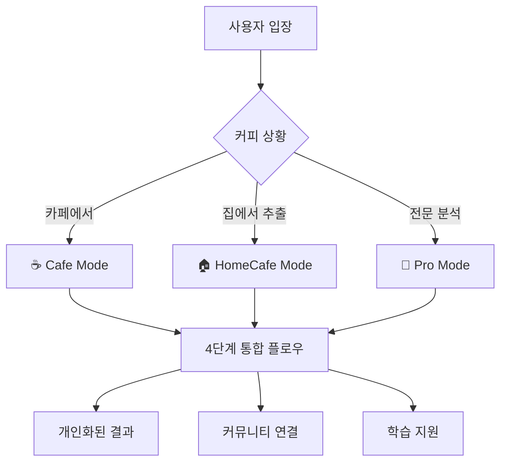

# TastingFlow 시스템 전체 개요

## 🎯 비전과 철학

### 핵심 비전
> "누구나 전문가처럼, 그러나 자기만의 방식으로 커피를 기록하고 나눌 수 있는 공간"

### 설계 철학

#### 1. 개인화된 언어 존중
- **전문가 표현** vs **일상적 표현**: 사용자가 편한 언어로 기록
- **문화적 맥락**: 한국적 커피 표현과 감각 용어 중시
- **학습 지원**: 전문 용어와 일상 표현 연결

#### 2. 상황별 맞춤 경험
- **카페**: 빠르고 간편한 기록
- **홈카페**: 레시피와 맛의 연결
- **프로**: 전문적 분석과 품질 관리

#### 3. 성장 중심 설계
- **점진적 학습**: 초보자에서 전문가로 자연스러운 발전
- **피드백 기반**: 기록을 통한 감각 향상
- **커뮤니티 연결**: 경험 공유와 상호 학습

## 🏗️ 시스템 아키텍처

### 모드 기반 아키텍처



### 계층적 복잡성 관리

| 레벨 | 대상 | 특징 | 소요시간 |
|------|------|------|----------|
| **Level 1** | 커피 입문자 | 기본적인 맛 기록 | 3-5분 |
| **Level 2** | 홈브루어 | 추출 + 맛 연결 | 5-8분 |
| **Level 3** | 전문가 | 분석적 평가 | 8-12분 |

## 📱 사용자 경험 설계

### UX 설계 원칙

#### 1. Progressive Disclosure
```
간단한 시작 → 점진적 상세화 → 전문적 깊이
    ↓              ↓              ↓
  필수만        선택사항      고급옵션
```

#### 2. Contextual Guidance
- **상황별 도움말**: 각 단계에서 적절한 가이드 제공
- **스마트 추천**: 이전 기록 기반 제안
- **에러 방지**: 입력 검증과 친화적 피드백

#### 3. Emotional Connection
- **격려 중심**: 낮은 점수도 성장 기회로 표현
- **성취감**: 배지, 레벨, 누적 통계
- **개인성**: 나만의 커피 여정 스토리

### 인터랙션 패턴

#### 입력 방식
- **터치 최적화**: 44px 이상 터치 타겟
- **직관적 제스처**: 스와이프, 탭, 롱프레스
- **키보드 친화적**: 접근성 고려

#### 피드백 시스템
- **즉시 반응**: 선택 시 시각적 확인
- **진행 표시**: 명확한 단계별 진행률
- **상황 인식**: 현재 위치와 다음 단계 안내

## 🔄 데이터 생명주기

### 데이터 흐름 아키텍처

```
사용자 입력 → 실시간 검증 → 세션 저장 → 분석 처리 → 영구 저장
     ↓              ↓              ↓              ↓              ↓
  UI 컴포넌트    클라이언트 검증   sessionStorage   Match Score    Supabase
```

### 저장 전략

#### 1. 다층 저장
- **세션 레벨**: sessionStorage (임시, 빠른 복구)
- **로컬 레벨**: localStorage (개인 설정, 오프라인)
- **클라우드 레벨**: Supabase (영구, 동기화)

#### 2. 데이터 최적화
- **점진적 저장**: 단계별 자동 저장
- **압축 전송**: 필요시 데이터 압축
- **캐싱 전략**: 자주 사용하는 데이터 캐시

## 🎨 모드별 차별화 전략

### Cafe Mode: 간편성 중심
```yaml
설계 목표: "3분 안에 핵심만"
핵심 기능:
  - 원터치 기록
  - 스마트 기본값
  - 건너뛰기 허용
UI 특징:
  - 큰 버튼
  - 적은 선택지
  - 명확한 진행률
```

### HomeCafe Mode: 레시피 연결
```yaml
설계 목표: "추출과 맛의 연결"
핵심 기능:
  - 레시피 관리
  - 실시간 계산
  - 타이머 기능
UI 특징:
  - 다이얼 컨트롤
  - 실시간 피드백
  - 저장/불러오기
```

### Pro Mode: 전문성 지원
```yaml
설계 목표: "SCA 표준 준수"
핵심 기능:
  - 정밀 측정
  - QC 리포트
  - 데이터 내보내기
UI 특징:
  - 정밀 입력
  - 상태 표시
  - 전문 용어
```

## 📊 성과 측정 시스템

### KPI 체계

#### 사용자 참여도
- **완료율**: 시작 대비 완료 비율
- **재방문률**: 주간/월간 재사용률
- **깊이**: 단계별 이탈률 분석

#### 학습 효과
- **성장 지표**: 시간에 따른 기록 품질 향상
- **어휘 확장**: 사용하는 표현의 다양성
- **정확도**: Match Score 일관성

#### 커뮤니티 연결
- **공유율**: 기록 공유 빈도
- **참여도**: 다른 사용자 기록 열람
- **기여도**: 커뮤니티 데이터 기여

### 피드백 루프

```
사용자 행동 → 데이터 수집 → 분석 처리 → 개선 제안 → 사용자 경험 향상
     ↑                                                           ↓
     ←───────────── 개인화된 추천 및 가이드 ←─────────────────────
```

## 🔮 미래 비전

### v2.0 로드맵
- **AI 큐레이션**: 개인 취향 기반 커피 추천
- **소셜 기능**: 실시간 커뮤니티 커핑
- **확장 생태계**: 카페/로스터리 파트너십

### 장기 목표
- **글로벌 표준**: 국제적 커피 기록 플랫폼
- **교육 도구**: 커피 전문가 양성 지원
- **산업 연결**: 커피 업계 디지털 전환 촉진

---

**📅 문서 생성**: 2025-07-31  
**버전**: v1.0.0-rc  
**작성자**: Claude Code SuperClaude Framework