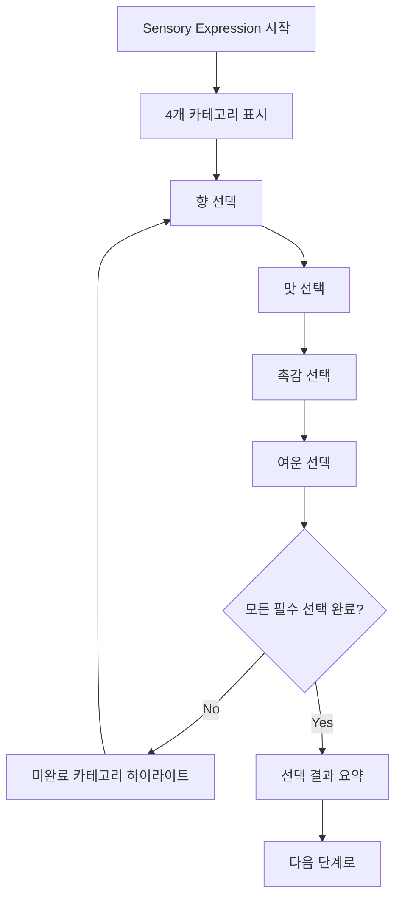

# Sensory Expression Screen (Step3)

## 🎯 화면 개요

커피의 감각적 경험을 표현하는 화면입니다. 모드별로 접근 방식이 다르지만, 핵심은 사용자의 주관적 감각을 구체적 언어로 표현하는 것입니다.

### 화면 위치
- **라우팅**: `/record/step3`
- **진행률**: 75% (3/4)
- **이전 화면**: Taste Evaluation (Step2)
- **다음 화면**: Personal Notes & Result (Step4)

## 🧠 감각 표현 철학

### 7/29 체크포인트 기반 설계 원칙

#### 감각 카테고리 단순화 (6개 → 4개)
```yaml
Before (복잡함):
  - 향 (Aroma)
  - 맛 (Taste) 
  - 촉각 (Mouthfeel)
  - 뒷맛 (Aftertaste)
  - 균형감 (Balance)
  - 전체적 느낌 (Overall)

After (단순화됨):
  - 🌸 향 (Aroma): "첫인상의 향기"
  - 👅 맛 (Flavor): "입안에서 느끼는 맛"
  - 🤲 촉감 (Body): "입안의 무게감과 질감"
  - 💫 여운 (Finish): "삼킨 후 남는 느낌"
```

#### 표현 방식의 이중화
```yaml
Dual Expression System:
  전문가 모드:
    - SCA 표준 용어
    - 객관적 디스크립터
    - 점수 기반 평가
  
  일반인 모드:
    - 일상적 표현
    - 감정적 연결
    - 직관적 선택
    
  연결 시스템:
    - "달콤한" ↔ "Sweet"
    - "시원한" ↔ "Bright/Clean"
    - "부드러운" ↔ "Smooth"
```

## 🎨 모드별 화면 구성

### ☕ Cafe Mode: 직관적 감각 표현

#### 체크포인트 반영 - 감정적 연결 중심
```yaml
Screen Philosophy:
  - "어떤 느낌이었나요?" 접근
  - 복잡한 용어 대신 일상 언어
  - 빠른 선택 (30초 목표)

Content Structure:
  향 (첫인상):
    - 달콤한 향, 고소한 향, 꽃향기, 과일향기
    - 새콤한 향, 스모키한 향, 흙내음, 상큼한 향
  
  맛 (입안에서):
    - 달콤함, 쓴맛, 신맛, 짠맛
    - 고소함, 깔끔함, 진함, 가벼움
  
  촉감 (질감):
    - 부드러움, 거칠음, 무거움, 가벼움
    - 크리미함, 산뜻함, 끈적함, 드라이함
  
  여운 (뒷맛):
    - 깔끔한 끝, 긴 여운, 단 여운, 쓴 여운
    - 상쾌한 끝, 따뜻한 끝, 시원한 끝
```

#### Cafe Mode UI 패턴
```typescript
interface CafeModeStep3 {
  sensory_expression: {
    aroma: string[]           // 최대 3개 선택
    flavor: string[]          // 최대 4개 선택  
    body: string[]            // 최대 2개 선택
    finish: string[]          // 최대 2개 선택
  }
  emotional_connection?: {
    mood: 'happy' | 'calm' | 'energetic' | 'cozy' | 'focused'
    situation: string         // "친구와 대화하며", "혼자 책 읽으며"
  }
}

// 일상 언어 디스크립터
const CAFE_DESCRIPTORS = {
  aroma: {
    category: '첫인상 향기',
    icon: '🌸',
    options: [
      { id: 'sweet_aroma', label: '달콤한 향', description: '설탕이나 꿀 같은' },
      { id: 'nutty_aroma', label: '고소한 향', description: '견과류 같은' },
      { id: 'floral', label: '꽃향기', description: '장미나 자스민 같은' },
      { id: 'fruity_aroma', label: '과일향기', description: '사과나 오렌지 같은' },
      { id: 'fresh', label: '상큼한 향', description: '레몬이나 민트 같은' },
      { id: 'smoky', label: '스모키한 향', description: '구운 냄새' },
      { id: 'earthy', label: '흙내음', description: '자연스러운 흙 냄새' },
      { id: 'roasted', label: '구운 향', description: '토스트나 견과류' }
    ]
  },
  // ... 다른 카테고리들
}
```

### 🏠 HomeCafe Mode: 레시피 연결 표현

#### 추출 방법과 감각의 연결
```yaml
Screen Philosophy:
  - "내가 만든 커피는 어땠나요?"
  - 추출 조건과 맛의 관계 학습
  - 다음 추출 개선점 제안

Recipe Connection:
  추출 결과 분석:
    - 드리퍼별 특성 반영
    - 비율/온도와 맛의 연결
    - "더 달게 하려면?" 제안
  
  Learning Feedback:
    - 과추출/미추출 판정
    - 개선 방향 제시
    - 레시피 조정 가이드
```

#### HomeCafe 특화 인터페이스
```typescript
interface HomeCafeModeStep3 {
  sensory_expression: {
    aroma: SCADescriptor[]    // SCA 연결 옵션
    flavor: SCADescriptor[]
    body: SCADescriptor[]
    finish: SCADescriptor[]
  }
  extraction_evaluation: {
    balance: 'under' | 'optimal' | 'over'    // 추출 균형
    target_adjustment?: {
      grind_size: 'finer' | 'coarser' | 'same'
      water_temp: 'higher' | 'lower' | 'same'
      brew_time: 'longer' | 'shorter' | 'same'
    }
  }
  recipe_notes?: string     // 다음 시도를 위한 메모
}

// SCA 연결 디스크립터 (중간 복잡도)
const HOMECAFE_DESCRIPTORS = {
  aroma: {
    category: '향 (Aroma)',
    learningTips: true,
    options: [
      { 
        id: 'floral', 
        label: '꽃향기', 
        sca_term: 'Floral',
        description: '자스민, 장미 같은 향기',
        brewing_note: 'V60에서 잘 나타남'
      },
      {
        id: 'fruity',
        label: '과일향',
        sca_term: 'Fruity',
        description: '베리, 시트러스 계열',
        brewing_note: '낮은 온도에서 강조됨'
      }
      // ... 더 많은 옵션
    ]
  }
}
```

### 🔬 Pro Mode: SCA 표준 평가

#### 전문 큐핑 프로토콜
```yaml
Screen Philosophy:
  - SCA Cupping Protocol 준수
  - 객관적 평가 기준
  - 점수화 가능한 데이터

SCA Standard Categories:
  Fragrance/Aroma (향미):
    - Dry Fragrance (드라이 향)
    - Wet Aroma (젖은 향)
    - 1-10점 스케일
  
  Flavor (플레이버):
    - 85개 SCA Flavor Wheel 디스크립터
    - Intensity 강도 (1-5)
    - Quality 품질 (1-10)
  
  Body (바디):
    - Light, Medium-Light, Medium, Medium-Full, Full
    - Texture 질감 평가
  
  Acidity (산미):
    - Intensity: Low, Medium-Low, Medium, Medium-High, High
    - Quality: Brightness, Liveliness, Sourness 구분
  
  Finish (피니시):
    - Length: Short, Medium, Long
    - Quality: Clean, Lingering, Astringent
    - Aftertaste 특성 기록
```

#### Pro Mode 전문 인터페이스
```typescript
interface ProModeStep3 {
  sca_evaluation: {
    fragrance_aroma: {
      dry_fragrance: {
        descriptors: string[]   // SCA Wheel 기준
        intensity: number       // 1-10
        quality: number        // 1-10
      }
      wet_aroma: {
        descriptors: string[]
        intensity: number
        quality: number
      }
    }
    flavor: {
      primary_descriptors: string[]    // 주요 3-5개
      secondary_descriptors: string[]  // 보조 향미
      intensity: number               // 1-10
      quality: number                // 1-10
    }
    body: {
      weight: 'light' | 'medium-light' | 'medium' | 'medium-full' | 'full'
      texture: string[]              // Creamy, Silky, Juicy 등
      intensity: number              // 1-10
    }
    acidity: {
      intensity: 'low' | 'medium-low' | 'medium' | 'medium-high' | 'high'
      quality: 'bright' | 'lively' | 'sour' | 'tart' | 'malic'
      score: number                  // 1-10
    }
    finish: {
      length: 'short' | 'medium' | 'long'
      quality: 'clean' | 'lingering' | 'astringent'
      aftertaste_descriptors: string[]
      score: number                  // 1-10
    }
  }
  overall_impression: {
    balance: number                   // 1-10
    sweetness: number                // 1-10
    uniformity: number               // 1-10 (일관성)
    clean_cup: number                // 1-10 (깔끔함)
    overall: number                  // 1-10
  }
  cupping_notes?: string            // 전문가 메모
}

// SCA 표준 디스크립터 (전체 85개)
const SCA_FLAVOR_WHEEL = {
  fruity: {
    berry: ['blackberry', 'raspberry', 'blueberry', 'strawberry'],
    dried_fruit: ['raisin', 'prune', 'fig', 'date'],
    other_fruit: ['coconut', 'cherry', 'pomegranate', 'pineapple'],
    citrus_fruit: ['grapefruit', 'orange', 'lemon', 'lime']
  },
  // ... 전체 SCA Wheel 구조
}
```

## 🔄 인터랙션 플로우

### 단계별 선택 프로세스



### 모드별 선택 흐름

#### Cafe Mode: 빠른 직관 선택
```typescript
// 카테고리별 순차 선택
const CafeModeFlow = () => {
  const [currentCategory, setCurrentCategory] = useState(0)
  const categories = ['aroma', 'flavor', 'body', 'finish']
  
  const handleSelection = (categoryIndex: number, selections: string[]) => {
    updateSensoryData(categories[categoryIndex], selections)
    
    // 자동 다음 카테고리로
    if (categoryIndex < categories.length - 1) {
      setCurrentCategory(categoryIndex + 1)
    } else {
      // 모든 선택 완료
      showSummary()
    }
  }
  
  return (
    <div className="cafe-sensory-flow">
      <CategoryProgress current={currentCategory} total={4} />
      <SensoryCategory
        category={categories[currentCategory]}
        onSelect={(selections) => handleSelection(currentCategory, selections)}
        maxSelections={getMaxSelections(categories[currentCategory])}
      />
    </div>
  )
}
```

#### HomeCafe Mode: 학습 중심 선택
```typescript
// 추출 결과와 연결된 선택
const HomeCafeModeFlow = () => {
  const { recipe } = useStep2Data() // 이전 단계 레시피 정보
  
  const getBrewingContext = (descriptor: string) => {
    // 추출 조건과 맛의 연결 설명
    const context = {
      dripper: recipe.dripper,
      ratio: recipe.ratio,
      temperature: recipe.water_temp
    }
    
    return generateBrewingAdvice(descriptor, context)
  }
  
  return (
    <div className="homecafe-sensory-flow">
      <RecipeContext recipe={recipe} />
      <SensoryCategories
        mode="homecafe"
        onSelect={handleHomeCafeSelection}
        brewingContext={getBrewingContext}
        showLearningTips={true}
      />
      <ExtractionAnalysis
        sensoryData={sensoryData}
        recipe={recipe}
        onAdjustmentSuggestion={handleAdjustmentSuggestion}
      />
    </div>
  )
}
```

#### Pro Mode: 체계적 SCA 평가
```typescript
// SCA 큐핑 시트 방식
const ProModeFlow = () => {
  const [evaluationStep, setEvaluationStep] = useState('fragrance')
  const scaSteps = ['fragrance', 'aroma', 'flavor', 'body', 'acidity', 'finish', 'overall']
  
  return (
    <div className="pro-sensory-flow">
      <SCAProgressTracker current={evaluationStep} />
      <CuppingSheet
        step={evaluationStep}
        onComplete={(data) => {
          updateSCAData(evaluationStep, data)
          moveToNextStep()
        }}
        showSCAGuidelines={true}
      />
      <ScoreCalculator currentScores={scaData} />
    </div>
  )
}
```

## 🎨 UI/UX 설계

### 감각 선택 인터페이스

#### 태그 기반 선택 시스템
```css
/* 감각 디스크립터 태그 */
.sensory-tag {
  display: inline-block;
  padding: 0.5rem 1rem;
  margin: 0.25rem;
  border: 2px solid transparent;
  border-radius: 25px;
  background: var(--coffee-cream);
  color: var(--coffee-dark);
  cursor: pointer;
  transition: all 0.2s ease;
  
  /* 터치 최적화 */
  min-height: 44px;
  min-width: 80px;
}

.sensory-tag:hover {
  background: var(--coffee-light);
  transform: translateY(-1px);
}

.sensory-tag.selected {
  background: var(--coffee-accent);
  border-color: var(--coffee-primary);
  color: white;
  font-weight: 600;
}

.sensory-tag.selected::after {
  content: "✓";
  margin-left: 0.5rem;
}
```

#### 카테고리별 진행 표시
```typescript
// 진행률 컴포넌트
const SensoryProgress = ({ categories, current, completed }: {
  categories: string[]
  current: number
  completed: boolean[]
}) => {
  return (
    <div className="sensory-progress">
      {categories.map((category, index) => (
        <div 
          key={category}
          className={`progress-step ${
            index === current ? 'current' : 
            completed[index] ? 'completed' : 'pending'
          }`}
        >
          <div className="step-icon">
            {completed[index] ? '✓' : getCategoryIcon(category)}
          </div>
          <div className="step-label">{getCategoryLabel(category)}</div>
        </div>
      ))}
    </div>
  )
}
```

### 모드별 시각적 차별화

```css
/* Cafe Mode - 따뜻하고 친근한 느낌 */
.cafe-mode .sensory-container {
  background: linear-gradient(135deg, #FFF8F0 0%, #F5F0E8 100%);
  --accent-color: #D2691E;
}

/* HomeCafe Mode - 실험적이고 학습적인 느낌 */
.homecafe-mode .sensory-container {
  background: linear-gradient(135deg, #F0F8F0 0%, #E8F5E8 100%);
  --accent-color: #228B22;
}

/* Pro Mode - 전문적이고 정밀한 느낌 */
.pro-mode .sensory-container {
  background: linear-gradient(135deg, #F8F0FF 0%, #F0E8FF 100%);
  --accent-color: #6A5ACD;
}
```

## 🔧 기술 구현

### React 컴포넌트 아키텍처

```typescript
// app/record/step3/page.tsx
export default function SensoryExpressionPage() {
  const { currentSession, updateStep3 } = useCoffeeRecordStore()
  const mode = currentSession.mode
  const [sensoryData, setSensoryData] = useState<Step3Data>({
    mode,
    sensory_expression: {}
  })

  const renderModeSpecificContent = () => {
    switch (mode) {
      case 'cafe':
        return (
          <CafeModeSensory
            data={sensoryData}
            onChange={setSensoryData}
            onComplete={handleComplete}
          />
        )
      case 'homecafe':
        return (
          <HomeCafeModeSensory
            data={sensoryData}
            recipe={currentSession.step2_data}
            onChange={setSensoryData}
            onComplete={handleComplete}
          />
        )
      case 'pro':
        return (
          <ProModeSensory
            data={sensoryData}
            onChange={setSensoryData}
            onComplete={handleComplete}
          />
        )
    }
  }

  const handleComplete = () => {
    updateStep3(sensoryData)
    router.push('/record/step4')
  }

  return (
    <ProtectedRoute>
      <div className={`sensory-expression-container ${mode}-mode`}>
        <StepHeader 
          step={3} 
          progress={75}
          mode={mode}
          title={getStepTitle(mode)}
          description={getStepDescription(mode)}
        />
        
        {renderModeSpecificContent()}
        
        <StepNavigation
          onPrevious={() => router.push('/record/step2')}
          onNext={validateAndNext}
          canGoNext={isStepComplete(sensoryData)}
          nextLabel="마지막 단계로"
        />
      </div>
    </ProtectedRoute>
  )
}
```

### 감각 데이터 검증 시스템

```typescript
// validation/sensoryValidation.ts
export const sensoryValidationRules: Record<CoffeeMode, ValidationRules> = {
  cafe: {
    required: ['aroma', 'flavor'],
    optional: ['body', 'finish'],
    constraints: {
      aroma: { maxSelections: 3, minSelections: 1 },
      flavor: { maxSelections: 4, minSelections: 2 },
      body: { maxSelections: 2, minSelections: 0 },
      finish: { maxSelections: 2, minSelections: 0 }
    }
  },
  
  homecafe: {
    required: ['aroma', 'flavor', 'extraction_evaluation'],
    optional: ['body', 'finish', 'recipe_notes'],
    constraints: {
      aroma: { maxSelections: 4, minSelections: 2 },
      flavor: { maxSelections: 5, minSelections: 3 },
      extraction_evaluation: { required: ['balance'] }
    }
  },
  
  pro: {
    required: [
      'fragrance_aroma', 'flavor', 'body', 'acidity', 'finish', 'overall_impression'
    ],
    optional: ['cupping_notes'],
    constraints: {
      flavor: { minDescriptors: 3, maxDescriptors: 8 },
      overall_impression: { allScoresRequired: true }
    }
  }
}

export const validateSensoryData = (data: Step3Data): ValidationResult => {
  const rules = sensoryValidationRules[data.mode]
  const errors: string[] = []
  
  // 필수 필드 검증
  rules.required.forEach(field => {
    if (!data.sensory_expression[field] || 
        (Array.isArray(data.sensory_expression[field]) && 
         data.sensory_expression[field].length === 0)) {
      errors.push(`${field}는 필수 선택 항목입니다`)
    }
  })
  
  // 제약 조건 검증
  Object.entries(rules.constraints || {}).forEach(([field, constraint]) => {
    const fieldData = data.sensory_expression[field]
    
    if (Array.isArray(fieldData)) {
      if (constraint.minSelections && fieldData.length < constraint.minSelections) {
        errors.push(`${field}는 최소 ${constraint.minSelections}개 선택해야 합니다`)
      }
      if (constraint.maxSelections && fieldData.length > constraint.maxSelections) {
        errors.push(`${field}는 최대 ${constraint.maxSelections}개만 선택 가능합니다`)
      }
    }
  })
  
  return {
    isValid: errors.length === 0,
    errors
  }
}
```

## 📊 성과 지표

### 사용성 메트릭
- **완료 시간**: Cafe 2분, HomeCafe 4분, Pro 8분 목표
- **선택 정확도**: 사용자 만족도 기반 재선택률 <10%
- **학습 효과**: HomeCafe 모드 개선 제안 활용률 >60%

### 데이터 품질
- **디스크립터 다양성**: 사용자당 평균 사용 디스크립터 수
- **SCA 표준 준수율**: Pro 모드 전문 용어 사용 비율
- **일관성 점수**: 같은 커피 반복 기록 시 일관성

---

**📅 문서 생성**: 2025-07-31  
**체크포인트 기반**: 7/29 감각 표현 4개 카테고리 단순화  
**구현 상태**: v1.0.0-rc, 모드별 차별화 완료