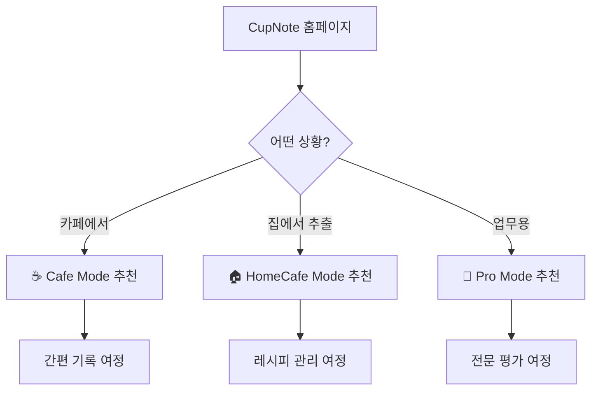
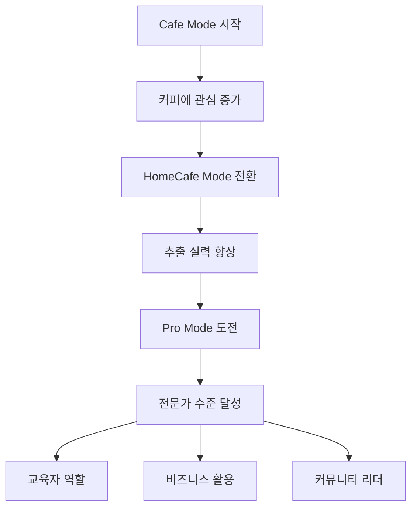

# 사용자 여정 및 플로우

## 🎭 사용자 페르소나

### 페르소나 1: 커피 입문자 "민지"
- **나이**: 25세, 직장인
- **상황**: 카페에서 커피 마시기 시작
- **목표**: 내가 좋아하는 커피 찾기
- **선호 모드**: ☕ Cafe Mode

### 페르소나 2: 홈브루어 "성준"  
- **나이**: 30세, 개발자
- **상황**: 재택근무하며 홈카페 운영
- **목표**: 완벽한 레시피 찾기
- **선호 모드**: 🏠 HomeCafe Mode

### 페르소나 3: 바리스타 "하연"
- **나이**: 28세, 카페 오너
- **상황**: 원두 품질 관리 및 메뉴 개발
- **목표**: 전문적 품질 평가
- **선호 모드**: 🔬 Pro Mode

## 🗺️ 전체 사용자 여정

### 진입점 분석



### 공통 여정 구조 (4단계)

모든 모드가 동일한 4단계 구조를 따르되, 각 단계의 내용과 깊이가 다름

```
1. 시작 (25%) → 2. 핵심 (50%) → 3. 감각 (75%) → 4. 완료 (100%)
```

## ☕ Cafe Mode 사용자 여정

### 민지의 하루: 점심 후 카페에서

#### 🌅 상황 설정
- **시간**: 점심 후 13:30
- **장소**: 블루보틀 청담점
- **목적**: 오후 업무 전 커피 한 잔
- **제약**: 빠르게 기록하고 싶음

#### 📱 앱 사용 여정

**1단계: 빠른 시작 (1분)**
```
앱 실행 → 카페 모드 선택 → 기본 정보 입력
- 커피 이름: "에티오피아 구지"
- 카페: "블루보틀 청담점" (자동완성)
- 날짜: 오늘 (자동)
```

**2단계: 간단한 맛 기록 (2분)**
```
직관적 평가 → 별점 + 간단 코멘트
- 전체 만족도: ⭐⭐⭐⭐
- 빠른 태그: "상큼한", "밝은", "과일향의"
```

**3단계: 감각 표현 (1분)**
```
한국어 표현 선택 → 간단한 느낌 기록
- 산미: "레몬같이 상큼한"
- 단맛: "은은하게 달콤한"
- 전체: "오후에 마시기 좋아요"
```

**4단계: 완료 (30초)**
```
간단 메모 → 저장 완료
- 메모: "점심 후 마시기 딱 좋음!"
- 저장 → 성취 배지 획득
```

#### 💭 사용자 감정 여정
1. **호기심** → 2. **몰입** → 3. **만족** → 4. **성취감**

### 기대 효과
- **시간 효율**: 5분 내 완료
- **부담 없음**: 복잡한 용어 없이 자연스럽게
- **성취감**: 내 기록이 쌓여가는 재미

## 🏠 HomeCafe Mode 사용자 여정

### 성준의 주말: 완벽한 V60 레시피 찾기

#### 🌅 상황 설정
- **시간**: 토요일 오전 10:00
- **장소**: 집 거실
- **목적**: 새로 산 원두로 최적 레시피 찾기
- **도구**: V60, 전자저울, 온도계

#### 📱 앱 사용 여정

**1단계: 레시피 준비 (2분)**
```
홈카페 모드 선택 → 커피 정보 입력
- 커피: "케냐 키리니아가 AA"
- 로스터: "커피리브레" (자동완성)
- 추가 정보: 원산지, 가공방식 등
```

**2단계: 추출 설정 (3분)**
```
레시피 설정 → 실시간 계산 확인
- 드리퍼: V60 선택
- 원두량: 20g (다이얼 조절)
- 비율: 1:16 선택 → 물량 320ml 자동 계산
- 물온도: 92°C
- 타이머 준비
```

**3단계: 추출 + 맛 평가 (8분)**
```
실제 추출 → 타이머 사용 → 맛 평가
- 타이머 시작: 0:00
- 1차 붓기: 0:30 (랩타임 기록)
- 2차 붓기: 1:00 (랩타임 기록)
- 완료: 2:30 (총 시간 저장)
- 맛 평가: 향미 선택 + 감각 표현
```

**4단계: 레시피 저장 (2분)**
```
결과 분석 → 레시피 저장
- 개인 메모: "블루밍 시간 늘려볼 것"
- 레시피 저장: "케냐 키리니아가 v1"
- 다음 실험 계획
```

#### 💭 학습 여정
1. **실험 정신** → 2. **정밀 측정** → 3. **맛 연결** → 4. **지식 축적**

### 기대 효과
- **체계적 관리**: 레시피와 결과 연결
- **실력 향상**: 추출과 맛의 상관관계 학습
- **효율성**: 성공한 레시피 재현 가능

## 🔬 Pro Mode 사용자 여정

### 하연의 업무: 신메뉴 원두 품질 평가

#### 🌅 상황 설정
- **시간**: 평일 오전 9:00 (오픈 전)
- **장소**: 카페 바 카운터
- **목적**: 신규 원두 메뉴 적합성 평가
- **도구**: 커핑 도구, TDS 미터, SCA 표준 프로토콜

#### 📱 앱 사용 여정

**1단계: 전문 정보 입력 (3분)**
```
프로 모드 선택 → 상세 원두 정보
- 농장: "Finca El Paraíso"
- 품종: "Castillo"
- 가공: "Anaerobic Natural"
- 고도: "1,800m"
- 로스팅 정보 등
```

**2단계: SCA 표준 측정 (5분)**
```
전문 추출 프로토콜 → 품질 측정
- 추출 방법: Pour Over
- 분쇄도: Medium (7/10)
- 물 품질: TDS 150ppm, pH 7.0
- TDS 측정: 1.35% → 추출수율 21.6% (최적)
- 상태: 초록불 (SCA 기준 적합)
```

**3단계: SCA 관능 평가 (4분)**
```
전문 평가 → 점수 산출
- Fragrance/Aroma: 4.2/5
- Flavor: 4.0/5
- Aftertaste: 4.1/5
- Acidity: 4.3/5
- Body: 3.9/5
- Balance: 4.0/5
- Overall: 4.1/5
→ 총점: 4.1/5 (Specialty Grade)
```

**4단계: QC 리포트 생성 (3분)**
```
전문 분석 → 보고서 작성
- 품질 등급: Specialty Grade
- 메뉴 적합성: 높음
- 추천 판매가: 7,000원
- PDF 리포트 생성
- 팀과 공유
```

#### 💭 전문가 사고 과정
1. **객관적 분석** → 2. **표준 준수** → 3. **비즈니스 판단** → 4. **문서화**

### 기대 효과
- **신뢰성**: SCA 표준 준수로 객관성 확보
- **효율성**: 디지털 QC 프로세스로 시간 단축
- **추적성**: 모든 평가 기록 보존 및 분석

## 🔄 모드 간 전환 여정

### 사용자 성장 스토리



### 전환 촉진 요소

#### Cafe → HomeCafe
- **방아쇠**: "집에서도 이런 맛을 내고 싶어"
- **지원**: 간단한 홈브루 레시피 추천
- **안내**: 필요한 도구 정보 제공

#### HomeCafe → Pro
- **방아쇠**: "좀 더 정확하게 측정하고 싶어"
- **지원**: SCA 기준 소개 및 가이드
- **안내**: 전문 도구 및 교육 정보

## 📊 여정별 성과 지표

### Cafe Mode KPI
- **속도**: 평균 완료 시간 5분 이내
- **만족도**: 사용 후 긍정 반응 80% 이상
- **재방문**: 주간 2회 이상 사용

### HomeCafe Mode KPI
- **학습**: 동일 원두 재기록 시 점수 향상
- **효율**: 레시피 저장/재사용률 70% 이상
- **실험**: 다양한 추출 조건 시도 빈도

### Pro Mode KPI
- **정확성**: SCA 인증 평가자와 일치율 90% 이상
- **완성도**: 필수 항목 입력 완료율 95% 이상
- **활용**: 리포트 다운로드 및 공유율

---

**📅 문서 생성**: 2025-07-31  
**버전**: v1.0.0-rc  
**분석 기반**: 7/29 체크포인트 백트레이싱