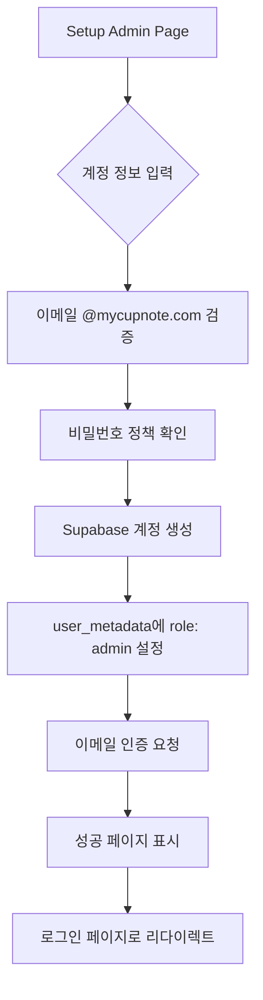
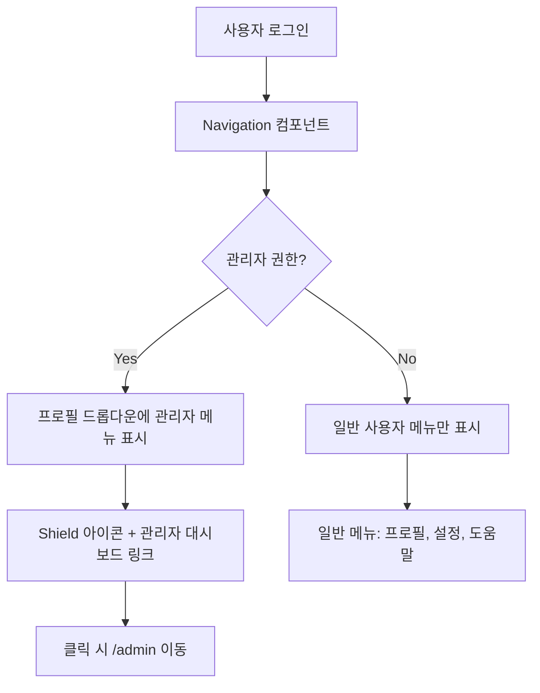
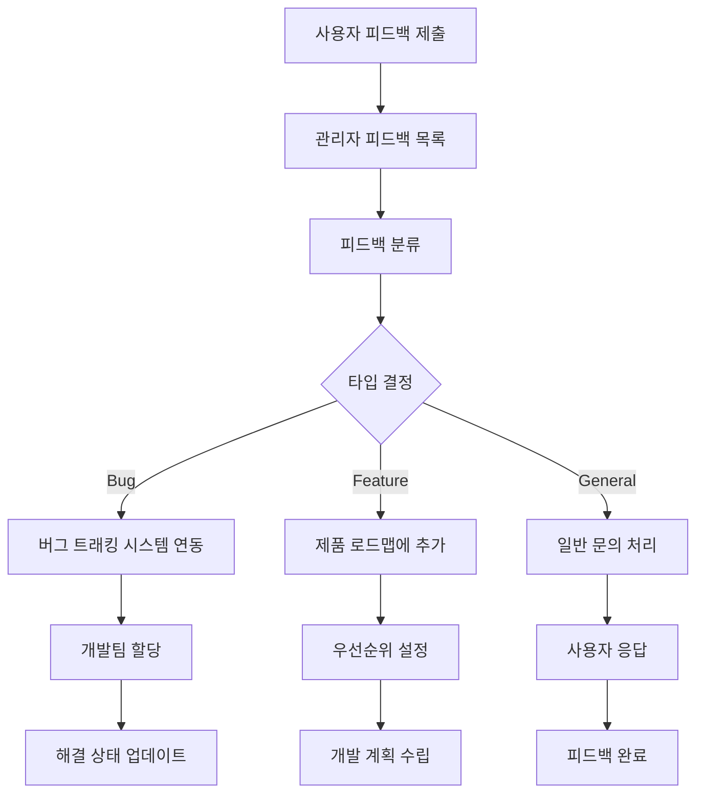

# CupNote 관리자 시스템 종합 가이드

## 📋 목차
1. [시스템 개요](#시스템-개요)
2. [관리자 권한 및 인증](#관리자-권한-및-인증)
3. [사용자 플로우](#사용자-플로우)
4. [관리자 대시보드 기능](#관리자-대시보드-기능)
5. [개발자 온보딩](#개발자-온보딩)
6. [보안 및 모니터링](#보안-및-모니터링)
7. [문제 해결](#문제-해결)

---

## 🎯 시스템 개요

### 핵심 목적
- **CupNote 플랫폼의 전체적인 운영 및 관리**
- **사용자 데이터, 콘텐츠, 시스템 성능의 통합 관리**
- **실시간 모니터링 및 문제 해결**

### 아키텍처 구조
```
┌─────────────────────────────────────────────────────────┐
│                   CupNote Admin System                  │
├─────────────────────────────────────────────────────────┤
│  Authentication Layer                                   │
│  ├── Domain-based (@mycupnote.com)                     │
│  ├── Role-based (user_metadata.role)                   │
│  └── Development Override (NODE_ENV)                   │
├─────────────────────────────────────────────────────────┤
│  Authorization Layer                                    │
│  ├── Admin Layout Protection                           │
│  ├── Route-level Guards                                │
│  └── Component-level Permissions                       │
├─────────────────────────────────────────────────────────┤
│  Dashboard Modules                                      │
│  ├── System Dashboard                                  │
│  ├── User Management                                   │
│  ├── Content Management                                │
│  ├── Performance Analytics                             │
│  ├── Feedback Management                               │
│  └── System Settings                                   │
├─────────────────────────────────────────────────────────┤
│  Data Layer                                            │
│  ├── Supabase Admin API                               │
│  ├── Real-time Subscriptions                          │
│  └── Analytics Integration                             │
└─────────────────────────────────────────────────────────┘
```

---

## 🔐 관리자 권한 및 인증

### 인증 방식

#### 1. 도메인 기반 인증 (Primary)
```typescript
// @mycupnote.com 도메인 자동 관리자 권한
const isDomainAdmin = user.email?.endsWith('@mycupnote.com')
```

#### 2. 특정 계정 (Explicit)
```typescript
// 명시적 관리자 계정
const isExplicitAdmin = user.email === 'admin@mycupnote.com'
```

#### 3. 메타데이터 기반 (Role-based)
```typescript
// Supabase user_metadata의 role 필드
const isRoleAdmin = user.user_metadata?.role === 'admin'
```

#### 4. 개발 환경 (Development Override)
```typescript
// 개발 환경에서는 모든 로그인 사용자 관리자
const isDevAdmin = process.env.NODE_ENV === 'development'
```

### 권한 체크 로직
```typescript
const isAdmin = () => {
  if (!user) return false
  
  return user.email === 'admin@mycupnote.com' || 
         user.email?.endsWith('@mycupnote.com') ||
         user.user_metadata?.role === 'admin' ||
         process.env.NODE_ENV === 'development'
}
```

### 환경별 권한 정책

| 환경 | 관리자 권한 | 접근 방식 |
|------|-------------|-----------|
| **Development** | 모든 로그인 사용자 | 자동 권한 부여 |
| **Staging** | @mycupnote.com 도메인만 | 제한적 접근 |
| **Production** | @mycupnote.com + 명시적 role | 엄격한 검증 |

---

## 🔄 사용자 플로우

### 1. 관리자 계정 생성 플로우



**URL**: https://mycupnote.com/setup-admin

**단계별 세부사항**:
1. **계정 정보 입력**
   - 이메일: `admin@mycupnote.com` (기본값)
   - 이름: `CupNote Administrator` (기본값)
   - 비밀번호: 안전한 비밀번호 생성 도구 제공

2. **유효성 검사**
   - 이메일 도메인 확인 (`@mycupnote.com`)
   - 비밀번호 정책 (최소 8자, 복합성)
   - 계정 중복 확인

3. **계정 생성**
   - Supabase Auth 계정 생성
   - 메타데이터 설정: `{ role: 'admin', name: '...', created_by: 'setup_page' }`
   - 이메일 인증 링크 발송

### 2. 관리자 로그인 플로우

```mermaid
flowchart TD
    A[인증 페이지 접근] --> B{이미 로그인?}
    B -->|Yes| C[로그인된 사용자 화면]
    B -->|No| D[로그인 폼 표시]
    D --> E[자격증명 입력]
    E --> F[Supabase Auth 검증]
    F --> G{관리자 권한?}
    G -->|Yes| H[/admin 자동 리다이렉트]
    G -->|No| I[/ 홈페이지 리다이렉트]
    C --> J[로그아웃 옵션 제공]
    J --> K[로그아웃 후 로그인 폼]
```

**URL**: https://mycupnote.com/auth

**관리자 자동 감지 로직**:
```typescript
// 로그인 성공 후 실행
const isAdmin = form.email === 'admin@mycupnote.com' || 
               form.email.endsWith('@mycupnote.com')

if (isAdmin) {
  router.push('/admin')  // 관리자 대시보드
} else {
  router.push('/')       // 일반 홈페이지
}
```

### 3. 관리자 대시보드 접근 플로우

```mermaid
flowchart TD
    A[/admin 페이지 접근] --> B[AdminLayout 권한 체크]
    B --> C{사용자 로그인?}
    C -->|No| D[/auth/login 리다이렉트]
    C -->|Yes| E{관리자 권한?}
    E -->|No| F[/ 홈페이지 리다이렉트]
    E -->|Yes| G[관리자 대시보드 로드]
    G --> H[사이드바 네비게이션 표시]
    H --> I[대시보드 콘텐츠 렌더링]
    I --> J[실시간 데이터 구독 시작]
```

**URL**: https://mycupnote.com/admin

**보호 계층**:
1. **AdminLayout**: 최상위 권한 체크
2. **useEffect**: 실시간 권한 검증
3. **로딩 상태**: 검증 중 로딩 표시
4. **리다이렉트**: 권한 없을 시 자동 이동

### 4. 네비게이션 통합 플로우



**구현 위치**: `src/components/Navigation.tsx`

**조건부 렌더링**:
```tsx
{isAdmin() && (
  <Link href="/admin" className="admin-dashboard-link">
    <Shield className="h-4 w-4 mr-3 text-coffee-600" />
    <span>관리자 대시보드</span>
  </Link>
)}
```

---

## 🏢 관리자 대시보드 기능

### 1. 시스템 대시보드 (`/admin`)

#### 실시간 지표
- **사용자 통계**: 총 사용자 수, 활성 사용자, 신규 가입자
- **콘텐츠 통계**: 총 커피 기록 수, 일일 기록 수, 모드별 사용량
- **시스템 성능**: 응답 시간, 오류율, 데이터베이스 상태
- **실시간 활동**: 현재 접속자, 최근 기록, 시스템 이벤트

#### 위젯 구성
```tsx
<AdminDashboard>
  <SystemMetrics />      // 시스템 전체 현황
  <UserMetrics />        // 사용자 관련 지표
  <ContentMetrics />     // 콘텐츠 관련 지표
  <RecentActivity />     // 최근 활동 피드
  <SystemAlerts />       // 시스템 알림 및 경고
  <QuickActions />       // 빠른 작업 버튼들
</AdminDashboard>
```

### 2. 사용자 관리 (`/admin/users`)

#### 기능 목록
- **사용자 목록**: 전체 사용자 조회, 검색, 필터링
- **사용자 상세**: 개별 사용자 프로필, 활동 내역, 기록 통계
- **권한 관리**: 관리자 권한 부여/회수, 계정 상태 변경
- **일괄 작업**: 대량 이메일 발송, 계정 상태 변경

#### 데이터 구조
```typescript
interface UserManagement {
  id: string
  email: string
  username: string
  avatar_url?: string
  created_at: string
  last_sign_in_at: string
  user_metadata: {
    role?: 'admin' | 'user'
    name: string
  }
  stats: {
    total_records: number
    favorite_mode: 'cafe' | 'homecafe' | 'lab'
    avg_rating: number
  }
  status: 'active' | 'suspended' | 'deleted'
}
```

### 3. 커피 기록 관리 (`/admin/records`)

#### 콘텐츠 관리
- **전체 기록 조회**: 모든 사용자의 커피 기록 통합 뷰
- **콘텐츠 모더레이션**: 부적절한 콘텐츠 신고 처리
- **데이터 분석**: 인기 원두, 로스터리, 맛 트렌드 분석
- **백업 및 복원**: 데이터 백업, 삭제된 기록 복원

#### 기록 분석 도구
```typescript
interface RecordAnalytics {
  total_records: number
  records_by_mode: {
    cafe: number
    homecafe: number
    lab: number
  }
  popular_origins: Array<{
    country: string
    count: number
  }>
  trending_flavors: Array<{
    flavor: string
    frequency: number
  }>
  roaster_rankings: Array<{
    roaster: string
    rating: number
    count: number
  }>
}
```

### 4. 성능 모니터링 (`/admin/analytics`)

#### 성능 지표
- **웹 성능**: Core Web Vitals, 페이지 로드 시간, SEO 점수
- **데이터베이스**: 쿼리 성능, 연결 상태, 저장소 사용량
- **오류 추적**: JavaScript 오류, 서버 오류, 네트워크 실패
- **사용자 행동**: 페이지 뷰, 세션 시간, 이탈률

#### 모니터링 도구 통합
- **Sentry**: 오류 추적 및 성능 모니터링
- **Vercel Analytics**: 웹 성능 및 사용자 분석
- **Supabase Metrics**: 데이터베이스 성능 모니터링

### 5. 피드백 관리 (`/admin/feedback`)

#### 피드백 시스템
- **베타 피드백**: 사용자가 제출한 피드백 조회 및 처리
- **버그 리포트**: 시스템 오류 및 버그 신고 관리
- **기능 요청**: 새로운 기능 제안 및 우선순위 관리
- **사용자 문의**: 일반 문의 및 지원 요청 처리

#### 피드백 워크플로우


### 6. 시스템 설정 (`/admin/settings`)

#### 앱 설정 관리
- **공지사항**: 전체 사용자 대상 공지사항 작성 및 관리
- **피처 플래그**: 새로운 기능의 점진적 배포 제어
- **콘텐츠 관리**: 카페 정보, 로스터리 데이터, 커피 원두 정보
- **시스템 설정**: 메일 설정, API 키 관리, 보안 정책

#### 구성 요소
```typescript
interface SystemSettings {
  announcements: Array<{
    id: string
    title: string
    content: string
    type: 'info' | 'warning' | 'urgent'
    active: boolean
    start_date: string
    end_date?: string
  }>
  feature_flags: {
    ENABLE_NEW_TASTING_FLOW: boolean
    ENABLE_COMMUNITY_FEATURES: boolean
    ENABLE_AI_RECOMMENDATIONS: boolean
  }
  content_data: {
    cafes: CafeData[]
    roasters: RoasterData[]
    coffee_beans: CoffeeBeanData[]
  }
}
```

---

## 👨‍💻 개발자 온보딩

### 관리자 시스템 개발 가이드

#### 1. 로컬 개발 환경 설정

```bash
# 1. 프로젝트 클론
git clone https://github.com/your-org/cupnote.git
cd cupnote

# 2. 의존성 설치 (npm 사용 필수)
npm install

# 3. 환경 변수 설정
cp .env.example .env.local
# Supabase 프로젝트 정보 입력

# 4. 개발 서버 시작
npm run dev
```

#### 2. 관리자 권한 확인

**개발 환경에서는 모든 로그인 사용자가 자동으로 관리자 권한을 가집니다.**

```typescript
// src/app/admin/layout.tsx
const isAdmin = process.env.NODE_ENV === 'development' || 
                user.email?.endsWith('@mycupnote.com') ||
                user.user_metadata?.role === 'admin'
```

#### 3. 새로운 관리자 페이지 추가

```typescript
// src/app/admin/new-feature/page.tsx
'use client'

import { useAuth } from '../../../contexts/AuthContext'
import AdminPageHeader from '../../../components/admin/AdminPageHeader'

export default function NewFeaturePage() {
  const { user } = useAuth()
  
  return (
    <div className="space-y-6">
      <AdminPageHeader 
        title="새로운 기능"
        description="새로운 관리자 기능 설명"
      />
      
      {/* 페이지 콘텐츠 */}
    </div>
  )
}
```

#### 4. 네비게이션에 메뉴 추가

```typescript
// src/app/admin/layout.tsx - navigationItems 배열에 추가
{
  id: 'new-feature',
  label: '새로운 기능',
  icon: <NewIcon className="h-5 w-5" />,
  href: '/admin/new-feature',
  description: '새로운 관리자 기능'
}
```

#### 5. 데이터 접근 패턴

```typescript
// 관리자 전용 데이터 접근
import { supabase } from '../../../lib/supabase'

// RLS 우회 (관리자만 가능)
const { data: allUserRecords } = await supabase
  .from('coffee_records')
  .select('*')
  .order('created_at', { ascending: false })

// 사용자별 통계
const { data: userStats } = await supabase
  .rpc('get_admin_user_stats')
```

### 코딩 컨벤션

#### 1. 파일 구조
```
src/app/admin/
├── layout.tsx              # 관리자 레이아웃 (권한 체크)
├── page.tsx                # 메인 대시보드
├── users/
│   ├── page.tsx           # 사용자 관리 메인
│   └── [id]/
│       └── page.tsx       # 개별 사용자 상세
├── records/
│   ├── page.tsx           # 기록 관리 메인
│   └── components/        # 기록 관리 전용 컴포넌트
└── components/            # 공통 관리자 컴포넌트
    ├── AdminPageHeader.tsx
    ├── AdminMetricCard.tsx
    └── AdminDataTable.tsx
```

#### 2. 컴포넌트 명명 규칙
```typescript
// 관리자 전용 컴포넌트는 Admin 접두사 사용
AdminDashboard.tsx
AdminUserList.tsx
AdminMetricCard.tsx

// 훅은 useAdmin 접두사
useAdminStats.ts
useAdminUsers.ts
```

#### 3. 타입 정의
```typescript
// src/types/admin.ts
export interface AdminUser {
  id: string
  email: string
  role: 'admin' | 'user'
  // ... 다른 필드들
}

export interface AdminMetric {
  label: string
  value: number | string
  change?: number
  trend?: 'up' | 'down' | 'stable'
}
```

---

## 🔒 보안 및 모니터링

### 보안 정책

#### 1. 접근 제어
- **다중 계층 보안**: 인증 → 권한 확인 → 리소스 접근
- **세션 관리**: Supabase Auth 기반 자동 세션 관리
- **권한 검증**: 모든 관리자 작업에 대해 실시간 권한 재확인

#### 2. 감사 로그
```typescript
// 모든 관리자 작업은 로그로 기록
logger.info('Admin action', {
  userId: user.id,
  email: user.email,
  action: 'user_suspended',
  targetUserId: targetUser.id,
  timestamp: new Date().toISOString(),
  ipAddress: request.ip
})
```

#### 3. 보안 헤더
```javascript
// vercel.json
{
  "headers": [
    {
      "source": "/(.*)",
      "headers": [
        {"key": "X-Frame-Options", "value": "DENY"},
        {"key": "X-Content-Type-Options", "value": "nosniff"},
        {"key": "Referrer-Policy", "value": "strict-origin-when-cross-origin"}
      ]
    }
  ]
}
```

### 모니터링 시스템

#### 1. 실시간 알림
- **시스템 오류**: 즉시 Slack/이메일 알림
- **비정상 접근**: 관리자 권한 남용 감지
- **성능 저하**: 응답 시간 임계값 초과 시 알림

#### 2. 대시보드 모니터링
```typescript
// 실시간 메트릭 수집
interface SystemHealth {
  status: 'healthy' | 'warning' | 'critical'
  metrics: {
    responseTime: number
    errorRate: number
    activeUsers: number
    databaseConnections: number
  }
  alerts: Alert[]
}
```

---

## 🛠️ 문제 해결

### 일반적인 문제들

#### 1. 관리자 페이지 접근 불가
**증상**: `/admin` 접근 시 홈페이지로 리다이렉트

**해결 방법**:
1. 로그인 상태 확인
2. 이메일 도메인 확인 (`@mycupnote.com`)
3. 브라우저 캐시 및 쿠키 삭제
4. 개발자 도구 콘솔에서 권한 로그 확인

```typescript
// 디버깅 코드
console.log('User:', user)
console.log('Is Admin:', isAdmin())
console.log('Email check:', user?.email?.endsWith('@mycupnote.com'))
```

#### 2. 로그아웃 버튼 작동 안함
**증상**: 로그아웃 클릭 시 반응 없음

**해결 방법**:
1. 네트워크 탭에서 API 호출 확인
2. AuthContext의 logout 함수 상태 확인
3. Supabase 연결 상태 점검

#### 3. 프로필 드롭다운에 관리자 메뉴 안보임
**증상**: 관리자 계정인데 관리자 대시보드 링크가 표시되지 않음

**해결 방법**:
1. `isAdmin()` 함수 결과 확인
2. 컴포넌트 리렌더링 확인
3. user 객체의 메타데이터 확인

### 디버깅 도구

#### 1. 로깅 시스템
```typescript
// src/lib/logger.ts 사용
import { logger } from '../lib/logger'

logger.info('Admin access attempt', { 
  userId: user.id, 
  email: user.email,
  isAdmin: isAdmin()
})
```

#### 2. 개발자 도구 확장
```typescript
// 개발 환경에서만 사용 가능한 디버그 함수
if (process.env.NODE_ENV === 'development') {
  (window as any).cupnoteDebug = {
    user,
    isAdmin: isAdmin(),
    permissions: getUserPermissions()
  }
}
```

---

## 📞 지원 및 연락처

### 기술 지원
- **개발팀**: dev@mycupnote.com
- **시스템 관리**: tech@mycupnote.com
- **보안 문의**: security@mycupnote.com

### 문서 업데이트
이 문서는 지속적으로 업데이트됩니다. 최신 버전은 항상 프로젝트 리포지토리에서 확인할 수 있습니다.

**마지막 업데이트**: 2025-08-03
**문서 버전**: v1.0.0
**담당자**: CupNote 개발팀