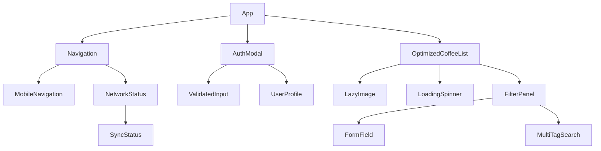

# CupNote 컴포넌트 가이드

## 📋 목차
1. [컴포넌트 개요](#컴포넌트-개요)
2. [컴포넌트 구조](#컴포넌트-구조)
3. [핵심 컴포넌트](#핵심-컴포넌트)
4. [UI 컴포넌트](#ui-컴포넌트)
5. [폼 컴포넌트](#폼-컴포넌트)
6. [인증 컴포넌트](#인증-컴포넌트)
7. [성과 컴포넌트](#성과-컴포넌트)
8. [네트워크 컴포넌트](#네트워크-컴포넌트)
9. [컴포넌트 의존성](#컴포넌트-의존성)

## 📊 컴포넌트 개요

CupNote는 총 **43개의 React 컴포넌트**로 구성되어 있으며, 다음과 같이 분류됩니다:

| 카테고리 | 컴포넌트 수 | 주요 역할 |
|----------|------------|-----------|
| 핵심 기능 | 12개 | 커피 기록, 목록 표시, 레시피 관리 |
| UI/UX | 8개 | 네비게이션, 로딩, 툴팁 등 |
| 폼 | 3개 | 입력 유효성 검사, 폼 필드 |
| 인증 | 3개 | 로그인, 회원가입, 보호 라우트 |
| 성과 | 2개 | 성취 표시, 알림 |
| 네트워크 | 4개 | 온/오프라인 상태, 동기화 |
| 성능 | 3개 | Web Vitals, 성능 모니터링 |
| 기타 | 8개 | 마이그레이션, 에러 처리 등 |

## 🏗️ 컴포넌트 구조

```
src/components/
├── achievements/        # 성취 관련 컴포넌트
├── auth/               # 인증 관련 컴포넌트
├── errors/             # 에러 처리 컴포넌트
├── forms/              # 폼 관련 컴포넌트
├── network/            # 네트워크 상태 컴포넌트
├── notifications/      # 알림 컴포넌트
├── performance/        # 성능 모니터링 컴포넌트
├── ui/                 # 기본 UI 컴포넌트
└── __tests__/          # 컴포넌트 테스트
```

## 🎯 핵심 컴포넌트

### 1. CoffeeRecordForm
**경로**: `src/components/CoffeeRecordForm.tsx`
**용도**: 커피 기록 작성 폼 (레거시, TastingFlow v2로 대체 예정)

```typescript
interface CoffeeRecordFormProps {
  initialData?: Partial<CoffeeRecord>
  onSubmit: (data: CoffeeRecord) => Promise<void>
  onCancel: () => void
}
```

### 2. OptimizedCoffeeList
**경로**: `src/components/OptimizedCoffeeList.tsx`
**용도**: 성능 최적화된 커피 목록 표시

```typescript
interface OptimizedCoffeeListProps {
  searchTerm?: string
  filters?: FilterOptions
  onLoadMore?: () => void
}
```

**특징**:
- 가상 스크롤링
- 지연 로딩
- 캐시 최적화
- 실시간 검색

### 3. RecipeLibrary
**경로**: `src/components/RecipeLibrary.tsx`
**용도**: HomeCafe 모드 레시피 라이브러리

```typescript
interface RecipeLibraryProps {
  onSelectRecipe: (recipe: Recipe) => void
  currentRecipe?: Recipe
}
```

### 4. FilterPanel
**경로**: `src/components/FilterPanel.tsx`
**용도**: 다중 필터 패널

```typescript
interface FilterPanelProps {
  filters: FilterOptions
  onChange: (filters: FilterOptions) => void
  availableOptions: {
    origins: string[]
    roasteries: string[]
    brewMethods: string[]
  }
}
```

### 5. RecipeSaveDialog
**경로**: `src/components/RecipeSaveDialog.tsx`
**용도**: 레시피 저장 다이얼로그

```typescript
interface RecipeSaveDialogProps {
  isOpen: boolean
  onClose: () => void
  onSave: (recipe: Recipe) => Promise<void>
  brewData: BrewSetup
}
```

## 🎨 UI 컴포넌트

### 1. Navigation
**경로**: `src/components/Navigation.tsx`
**용도**: 데스크톱 네비게이션 바

```typescript
interface NavigationProps {
  currentPage: 'home' | 'stats' | 'achievements' | 'settings'
}
```

### 2. MobileNavigation
**경로**: `src/components/MobileNavigation.tsx`
**용도**: 모바일 하단 네비게이션

**특징**:
- 고정 하단 배치
- Safe area 대응
- 활성 페이지 표시

### 3. LoadingSpinner
**경로**: `src/components/ui/LoadingSpinner.tsx`
**용도**: 로딩 인디케이터

```typescript
interface LoadingSpinnerProps {
  size?: 'sm' | 'md' | 'lg'
  color?: string
  fullScreen?: boolean
}
```

### 4. HelpTooltip
**경로**: `src/components/HelpTooltip.tsx`
**용도**: 도움말 툴팁

```typescript
interface HelpTooltipProps {
  content: string
  position?: 'top' | 'bottom' | 'left' | 'right'
}
```

### 5. LazyImage
**경로**: `src/components/LazyImage.tsx`
**용도**: 지연 로딩 이미지

```typescript
interface LazyImageProps {
  src: string
  alt: string
  thumbnail?: string
  className?: string
  onLoad?: () => void
}
```

## 📝 폼 컴포넌트

### 1. FormField
**경로**: `src/components/forms/FormField.tsx`
**용도**: 재사용 가능한 폼 필드

```typescript
interface FormFieldProps {
  label: string
  name: string
  type?: 'text' | 'number' | 'select' | 'textarea'
  required?: boolean
  error?: string
  helpText?: string
}
```

### 2. ValidatedInput
**경로**: `src/components/forms/ValidatedInput.tsx`
**용도**: 실시간 유효성 검사 입력 필드

```typescript
interface ValidatedInputProps extends FormFieldProps {
  validation?: ValidationRule[]
  onValidChange?: (isValid: boolean) => void
}
```

## 🔐 인증 컴포넌트

### 1. AuthModal
**경로**: `src/components/auth/AuthModal.tsx`
**용도**: 로그인/회원가입 모달

```typescript
interface AuthModalProps {
  isOpen: boolean
  onClose: () => void
  onSuccess: () => void
  initialMode?: 'login' | 'signup'
}
```

### 2. ProtectedRoute
**경로**: `src/components/auth/ProtectedRoute.tsx`
**용도**: 인증이 필요한 라우트 보호

```typescript
interface ProtectedRouteProps {
  children: React.ReactNode
  fallback?: React.ReactNode
  redirectTo?: string
}
```

### 3. UserProfile
**경로**: `src/components/auth/UserProfile.tsx`
**용도**: 사용자 프로필 표시

```typescript
interface UserProfileProps {
  user: User
  showStats?: boolean
  compact?: boolean
}
```

## 🏆 성과 컴포넌트

### 1. AchievementCard
**경로**: `src/components/achievements/AchievementCard.tsx`
**용도**: 성취 카드 표시

```typescript
interface AchievementCardProps {
  achievement: Achievement
  unlocked: boolean
  progress?: number
  onClaim?: () => void
}
```

### 2. AchievementNotification
**경로**: `src/components/achievements/AchievementNotification.tsx`
**용도**: 성취 달성 알림

```typescript
interface AchievementNotificationProps {
  achievement: Achievement
  onClose: () => void
  autoClose?: number // milliseconds
}
```

## 🌐 네트워크 컴포넌트

### 1. NetworkStatus
**경로**: `src/components/network/NetworkStatus.tsx`
**용도**: 네트워크 상태 표시

```typescript
export interface NetworkStatusProps {
  showDetails?: boolean
  position?: 'top' | 'bottom'
}
```

### 2. SyncStatus
**경로**: `src/components/SyncStatus.tsx`
**용도**: 데이터 동기화 상태

```typescript
interface SyncStatusProps {
  onSync?: () => Promise<void>
  autoSync?: boolean
}
```

### 3. PWAInstallPrompt
**경로**: `src/components/PWAInstallPrompt.tsx`
**용도**: PWA 설치 프롬프트

```typescript
interface PWAInstallPromptProps {
  onInstall?: () => void
  onDismiss?: () => void
}
```

## 📊 성능 컴포넌트

### 1. WebVitalsInitializer
**경로**: `src/components/performance/WebVitalsInitializer.tsx`
**용도**: Web Vitals 모니터링 초기화

### 2. PerformanceDashboard
**경로**: `src/components/performance/PerformanceDashboard.tsx`
**용도**: 성능 지표 대시보드

### 3. PerformanceIndicator
**경로**: `src/components/performance/PerformanceIndicator.tsx`
**용도**: 개별 성능 지표 표시

## 🔗 컴포넌트 의존성 다이어그램



## 🧪 컴포넌트 테스트

각 컴포넌트는 대응하는 테스트 파일을 가지고 있습니다:

```bash
# 컴포넌트 테스트 실행
npm test src/components

# 특정 컴포넌트 테스트
npm test src/components/OptimizedCoffeeList.test.tsx
```

## 💡 컴포넌트 작성 가이드라인

1. **TypeScript 우선**: 모든 Props는 인터페이스로 정의
2. **함수형 컴포넌트**: React Hooks 사용
3. **메모이제이션**: 필요시 React.memo 사용
4. **에러 바운더리**: 중요 컴포넌트는 ErrorBoundary로 감싸기
5. **접근성**: ARIA 속성 및 키보드 네비게이션 지원
6. **반응형**: 모바일 우선 디자인
7. **테스트**: 각 컴포넌트당 최소 1개의 테스트 파일

## 📚 관련 문서

- [API 레퍼런스](./API_REFERENCE.md)
- [TastingFlow v2.0 아키텍처](./TASTINGFLOW_V2_ARCHITECTURE.md)
- [개발 환경 설정](./DEVELOPMENT_SETUP.md)