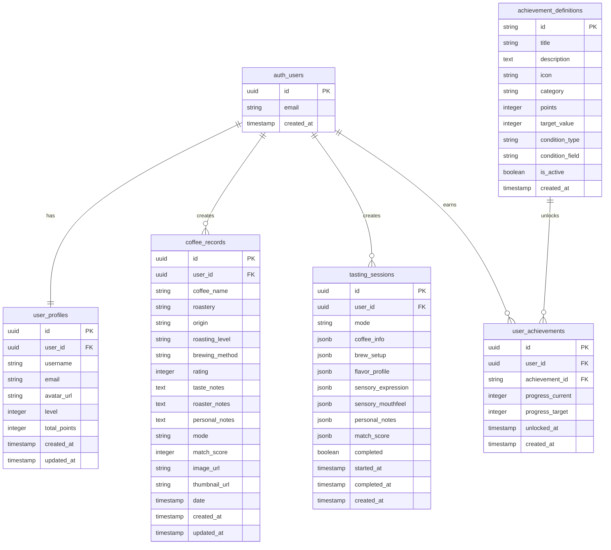

# CupNote 데이터베이스 스키마

## 📋 목차
1. [개요](#개요)
2. [ERD 다이어그램](#erd-다이어그램)
3. [테이블 상세](#테이블-상세)
4. [관계 설명](#관계-설명)
5. [인덱스 및 최적화](#인덱스-및-최적화)
6. [RLS 정책](#rls-정책)
7. [마이그레이션 히스토리](#마이그레이션-히스토리)

## 📖 개요

CupNote는 **Supabase PostgreSQL**을 데이터베이스로 사용하며, 다음과 같이 구성됩니다:

- **인증**: Supabase Auth (auth.users)
- **사용자 프로필**: user_profiles
- **커피 기록**: coffee_records, tasting_sessions
- **성취 시스템**: achievement_definitions, user_achievements
- **보안**: Row Level Security (RLS) 적용

### 데이터베이스 정보
- **버전**: PostgreSQL 15.x
- **확장**: uuid-ossp (UUID 생성)
- **보안**: RLS 정책으로 사용자별 데이터 격리
- **백업**: Supabase 자동 백업 (매일)

## 🗂️ ERD 다이어그램



## 📊 테이블 상세

### 1. user_profiles
**용도**: 사용자 프로필 및 레벨 정보

| 컬럼 | 타입 | 제약 | 설명 |
|------|------|------|------|
| id | UUID | PK | 프로필 고유 ID |
| user_id | UUID | FK, UNIQUE | auth.users 참조 |
| username | TEXT | NOT NULL | 사용자명 |
| email | TEXT | NOT NULL | 이메일 주소 |
| avatar_url | TEXT | NULL | 프로필 이미지 URL |
| level | INTEGER | DEFAULT 1 | 사용자 레벨 (1-10) |
| total_points | INTEGER | DEFAULT 0 | 총 포인트 |
| created_at | TIMESTAMPTZ | DEFAULT NOW() | 생성 시간 |
| updated_at | TIMESTAMPTZ | DEFAULT NOW() | 수정 시간 |

### 2. coffee_records (레거시)
**용도**: 기존 커피 기록 (TastingFlow v1.0)

| 컬럼 | 타입 | 제약 | 설명 |
|------|------|------|------|
| id | UUID | PK | 기록 고유 ID |
| user_id | UUID | FK | 사용자 ID |
| coffee_name | TEXT | NOT NULL | 커피명 |
| roastery | TEXT | NULL | 로스터리명 |
| origin | TEXT | NULL | 원산지 |
| roasting_level | TEXT | NULL | 로스팅 레벨 |
| brewing_method | TEXT | NULL | 추출 방법 |
| rating | INTEGER | 1-5 | 평점 |
| taste_notes | TEXT | NOT NULL | 맛 노트 |
| roaster_notes | TEXT | NULL | 로스터 노트 |
| personal_notes | TEXT | NULL | 개인 노트 |
| mode | TEXT | cafe/homecafe/lab | 기록 모드 |
| match_score | INTEGER | 0-100 | 매치 점수 |
| image_url | TEXT | NULL | 이미지 URL |
| thumbnail_url | TEXT | NULL | 썸네일 URL |
| date | TIMESTAMPTZ | NULL | 테이스팅 날짜 |
| created_at | TIMESTAMPTZ | DEFAULT NOW() | 생성 시간 |
| updated_at | TIMESTAMPTZ | DEFAULT NOW() | 수정 시간 |

### 3. tasting_sessions (신규)
**용도**: TastingFlow v2.0 세션 데이터

| 컬럼 | 타입 | 제약 | 설명 |
|------|------|------|------|
| id | UUID | PK | 세션 고유 ID |
| user_id | UUID | FK | 사용자 ID |
| mode | TEXT | cafe/homecafe | 테이스팅 모드 |
| coffee_info | JSONB | NULL | 커피 정보 |
| brew_setup | JSONB | NULL | 브루잉 설정 (HomeCafe만) |
| flavor_profile | JSONB | NULL | 향미 프로필 |
| sensory_expression | JSONB | NULL | 감각 표현 |
| sensory_mouthfeel | JSONB | NULL | 수치 평가 (선택) |
| personal_notes | JSONB | NULL | 개인 노트 |
| match_score | JSONB | NULL | 매치 스코어 결과 |
| completed | BOOLEAN | DEFAULT FALSE | 완료 여부 |
| started_at | TIMESTAMPTZ | DEFAULT NOW() | 시작 시간 |
| completed_at | TIMESTAMPTZ | NULL | 완료 시간 |
| created_at | TIMESTAMPTZ | DEFAULT NOW() | 생성 시간 |

#### JSONB 필드 구조

**coffee_info**:
```json
{
  "cafeName": "블루보틀 성수",
  "roasterName": "블루보틀",
  "coffeeName": "벨라 도노반",
  "temperature": "hot",
  "origin": "에티오피아",
  "variety": "헤이룸",
  "processing": "내추럴",
  "roastLevel": "라이트 미디엄",
  "altitude": 1800
}
```

**brew_setup** (HomeCafe 전용):
```json
{
  "dripper": "V60",
  "coffeeAmount": 22,
  "waterAmount": 350,
  "ratio": 15.9,
  "grindSize": "중간",
  "waterTemp": 92,
  "brewTime": 180,
  "timerData": {
    "totalTime": 183,
    "lapTimes": [
      {"time": 30, "note": "블루밍", "timestamp": "2025-08-02T10:00:30Z"}
    ],
    "completed": true
  }
}
```

**flavor_profile**:
```json
{
  "selectedFlavors": ["초콜릿", "캐러멜", "견과류"],
  "intensity": "medium",
  "complexity": 3
}
```

**match_score**:
```json
{
  "finalScore": 87,
  "flavorScore": 90,
  "sensoryScore": 84,
  "message": "훌륭한 매칭입니다!",
  "matchedFlavors": ["초콜릿", "캐러멜"],
  "matchedSensory": ["부드러운", "달콤한"],
  "roasterNote": "다크 초콜릿과 캐러멜의 달콤함"
}
```

### 4. achievement_definitions
**용도**: 성취 마스터 데이터

| 컬럼 | 타입 | 제약 | 설명 |
|------|------|------|------|
| id | TEXT | PK | 성취 ID (예: first-tasting) |
| title | TEXT | NOT NULL | 성취 제목 |
| description | TEXT | NOT NULL | 성취 설명 |
| icon | TEXT | NOT NULL | 아이콘 (이모지) |
| category | TEXT | NOT NULL | 카테고리 |
| points | INTEGER | DEFAULT 0 | 포인트 |
| target_value | INTEGER | DEFAULT 1 | 목표값 |
| condition_type | TEXT | NOT NULL | 조건 타입 |
| condition_field | TEXT | NULL | 조건 필드 |
| is_active | BOOLEAN | DEFAULT TRUE | 활성 여부 |
| created_at | TIMESTAMPTZ | DEFAULT NOW() | 생성 시간 |

#### 성취 카테고리
- `milestone`: 테이스팅 마일스톤
- `quality`: 전문성 성취
- `exploration`: 탐험 성취
- `consistency`: 꾸준함 성취
- `special`: 특별 성취

### 5. user_achievements
**용도**: 사용자별 성취 진행도

| 컬럼 | 타입 | 제약 | 설명 |
|------|------|------|------|
| id | UUID | PK | 성취 기록 ID |
| user_id | UUID | FK | 사용자 ID |
| achievement_id | TEXT | FK | 성취 정의 ID |
| progress_current | INTEGER | DEFAULT 0 | 현재 진행도 |
| progress_target | INTEGER | NOT NULL | 목표 진행도 |
| unlocked_at | TIMESTAMPTZ | NULL | 달성 시간 |
| created_at | TIMESTAMPTZ | DEFAULT NOW() | 생성 시간 |

**제약 조건**: UNIQUE(user_id, achievement_id)

## 🔗 관계 설명

### 1. 사용자 - 프로필 (1:1)
- auth.users ↔ user_profiles
- CASCADE DELETE: 사용자 삭제 시 프로필도 삭제

### 2. 사용자 - 기록 (1:N)
- auth.users → coffee_records
- auth.users → tasting_sessions
- CASCADE DELETE: 사용자 삭제 시 모든 기록 삭제

### 3. 사용자 - 성취 (M:N)
- auth.users ↔ achievement_definitions (via user_achievements)
- 사용자는 여러 성취를 가질 수 있음
- 각 성취는 여러 사용자에 의해 달성 가능

## 🚀 인덱스 및 최적화

### 기본 인덱스
```sql
-- 성능 최적화 인덱스
CREATE INDEX idx_coffee_records_user_id ON coffee_records(user_id);
CREATE INDEX idx_coffee_records_created_at ON coffee_records(created_at DESC);
CREATE INDEX idx_coffee_records_mode ON coffee_records(mode);

CREATE INDEX idx_tasting_sessions_user_id ON tasting_sessions(user_id);
CREATE INDEX idx_tasting_sessions_mode ON tasting_sessions(mode);
CREATE INDEX idx_tasting_sessions_completed ON tasting_sessions(completed);

CREATE INDEX idx_user_achievements_user_id ON user_achievements(user_id);
CREATE INDEX idx_user_achievements_unlocked ON user_achievements(unlocked_at) 
WHERE unlocked_at IS NOT NULL;
```

### JSONB 인덱스 (필요시 추가)
```sql
-- 향미 검색용 GIN 인덱스
CREATE INDEX idx_tasting_flavor_profile 
ON tasting_sessions USING GIN ((flavor_profile->'selectedFlavors'));

-- 커피명 검색용 인덱스
CREATE INDEX idx_tasting_coffee_name 
ON tasting_sessions USING GIN ((coffee_info->'coffeeName'));
```

## 🔐 RLS 정책

### user_profiles 정책
```sql
-- 사용자는 자신의 프로필만 조회/수정 가능
CREATE POLICY "Users can view own profile" ON user_profiles
    FOR SELECT USING (auth.uid() = user_id);

CREATE POLICY "Users can update own profile" ON user_profiles
    FOR UPDATE USING (auth.uid() = user_id);

CREATE POLICY "Users can insert own profile" ON user_profiles
    FOR INSERT WITH CHECK (auth.uid() = user_id);
```

### coffee_records 정책
```sql
-- 사용자는 자신의 기록만 CRUD 가능
CREATE POLICY "Users can view own coffee records" ON coffee_records
    FOR SELECT USING (auth.uid() = user_id);

CREATE POLICY "Users can create own coffee records" ON coffee_records
    FOR INSERT WITH CHECK (auth.uid() = user_id);

CREATE POLICY "Users can update own coffee records" ON coffee_records
    FOR UPDATE USING (auth.uid() = user_id);

CREATE POLICY "Users can delete own coffee records" ON coffee_records
    FOR DELETE USING (auth.uid() = user_id);
```

### tasting_sessions 정책
```sql
-- TastingFlow v2.0 세션 데이터 보호
CREATE POLICY "Users can manage own tasting sessions" ON tasting_sessions
    FOR ALL USING (auth.uid() = user_id);
```

### achievement_definitions 정책
```sql
-- 모든 사용자가 성취 정의 조회 가능 (읽기 전용)
CREATE POLICY "Anyone can view achievement definitions" ON achievement_definitions
    FOR SELECT USING (true);
```

### user_achievements 정책
```sql
-- 사용자는 자신의 성취만 조회/수정 가능
CREATE POLICY "Users can view own achievements" ON user_achievements
    FOR SELECT USING (auth.uid() = user_id);

CREATE POLICY "Users can update own achievements" ON user_achievements
    FOR ALL USING (auth.uid() = user_id);
```

## 📚 마이그레이션 히스토리

### 1. 001_initial_schema.sql (2025-01-01)
**내용**: 초기 스키마 생성
- user_profiles, coffee_records 테이블
- achievement_definitions, user_achievements 테이블
- 기본 인덱스 및 RLS 정책

### 2. 20250131_add_image_fields.sql (2025-01-31)
**내용**: 이미지 필드 추가
```sql
-- coffee_records에 이미지 URL 필드 추가
ALTER TABLE coffee_records 
ADD COLUMN image_url TEXT,
ADD COLUMN thumbnail_url TEXT;
```

### 3. 20250801_fix_schema_mismatch.sql (2025-08-01)
**내용**: 스키마 불일치 수정
```sql
-- date 필드 추가 및 기존 데이터 마이그레이션
ALTER TABLE coffee_records 
ADD COLUMN date TIMESTAMP WITH TIME ZONE;

-- 기존 created_at을 date로 복사
UPDATE coffee_records SET date = created_at WHERE date IS NULL;
```

### 4. 20250802_add_tasting_details.sql (2025-08-02)
**내용**: TastingFlow v2.0 지원
```sql
-- tasting_sessions 테이블 생성
CREATE TABLE tasting_sessions (
    id UUID DEFAULT uuid_generate_v4() PRIMARY KEY,
    user_id UUID REFERENCES auth.users(id) ON DELETE CASCADE NOT NULL,
    mode TEXT NOT NULL CHECK (mode IN ('cafe', 'homecafe')),
    coffee_info JSONB,
    brew_setup JSONB,
    flavor_profile JSONB,
    sensory_expression JSONB,
    sensory_mouthfeel JSONB,
    personal_notes JSONB,
    match_score JSONB,
    completed BOOLEAN DEFAULT FALSE,
    started_at TIMESTAMP WITH TIME ZONE DEFAULT NOW(),
    completed_at TIMESTAMP WITH TIME ZONE,
    created_at TIMESTAMP WITH TIME ZONE DEFAULT NOW()
);

-- 인덱스 및 RLS 정책 추가
CREATE INDEX idx_tasting_sessions_user_id ON tasting_sessions(user_id);
CREATE INDEX idx_tasting_sessions_mode ON tasting_sessions(mode);
CREATE INDEX idx_tasting_sessions_completed ON tasting_sessions(completed);

ALTER TABLE tasting_sessions ENABLE ROW LEVEL SECURITY;
CREATE POLICY "Users can manage own tasting sessions" ON tasting_sessions
    FOR ALL USING (auth.uid() = user_id);
```

## 🛠️ 개발 도구

### Supabase 로컬 마이그레이션
```bash
# 마이그레이션 적용
supabase db push

# 마이그레이션 생성
supabase migration new add_new_feature

# 스키마 덤프
supabase db dump -f schema.sql --schema-only
```

### 백업 및 복원
```bash
# 데이터 백업
pg_dump -h localhost -p 54322 -U postgres postgres > backup.sql

# 데이터 복원
psql -h localhost -p 54322 -U postgres -d postgres < backup.sql
```

## 📈 성능 모니터링

### 쿼리 성능 확인
```sql
-- 느린 쿼리 확인
SELECT query, mean_exec_time, calls 
FROM pg_stat_statements 
WHERE mean_exec_time > 100
ORDER BY mean_exec_time DESC;

-- 인덱스 사용률 확인
SELECT schemaname, tablename, attname, n_distinct, correlation
FROM pg_stats 
WHERE tablename IN ('coffee_records', 'tasting_sessions');
```

### 테이블 크기 모니터링
```sql
-- 테이블 크기 확인
SELECT 
    schemaname,
    tablename,
    pg_size_pretty(pg_total_relation_size(schemaname||'.'||tablename)) as size
FROM pg_tables 
WHERE schemaname = 'public'
ORDER BY pg_total_relation_size(schemaname||'.'||tablename) DESC;
```

## 📚 관련 문서

- [API 레퍼런스](./API_REFERENCE.md)
- [TastingFlow v2.0 아키텍처](./TASTINGFLOW_V2_ARCHITECTURE.md)
- [개발 환경 설정](./DEVELOPMENT_SETUP.md)