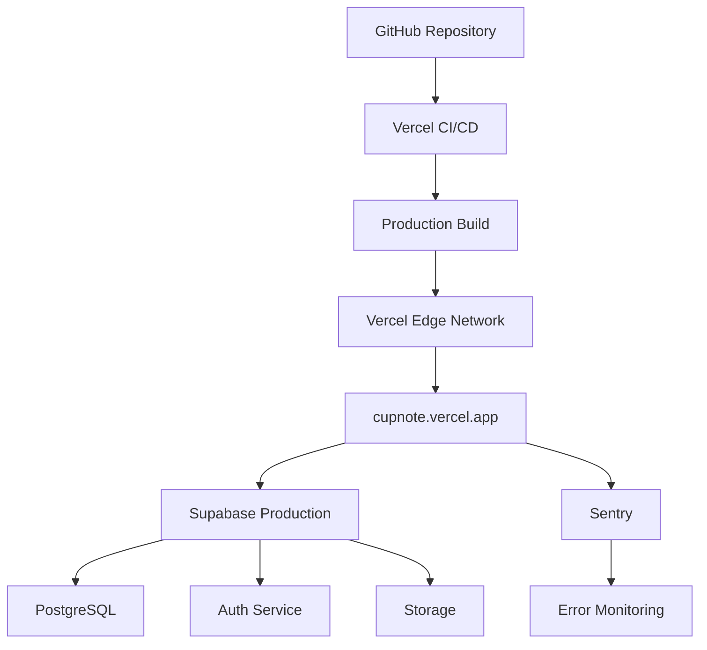

# CupNote 배포 가이드

## 📋 목차
1. [배포 개요](#배포-개요)
2. [Vercel 배포](#vercel-배포)
3. [환경 변수 설정](#환경-변수-설정)
4. [Supabase 프로덕션 설정](#supabase-프로덕션-설정)
5. [CI/CD 파이프라인](#cicd-파이프라인)
6. [모니터링 설정](#모니터링-설정)
7. [도메인 설정](#도메인-설정)
8. [문제 해결](#문제-해결)

## 📖 배포 개요

CupNote는 **Vercel**을 메인 배포 플랫폼으로 사용하며, **Supabase**를 백엔드 서비스로 활용합니다.

### 🏗️ 배포 아키텍처


### 📊 현재 배포 상태
- **Production URL**: https://cupnote.vercel.app
- **Framework**: Next.js 15.4.5 (App Router)
- **Node.js**: v18.17.0+
- **Build Time**: ~25초
- **Deploy Time**: ~30초

## 🚀 Vercel 배포

### 1. 초기 설정

#### GitHub 연결
1. [Vercel Dashboard](https://vercel.com/dashboard) 접속
2. "New Project" 클릭
3. GitHub 저장소 선택: `cupnote`
4. Import 프로젝트

#### 프로젝트 설정
```bash
# Framework Preset: Next.js
# Build Command: npm run build
# Output Directory: .next
# Install Command: npm install
# Development Command: npm run dev
```

### 2. 빌드 설정

#### next.config.js 핵심 설정
```javascript
const nextConfig = {
  reactStrictMode: true,
  
  // 성능 최적화
  compiler: {
    removeConsole: process.env.NODE_ENV === 'production',
  },
  
  // 실험적 기능
  experimental: {
    optimizePackageImports: ['lucide-react'],
  },
  
  // ESLint 빌드 시 무시 (임시)
  eslint: {
    ignoreDuringBuilds: true,
  },
  
  // 이미지 최적화
  images: {
    remotePatterns: [
      {
        protocol: 'https',
        hostname: '**.supabase.co',
        pathname: '/storage/v1/object/public/**',
      },
    ],
    formats: ['image/webp', 'image/avif'],
  },
  
  // Gzip 압축
  compress: true,
}
```

### 3. 빌드 최적화

#### 번들 분석
```bash
# 빌드 결과 (2025-08-02 기준)
Route (app)                Size     First Load JS
┌ ○ /                     11 kB    298 kB
├ ○ /achievements         3.91 kB  291 kB
├ ○ /stats                3.75 kB  285 kB
├ ƒ /tasting-flow/[mode]  16.2 kB  298 kB (최대)
└ + 25 more routes...

First Load JS shared by all: 232 kB
├ chunks/4bd1b696-ee5a00fe1afffebd.js  54.3 kB
├ chunks/52774a7f-7f2212f0dea75d93.js  36.7 kB
├ chunks/8824-c8768089b71f038d.js     138 kB
└ other shared chunks (total)          3.1 kB
```

#### 성능 목표
- **First Load JS**: < 300 kB ✅
- **Largest Page**: < 400 kB ✅
- **Build Time**: < 60초 ✅
- **Lighthouse Score**: > 90 🎯

## 🔑 환경 변수 설정

### Vercel 환경 변수 설정

#### 1. 기본 설정
Vercel Dashboard > Project > Settings > Environment Variables

```env
# 애플리케이션 URL
NEXT_PUBLIC_APP_URL=https://cupnote.vercel.app

# Supabase 설정 (프로덕션)
NEXT_PUBLIC_SUPABASE_URL=https://your-project.supabase.co
NEXT_PUBLIC_SUPABASE_ANON_KEY=your_anon_key
SUPABASE_SERVICE_ROLE_KEY=your_service_role_key

# 이미지 업로드
NEXT_PUBLIC_SUPABASE_STORAGE_BUCKET=coffee-images

# 보안 설정
NEXTAUTH_SECRET=your_production_secret_32_chars_minimum
NEXTAUTH_URL=https://cupnote.vercel.app

# 애플리케이션 버전
NEXT_PUBLIC_APP_VERSION=1.0.0-rc.1

# Sentry 모니터링 (선택)
NEXT_PUBLIC_SENTRY_DSN=your_sentry_dsn
SENTRY_ORG=your_sentry_org
SENTRY_PROJECT=cupnote
SENTRY_AUTH_TOKEN=your_sentry_auth_token

# Google Analytics (선택)
NEXT_PUBLIC_GA_ID=G-XXXXXXXXXX

# 프로덕션 환경
NODE_ENV=production
```

#### 2. 환경별 설정

**환경 구분**:
- **Production**: `main` 브랜치
- **Preview**: 모든 PR 및 브랜치
- **Development**: 로컬 개발

**변수 적용 범위**:
```
Production ✓  Preview ✓  Development ✗
↳ 프로덕션 전용 설정

Production ✗  Preview ✓  Development ✗  
↳ 프리뷰 전용 설정

Production ✓  Preview ✓  Development ✓
↳ 모든 환경 공통
```

### 3. 보안 고려사항

#### 민감한 정보 관리
- **절대 금지**: .env 파일을 git에 커밋
- **권장**: Vercel Dashboard에서만 환경 변수 설정
- **필수**: `NEXTAUTH_SECRET`은 32자 이상 무작위 문자열

#### 환경 변수 검증
```typescript
// src/lib/env.ts
function validateEnv() {
  const required = [
    'NEXT_PUBLIC_SUPABASE_URL',
    'NEXT_PUBLIC_SUPABASE_ANON_KEY', 
    'SUPABASE_SERVICE_ROLE_KEY',
    'NEXTAUTH_SECRET'
  ]
  
  for (const key of required) {
    if (!process.env[key]) {
      throw new Error(`Missing required environment variable: ${key}`)
    }
  }
}
```

## 🗄️ Supabase 프로덕션 설정

### 1. 프로젝트 생성

#### 새 Supabase 프로젝트
1. [Supabase Dashboard](https://app.supabase.com) 접속
2. "New Project" 클릭
3. 설정:
   - **Name**: `cupnote-production`
   - **Database Password**: 강력한 비밀번호 (16자+)
   - **Region**: 가장 가까운 지역 (Asia Northeast)

### 2. 데이터베이스 설정

#### 마이그레이션 실행
```bash
# 로컬에서 스키마 푸시
supabase link --project-ref your-project-ref
supabase db push
```

#### 필수 마이그레이션 순서
1. `001_initial_schema.sql` - 기본 테이블
2. `20250131_add_image_fields.sql` - 이미지 필드
3. `20250801_fix_schema_mismatch.sql` - 스키마 수정
4. `20250802_add_tasting_details.sql` - TastingFlow v2.0

### 3. Storage 설정

#### coffee-images 버킷 생성
```sql
-- Storage 버킷 생성
INSERT INTO storage.buckets (id, name, public)
VALUES ('coffee-images', 'coffee-images', true);

-- RLS 정책 설정
CREATE POLICY "Public Access" ON storage.objects
FOR SELECT USING (bucket_id = 'coffee-images');

CREATE POLICY "User Upload" ON storage.objects
FOR INSERT WITH CHECK (
  bucket_id = 'coffee-images' AND 
  auth.uid()::text = (storage.foldername(name))[1]
);
```

#### MIME 타입 제한
- **허용**: `image/jpeg`, `image/png`, `image/webp`
- **최대 크기**: 5MB
- **파일명 패턴**: `{user_id}/{timestamp}_{random}.{ext}`

### 4. Authentication 설정

#### 이메일 설정
- **Email Confirmation**: ✅ 활성화
- **Email Change Confirmation**: ✅ 활성화
- **Secure Email Change**: ✅ 활성화

#### URL 설정
```
Site URL: https://cupnote.vercel.app
Redirect URLs:
- https://cupnote.vercel.app/auth/callback
- https://cupnote.vercel.app/
```

#### 보안 설정
- **JWT Expiry**: 3600 (1시간)
- **Refresh Token Rotation**: ✅ 활성화
- **Reuse Interval**: 10초

## 🔄 CI/CD 파이프라인

### 1. GitHub Actions 설정

#### .github/workflows/deploy.yml
```yaml
name: Deploy to Vercel

on:
  push:
    branches: [main]
  pull_request:
    branches: [main]

jobs:
  test:
    runs-on: ubuntu-latest
    steps:
      - uses: actions/checkout@v4
      - uses: actions/setup-node@v4
        with:
          node-version: '18'
          cache: 'npm'
      
      - run: npm ci
      - run: npm run type-check
      - run: npm run test:run
      - run: npm run e2e

  deploy:
    runs-on: ubuntu-latest
    needs: test
    if: github.ref == 'refs/heads/main'
    steps:
      - uses: actions/checkout@v4
      - uses: amondnet/vercel-action@v25
        with:
          vercel-token: ${{ secrets.VERCEL_TOKEN }}
          vercel-org-id: ${{ secrets.VERCEL_ORG_ID }}
          vercel-project-id: ${{ secrets.VERCEL_PROJECT_ID }}
```

### 2. 자동 배포 흐름

#### 브랜치 전략
```
main (production)
├── feature/new-feature (preview)
├── hotfix/critical-bug (preview)
└── develop (preview)
```

#### 배포 트리거
- **Production**: `main` 브랜치 push
- **Preview**: PR 생성/업데이트
- **Manual**: Vercel Dashboard에서 수동 배포

### 3. 빌드 후크

#### Vercel Deploy Hooks
```bash
# 프로덕션 배포 트리거
curl -X POST "https://api.vercel.com/v1/integrations/deploy/prj_xxx/xxx"
```

#### 외부 서비스 연동
- **Supabase**: 마이그레이션 완료 후 자동 배포
- **Sentry**: 새 릴리즈 등록
- **Slack**: 배포 완료 알림

## 📊 모니터링 설정

### 1. Sentry 에러 모니터링

#### 설정 파일
```javascript
// sentry.client.config.ts
import { init } from '@sentry/nextjs'

init({
  dsn: process.env.NEXT_PUBLIC_SENTRY_DSN,
  environment: process.env.NODE_ENV,
  tracesSampleRate: 0.1,
  debug: false,
  
  // 성능 모니터링
  profilesSampleRate: 0.1,
  
  // 에러 필터링
  beforeSend(event) {
    // 개발 환경 에러 제외
    if (event.environment === 'development') {
      return null
    }
    return event
  }
})
```

#### 알림 설정
- **Critical Error**: 즉시 Slack 알림
- **Performance Issue**: 매일 요약 리포트
- **Release**: 새 배포 시 자동 태그

### 2. Vercel Analytics

#### Web Vitals 모니터링
```javascript
// src/app/layout.tsx
import { SpeedInsights } from '@vercel/speed-insights/next'
import { Analytics } from '@vercel/analytics/react'

export default function RootLayout({ children }) {
  return (
    <html>
      <body>
        {children}
        <SpeedInsights />
        <Analytics />
      </body>
    </html>
  )
}
```

#### 목표 지표
- **LCP**: < 2.5초
- **FID**: < 100ms  
- **CLS**: < 0.1
- **TTFB**: < 800ms

### 3. Supabase 모니터링

#### 데이터베이스 성능
- **Connection Pool**: 최대 25개 연결
- **Query Timeout**: 30초
- **Slow Query**: > 1초 쿼리 로깅

#### 리소스 모니터링
- **Database Size**: < 500MB (Free Tier)
- **API Requests**: < 50,000/월
- **Storage**: < 1GB
- **Bandwidth**: < 2GB/월

## 🌐 도메인 설정

### 1. 커스텀 도메인 (옵션)

#### 도메인 구입 및 설정
1. 도메인 구입 (예: cupnote.com)
2. Vercel에서 도메인 추가
3. DNS 설정:
   ```
   Type: CNAME
   Name: www
   Value: cname.vercel-dns.com
   
   Type: A
   Name: @
   Value: 76.76.19.61
   ```

#### SSL 인증서
- **자동 설정**: Vercel이 Let's Encrypt 인증서 자동 관리
- **갱신**: 자동 갱신 (만료 30일 전)
- **강제 HTTPS**: 모든 HTTP 요청을 HTTPS로 리다이렉트

### 2. 서브도메인 설정

#### 환경별 도메인
- **Production**: cupnote.com
- **Staging**: staging.cupnote.com  
- **API Docs**: docs.cupnote.com

## 🔧 문제 해결

### 1. 빌드 오류

#### 일반적인 문제
```bash
# TypeScript 에러
Error: Type errors found
해결: npm run type-check로 사전 확인

# 메모리 부족
Error: JavaScript heap out of memory
해결: NODE_OPTIONS="--max-old-space-size=4096" npm run build

# ESLint 에러
Error: ESLint errors found
해결: eslint.ignoreDuringBuilds = true (임시)
```

#### 환경 변수 누락
```bash
Error: Missing required environment variable
해결: Vercel Dashboard에서 환경 변수 확인
```

### 2. 배포 후 오류

#### 404 오류
- **원인**: Next.js 라우팅 문제
- **해결**: `next.config.js`에서 `trailingSlash` 설정

#### API 오류
- **원인**: Supabase 연결 실패
- **해결**: 환경 변수 및 RLS 정책 확인

#### 이미지 로딩 실패
- **원인**: Supabase Storage 설정 문제
- **해결**: CORS 및 버킷 정책 확인

### 3. 성능 문제

#### 느린 로딩
```javascript
// 해결책: 코드 분할
const LazyComponent = dynamic(() => import('./Component'), {
  loading: () => <LoadingSpinner />
})
```

#### 큰 번들 크기
```bash
# 번들 분석
npm run build
npx @next/bundle-analyzer
```

### 4. 모니터링 알림

#### Sentry 에러 급증
1. Error 대시보드에서 패턴 확인
2. 관련 커밋 롤백 고려
3. 핫픽스 브랜치로 수정

#### 성능 저하
1. Vercel Analytics에서 Web Vitals 확인
2. Lighthouse 감사 실행
3. 병목 지점 식별 및 최적화

## 📋 배포 체크리스트

### 배포 전 확인사항
- [ ] 모든 테스트 통과 (`npm run test:run`)
- [ ] TypeScript 에러 없음 (`npm run type-check`)
- [ ] ESLint 에러 해결 (`npm run lint`)
- [ ] 빌드 성공 (`npm run build`)
- [ ] E2E 테스트 통과 (`npm run e2e`)

### 환경 변수 확인
- [ ] Supabase URL 및 키 설정
- [ ] NextAuth 시크릿 설정
- [ ] Sentry DSN 설정 (옵션)
- [ ] 모든 환경에서 변수 동기화

### 배포 후 확인사항
- [ ] 프로덕션 사이트 정상 로딩
- [ ] 로그인/회원가입 기능 테스트
- [ ] 이미지 업로드 테스트
- [ ] TastingFlow 기능 테스트
- [ ] 모바일 반응형 확인

### 모니터링 확인
- [ ] Sentry 에러 모니터링 활성화
- [ ] Vercel Analytics 데이터 수집
- [ ] Supabase 메트릭 정상
- [ ] Web Vitals 점수 확인

## 📚 관련 문서

- [개발 환경 설정](./DEVELOPMENT_SETUP.md)
- [API 레퍼런스](./API_REFERENCE.md)
- [성능 최적화 전략](../patterns/PERFORMANCE_OPTIMIZATION.md)
- [모니터링 설정](../patterns/MONITORING_SETUP.md)

---

**📅 최종 업데이트**: 2025-08-02  
**✏️ 작성자**: Claude Code SuperClaude  
**🔄 버전**: 1.0.0