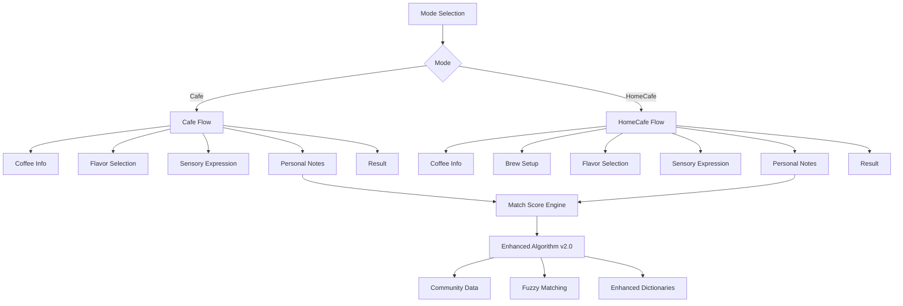
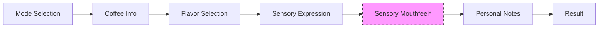
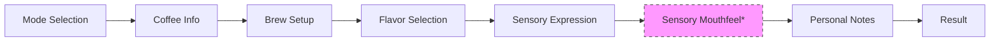

# TastingFlow v2.0 아키텍처

## 📋 목차
1. [개요](#개요)
2. [시스템 아키텍처](#시스템-아키텍처)
3. [모드별 플로우](#모드별-플로우)
4. [데이터 구조](#데이터-구조)
5. [페이지 구조](#페이지-구조)
6. [상태 관리](#상태-관리)
7. [UI/UX 가이드](#uiux-가이드)
8. [마이그레이션 가이드](#마이그레이션-가이드)

## 📖 개요

TastingFlow v2.0은 기존의 단순한 기록 시스템을 **모드별 특화된 테이스팅 경험**으로 진화시킨 시스템입니다.

### 🎯 핵심 목표
- **사용자별 맞춤형 경험**: 카페 방문자, 홈카페 유저에 따른 차별화
- **점진적 정보 공개**: 필수 → 선택 정보 단계별 입력
- **전문성 확장**: 기본 → 고급 기능 선택적 제공
- **데이터 일관성**: 구조화된 JSON 데이터로 확장성 보장

### 📊 v1.0 vs v2.0 비교

| 구분 | v1.0 (레거시) | v2.0 (TastingFlow) |
|------|---------------|-------------------|
| **데이터 구조** | 단일 테이블 (coffee_records) | 구조화된 JSONB (tasting_sessions) |
| **모드** | cafe/homecafe/lab | cafe/homecafe (lab 제거) |
| **플로우** | 1페이지 폼 | 7단계 가이드 플로우 |
| **사용자 경험** | 동일한 인터페이스 | 모드별 특화 경험 |
| **확장성** | 제한적 | 높음 (JSONB 구조) |

## 🏗️ 시스템 아키텍처

### 전체 아키텍처 다이어그램



### 핵심 컴포넌트

1. **모드 시스템**: 사용자 컨텍스트별 플로우 분기
2. **단계별 가이드**: 7-8단계 점진적 정보 수집
3. **데이터 검증**: 실시간 유효성 검사 및 자동 저장
4. **매치 스코어 엔진**: Enhanced v2.0 알고리즘
5. **세션 관리**: 중단 및 재개 지원

## 🎭 모드별 플로우

### Cafe Mode (카페 경험) - 7단계
**대상**: 카페에서 커피를 마시는 사용자
**소요 시간**: 5-7분
**특징**: 간편하고 빠른 기록



#### 단계별 상세

1. **Coffee Info** (필수: 3개, 선택: 5개)
   - 필수: 카페명, 로스터리, 커피명
   - 선택: 원산지, 품종, 가공법, 로스팅 레벨, 고도

2. **Flavor Selection** (2-8개 선택)
   - 8개 카테고리별 향미 선택
   - 강도 설정 (low/medium/high)
   - 복합도 평가 (1-5)

3. **Sensory Expression** (자유 선택)
   - 감각 표현 태그 선택
   - 커스텀 표현 추가 가능

4. **Sensory Mouthfeel** ⭐ *선택 단계*
   - 9개 항목 수치 평가 (1-5)
   - 자동 코멘트 생성
   - 강점/약점 분석

5. **Personal Notes** (자유 작성)
   - 텍스트 메모
   - 빠른 입력 템플릿
   - 감정 태그

6. **Result** (결과 표시)
   - Match Score 계산 및 표시
   - 로스터 노트 비교
   - 성취 체크

### HomeCafe Mode (홈카페 레시피) - 8단계
**대상**: 집에서 커피를 추출하는 사용자
**소요 시간**: 8-12분
**특징**: 상세한 레시피 기록 및 관리



#### 단계별 상세

1. **Coffee Info** (필수: 2개, 선택: 6개)
   - 필수: 로스터리, 커피명
   - 선택: 원산지, 품종, 가공법, 로스팅 레벨, 고도, 구매일

2. **Brew Setup** ⭐ *HomeCafe 전용*
   - 드리퍼 선택 (V60, Chemex, French Press 등)
   - 원두량/물 양/비율 계산기
   - 분쇄도, 물 온도, 추출 시간
   - **통합 브루 타이머** (랩타임 기록)
   - 레시피 라이브러리 연동

3. **Flavor Selection** (Cafe와 동일)

4. **Sensory Expression** (Cafe와 동일)

5. **Sensory Mouthfeel** ⭐ *선택 단계*

6. **Personal Notes** (확장 기능)
   - 레시피 노트
   - 다음번 개선사항
   - 원두 평가

7. **Result** (확장 기능)
   - 레시피 저장 다이얼로그
   - 추출 성공률 분석
   - 레시피 공유 기능

## 📊 데이터 구조

### TastingSession 타입

```typescript
interface TastingSession {
  // 메타데이터
  id: string
  user_id: string
  mode: 'cafe' | 'homecafe'
  started_at: string
  completed_at?: string
  completed: boolean
  
  // 플로우 데이터 (JSONB)
  coffee_info?: CoffeeInfo
  brew_setup?: BrewSetup        // HomeCafe만
  flavor_profile?: FlavorProfile
  sensory_expression?: SensoryExpression
  sensory_mouthfeel?: SensoryMouthFeel  // 선택
  personal_notes?: PersonalNotes
  match_score?: MatchScoreResult
}
```

### CoffeeInfo 구조

```typescript
interface CoffeeInfo {
  // Cafe Mode 필수
  cafeName?: string
  
  // 공통 필수
  roasterName: string
  coffeeName: string
  temperature: 'hot' | 'iced'
  
  // 선택 정보 (Progressive Disclosure)
  origin?: string
  variety?: string
  processing?: string
  roastLevel?: string
  altitude?: number
  roasterNote?: string
  purchaseDate?: string    // HomeCafe만
  
  // 메타데이터
  isNewCoffee?: boolean
  autoFilled?: boolean
}
```

### BrewSetup 구조 (HomeCafe 전용)

```typescript
interface BrewSetup {
  // 핵심 추출 정보
  dripper: string           // V60, Chemex, French Press 등
  coffeeAmount: number      // 그램 (정밀도: ±1g)
  waterAmount: number       // ml
  ratio: number            // 자동 계산
  grindSize: string        // 거칠기
  
  // 고급 정보
  customDripper?: string
  grinderBrand?: string
  grinderModel?: string
  grinderSetting?: string
  waterTemp?: number       // 섭씨
  brewTime: number         // 초
  
  // 타이머 데이터
  timerData?: {
    totalTime: number
    lapTimes: Array<{
      time: number
      note: string
      timestamp: Date
    }>
    completed: boolean
  }
}
```

## 📱 페이지 구조

### URL 패턴
```
/tasting-flow/{mode}/{step}

예시:
/tasting-flow/cafe/coffee-info
/tasting-flow/homecafe/brew-setup
/tasting-flow/cafe/result
```

### 페이지별 컴포넌트

| 단계 | 컴포넌트 | 공통/전용 |
|------|----------|-----------|
| Mode Selection | ModeSelectionPage | 공통 |
| Coffee Info | CoffeeInfoPage | 공통 (조건부 필드) |
| Brew Setup | BrewSetupPage | HomeCafe 전용 |
| Flavor Selection | FlavorSelectionPage | 공통 |
| Sensory Expression | SensoryExpressionPage | 공통 |
| Sensory Mouthfeel | SensoryMouthfeelPage | 공통 (선택) |
| Personal Notes | PersonalNotesPage | 공통 |
| Result | ResultPage | 공통 (기능 차이) |

### 네비게이션 패턴

```typescript
// 다음 단계 결정 로직
function getNextStep(currentStep: string, mode: TastingMode): string {
  const flowMap = {
    cafe: [
      'coffee-info',
      'flavor-selection', 
      'sensory-expression',
      'sensory-mouthfeel', // 선택
      'personal-notes',
      'result'
    ],
    homecafe: [
      'coffee-info',
      'brew-setup',
      'flavor-selection',
      'sensory-expression', 
      'sensory-mouthfeel', // 선택
      'personal-notes',
      'result'
    ]
  }
  
  const steps = flowMap[mode]
  const currentIndex = steps.indexOf(currentStep)
  return steps[currentIndex + 1] || 'result'
}
```

## 🔄 상태 관리

### 세션 상태 관리

```typescript
// TastingFlowContext
interface TastingFlowContextValue {
  // 현재 세션
  currentSession: TastingSession | null
  
  // 상태 관리
  updateSession: (data: Partial<TastingSession>) => void
  saveStep: (step: string, data: any) => Promise<void>
  
  // 네비게이션
  goToNextStep: () => void
  goToPreviousStep: () => void
  completeFlow: () => Promise<void>
  
  // 유틸리티
  getProgress: () => number
  canSkipStep: (step: string) => boolean
}
```

### 자동 저장 전략

1. **단계 완료 시**: 필수 자동 저장
2. **5초 비활성**: 임시 저장 (draft)
3. **페이지 이탈**: beforeunload 이벤트로 저장
4. **네트워크 복구**: 오프라인 데이터 동기화

## 🎨 UI/UX 가이드

### 디자인 시스템

#### 컬러 팔레트
- **Primary**: Coffee Brown (#6F4E37)
- **Secondary**: Cream (#F5F5DC)
- **Accent**: Caramel (#D2691E)
- **Success**: Green (#22C55E)
- **Warning**: Orange (#F59E0B)
- **Error**: Red (#EF4444)

#### 타이포그래피
- **Heading**: 24px/28px, Bold
- **Subheading**: 18px/22px, Medium
- **Body**: 16px/20px, Regular
- **Caption**: 14px/18px, Regular

#### 간격 시스템
- **xs**: 4px
- **sm**: 8px
- **md**: 16px
- **lg**: 24px
- **xl**: 32px
- **2xl**: 48px

### 인터랙션 패턴

#### 입력 검증
```typescript
// 실시간 검증
const validateCoffeeInfo = (data: CoffeeInfo): ValidationResult => {
  const errors: string[] = []
  
  if (!data.roasterName?.trim()) {
    errors.push('로스터리명을 입력해주세요')
  }
  
  if (!data.coffeeName?.trim()) {
    errors.push('커피명을 입력해주세요')
  }
  
  return {
    isValid: errors.length === 0,
    errors
  }
}
```

#### 진행률 표시
```typescript
// 단계별 진행률 계산
const calculateProgress = (currentStep: string, mode: TastingMode): number => {
  const totalSteps = mode === 'cafe' ? 6 : 7
  const stepIndex = getStepIndex(currentStep, mode)
  return Math.round((stepIndex / totalSteps) * 100)
}
```

### 반응형 디자인

#### 브레이크포인트
- **Mobile**: < 768px
- **Tablet**: 768px - 1024px  
- **Desktop**: > 1024px

#### 모바일 최적화
- **하단 네비게이션**: 고정 버튼 배치
- **원핸드 사용성**: 엄지 영역 최적화
- **타이포그래피**: 가독성 우선 크기 조정
- **터치 타겟**: 최소 44px 크기 보장

## 📈 성능 최적화

### 렌더링 최적화
- **React.memo**: 불필요한 리렌더링 방지
- **useMemo/useCallback**: 연산 결과 캐싱
- **Lazy Loading**: 페이지별 코드 분할
- **Intersection Observer**: 뷰포트 기반 로딩

### 데이터 최적화
- **JSONB 인덱스**: 자주 쿼리되는 필드
- **부분 업데이트**: 변경된 필드만 저장
- **캐시 전략**: 2단계 캐싱 (메모리 + localStorage)
- **압축**: 큰 텍스트 데이터 gzip 압축

## 🔄 마이그레이션 가이드

### v1.0 → v2.0 데이터 마이그레이션

```typescript
// 레거시 데이터 변환 함수
function migrateCoffeeRecordToTastingSession(
  record: CoffeeRecord
): TastingSession {
  return {
    id: generateUUID(),
    user_id: record.user_id,
    mode: record.mode as TastingMode,
    started_at: record.created_at,
    completed_at: record.created_at,
    completed: true,
    
    coffee_info: {
      roasterName: record.roastery || '',
      coffeeName: record.coffee_name,
      temperature: 'hot',
      origin: record.origin,
      roastLevel: record.roasting_level
    },
    
    flavor_profile: {
      selectedFlavors: parseTasteNotes(record.taste_notes),
      intensity: 'medium',
      complexity: 3
    },
    
    personal_notes: {
      noteText: record.personal_notes || '',
      selectedQuickInputs: [],
      selectedEmotions: [],
      timeContext: 'morning',
      createdAt: record.created_at
    },
    
    match_score: {
      finalScore: record.match_score || 0,
      flavorScore: 0,
      sensoryScore: 0,
      message: '',
      matchedFlavors: [],
      matchedSensory: [],
      roasterNote: record.roaster_notes || ''
    }
  }
}
```

### 점진적 마이그레이션 전략

1. **Phase 1**: 새로운 데이터는 v2.0 구조 사용
2. **Phase 2**: 기존 데이터 읽기 호환성 유지
3. **Phase 3**: 배경에서 점진적 마이그레이션 실행
4. **Phase 4**: v1.0 데이터 아카이브

### 호환성 매트릭스

| 기능 | v1.0 | v2.0 | 호환성 |
|------|------|------|--------|
| 데이터 읽기 | ✅ | ✅ | ✅ |
| 데이터 쓰기 | ✅ | ✅ | ❌ |
| 검색/필터 | ✅ | ✅ | ✅ |
| 통계 | ✅ | ✅ | ✅ |
| 성취 | ✅ | ✅ | ✅ |

## 🧪 테스트 전략

### 단위 테스트
- **데이터 변환**: 마이그레이션 함수
- **검증 로직**: 입력 유효성 검사
- **계산 함수**: 매치 스코어, 비율 계산

### 통합 테스트
- **플로우 테스트**: 전체 테이스팅 플로우
- **상태 관리**: Context API 동작
- **API 연동**: Supabase 연동

### E2E 테스트
- **사용자 시나리오**: 모드별 완전한 플로우
- **크로스 브라우저**: Chrome, Safari, Firefox
- **모바일 테스트**: iOS Safari, Android Chrome

### 성능 테스트
- **렌더링 시간**: 각 페이지 로딩 시간
- **메모리 사용량**: 세션 데이터 메모리 사용
- **네트워크**: API 응답 시간

## 📚 관련 문서

- [컴포넌트 가이드](./COMPONENTS_GUIDE.md)
- [API 레퍼런스](./API_REFERENCE.md)
- [데이터베이스 스키마](./DATABASE_SCHEMA.md)
- [Enhanced Match Score v2.0](../features/MATCH_SCORE_ACCURACY_IMPROVEMENT_PLAN.md)