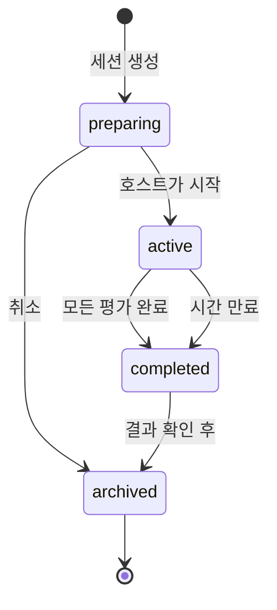

# 커뮤니티 커핑 기능

> 여러 사용자가 동일한 커피를 시음하고 결과를 공유/비교하는 소셜 기능

## 🎯 기능 개요

커뮤니티 커핑은 전통적인 커피 커핑 세션을 온라인으로 구현한 기능입니다. 한 명의 호스트가 커핑 세션을 생성하면, 다른 사용자들이 참여하여 동일한 커피에 대한 각자의 평가를 기록하고 결과를 비교할 수 있습니다.

## 🏗️ 아키텍처 설계

### 데이터 구조

```typescript
// 커핑 세션 기본 정보
interface CuppingSession {
  id: string
  hostId: string
  title: string
  description?: string
  coffeeInfo: CoffeeBasicInfo
  status: 'preparing' | 'active' | 'completed' | 'archived'
  sessionType: 'public' | 'private' | 'invite-only'
  maxParticipants?: number
  createdAt: Date
  scheduledAt?: Date
  startedAt?: Date
  endedAt?: Date
  inviteCode?: string // private/invite-only 세션용
}

// 참여자 정보
interface Participant {
  id: string
  userId: string
  sessionId: string
  nickname: string
  joinedAt: Date
  status: 'joined' | 'tasting' | 'completed' | 'left'
  isHost: boolean
}

// 개별 평가 기록
interface CuppingEvaluation {
  id: string
  sessionId: string
  participantId: string
  coffeeId: string
  
  // 커핑 표준 평가 항목
  aroma: number // 1-10
  flavor: number // 1-10
  aftertaste: number // 1-10
  acidity: number // 1-10
  body: number // 1-10
  balance: number // 1-10
  overall: number // 1-10
  
  // 선택적 상세 평가
  sweetness?: number
  uniformity?: number
  cleanliness?: number
  
  // 주관적 평가
  flavorNotes: string[]
  personalNotes: string
  defects?: string[]
  
  submittedAt: Date
  isPublic: boolean
}

// 세션 결과 분석
interface SessionAnalysis {
  sessionId: string
  participantCount: number
  averageScores: {
    aroma: number
    flavor: number
    aftertaste: number
    acidity: number
    body: number
    balance: number
    overall: number
    total: number
  }
  scoreDistribution: {
    [key in keyof CuppingEvaluation]: number[]
  }
  consensusNotes: string[] // 공통적으로 언급된 향미
  diversityIndex: number // 평가 다양성 지수
  topParticipants: string[] // 평가 완료한 참여자들
}
```

### 상태 흐름



## 🎨 사용자 인터페이스

### 1. 세션 목록 페이지 (`/community`)

```tsx
// 진행 중인 세션들을 카드 형태로 표시
<CuppingSessionCard>
  - 세션 제목 및 설명
  - 커피 정보 (이름, 원산지)
  - 호스트 정보
  - 참여자 수 / 최대 인원
  - 세션 상태 (모집중/진행중/완료)
  - 참여 버튼
</CuppingSessionCard>
```

### 2. 세션 생성 페이지 (`/community/create`)

```tsx
<CreateSessionForm>
  - 세션 기본 정보 (제목, 설명)
  - 커피 선택 (기존 기록에서 선택 또는 새로 입력)
  - 세션 설정
    - 공개/비공개/초대제
    - 최대 참여자 수
    - 예약 시간 설정
    - 평가 시간 제한
</CreateSessionForm>
```

### 3. 세션 대기실 (`/community/session/[id]/lobby`)

```tsx
<SessionLobby>
  - 커피 정보 표시
  - 참여자 목록 (실시간 업데이트)
  - 채팅 기능 (선택사항)
  - 호스트 전용: 세션 시작 버튼
  - 참여자: 준비 완료 상태 토글
</SessionLobby>
```

### 4. 커핑 평가 페이지 (`/community/session/[id]/evaluate`)

```tsx
<CuppingEvaluationForm>
  - 표준 커핑 폼 (SCA 기준)
  - 점수 슬라이더 (1-10)
  - 향미 노트 입력
  - 개인 메모
  - 실시간 타이머
  - 임시 저장 기능
  - 최종 제출 버튼
</CuppingEvaluationForm>
```

### 5. 결과 분석 페이지 (`/community/session/[id]/results`)

```tsx
<SessionResults>
  - 전체 평균 점수
  - 개별 참여자 점수 비교
  - 레이더 차트 (평가 항목별)
  - 공통 향미 노트 워드클라우드
  - 점수 분포 히스토그램
  - 개별 평가 상세보기
  - 결과 공유 기능
</SessionResults>
```

## 🔧 기술적 구현

### 데이터 저장 전략

**Phase 1: 로컬 기반 (MVP)**
```typescript
// 로컬 스토리지 + 간단한 공유 기능
const localCuppingSessions = {
  sessions: CuppingSession[],
  myEvaluations: CuppingEvaluation[],
  sharedResults: SessionAnalysis[]
}

// URL 기반 결과 공유
const shareableUrl = `/community/shared/${sessionId}?data=${encodedData}`
```

**Phase 2: 실시간 동기화 (확장)**
```typescript
// WebSocket 또는 실시간 DB 연동
interface RealtimeEvents {
  'participant-joined': Participant
  'participant-left': Participant
  'session-started': CuppingSession
  'evaluation-submitted': CuppingEvaluation
  'session-completed': SessionAnalysis
}
```

### 컴포넌트 구조

```
src/components/community/
├── CuppingSessionCard.tsx
├── CreateSessionForm.tsx
├── SessionLobby.tsx
├── CuppingEvaluationForm.tsx
├── SessionResults.tsx
├── ParticipantsList.tsx
├── ScoreSlider.tsx
├── FlavorNotesInput.tsx
├── ResultsChart.tsx
└── ShareSessionModal.tsx
```

### 라우팅 구조

```
/community
├── /                    # 세션 목록
├── /create             # 세션 생성
├── /session/[id]
│   ├── /lobby          # 대기실
│   ├── /evaluate       # 평가 진행
│   └── /results        # 결과 보기
├── /my-sessions        # 내 세션 관리
└── /shared/[id]        # 공유된 결과
```

## 📊 평가 시스템

### SCA 커핑 스코어카드 기반

```typescript
const cuppingCriteria = {
  aroma: {
    weight: 1.0,
    description: '향기 (건조/습식)',
    scale: '1-10'
  },
  flavor: {
    weight: 2.0,
    description: '맛 (전체적인 풍미)',
    scale: '1-10'
  },
  aftertaste: {
    weight: 1.0,
    description: '여운 (마신 후 남는 느낌)',
    scale: '1-10'
  },
  acidity: {
    weight: 1.0,
    description: '산미 (신맛의 강도와 질)',
    scale: '1-10'
  },
  body: {
    weight: 1.0,
    description: '바디감 (입안의 무게감)',
    scale: '1-10'
  },
  balance: {
    weight: 1.0,
    description: '밸런스 (전체적인 조화)',
    scale: '1-10'
  },
  overall: {
    weight: 1.0,
    description: '전체 평가 (개인적 선호)',
    scale: '1-10'
  }
}

// 총점 계산
const totalScore = (scores: CuppingScores) => {
  return Object.entries(cuppingCriteria).reduce((total, [key, criteria]) => {
    return total + (scores[key] * criteria.weight)
  }, 0)
}
```

### 결과 분석 알고리즘

```typescript
// 평가 합의도 계산
const calculateConsensus = (evaluations: CuppingEvaluation[]) => {
  const scores = evaluations.map(e => e.overall)
  const mean = scores.reduce((a, b) => a + b) / scores.length
  const variance = scores.reduce((sum, score) => sum + Math.pow(score - mean, 2), 0) / scores.length
  const standardDeviation = Math.sqrt(variance)
  
  return {
    agreement: Math.max(0, 1 - (standardDeviation / 3)), // 0-1 scale
    confidence: evaluations.length >= 5 ? 'high' : evaluations.length >= 3 ? 'medium' : 'low'
  }
}

// 공통 향미 추출
const extractCommonFlavors = (evaluations: CuppingEvaluation[]) => {
  const flavorCounts = {}
  evaluations.forEach(evaluation => {
    evaluation.flavorNotes.forEach(flavor => {
      flavorCounts[flavor] = (flavorCounts[flavor] || 0) + 1
    })
  })
  
  const threshold = Math.ceil(evaluations.length * 0.3) // 30% 이상 언급
  return Object.entries(flavorCounts)
    .filter(([_, count]) => count >= threshold)
    .sort(([_, a], [__, b]) => b - a)
    .map(([flavor, count]) => ({ flavor, mentions: count }))
}
```

## 🚀 구현 계획

### Phase 1: 기본 MVP (2주)
- [x] 데이터 모델 설계
- [ ] 세션 생성/참여 기능
- [ ] 기본 평가 폼
- [ ] 로컬 저장 및 결과 표시
- [ ] URL 기반 결과 공유

### Phase 2: 향상된 UX (2주)
- [ ] 실시간 참여자 상태
- [ ] 고급 결과 분석 (차트, 통계)
- [ ] 향미 자동완성
- [ ] 모바일 최적화

### Phase 3: 소셜 기능 (3주)
- [ ] 사용자 프로필
- [ ] 세션 히스토리
- [ ] 평가 비교 및 학습
- [ ] 커뮤니티 랭킹

### Phase 4: 실시간 동기화 (4주)
- [ ] WebSocket 연동
- [ ] 실시간 채팅
- [ ] 푸시 알림
- [ ] 오프라인 지원

## 📱 사용자 여정

### 호스트 여정
1. 커뮤니티 메뉴 접근
2. "새 세션 만들기" 클릭
3. 커피 정보 및 세션 설정 입력
4. 세션 생성 후 대기실에서 참여자 대기
5. 충분한 참여자 모이면 세션 시작
6. 자신도 평가 참여
7. 모든 평가 완료 후 결과 분석 확인
8. 결과 공유 또는 아카이브

### 참여자 여정
1. 커뮤니티 메뉴에서 활성 세션 검색
2. 원하는 세션 선택 후 참여
3. 대기실에서 다른 참여자들과 대기
4. 호스트가 시작하면 평가 페이지로 이동
5. 표준 커핑 폼으로 평가 진행
6. 평가 제출 후 결과 대기
7. 완료 후 분석 결과 확인
8. 다른 참여자들의 평가와 비교

## 🔐 개인정보 보호

- 참여자는 닉네임으로만 표시
- 개인 평가 내용은 선택적 공개
- 세션별 익명 모드 지원
- 평가 데이터는 세션 종료 후 개인 계정에만 저장

## 📈 성공 지표

- 세션 생성률 (주간 활성 세션 수)
- 참여 완료율 (참여 후 평가 완료 비율)
- 재참여율 (동일 사용자의 반복 참여)
- 평가 품질 (상세도, 일관성)
- 커뮤니티 성장 (신규 사용자 유입)

---

**문서 버전**: 1.0  
**최종 업데이트**: 2025-01-30  
**상태**: 설계 완료, 구현 대기