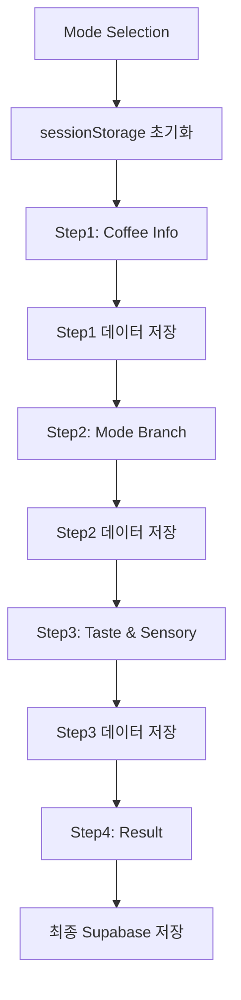

# 화면 아키텍처

## 🏗️ 전체 화면 구조

TastingFlow는 모드별 차별화와 통합 플로우의 균형을 맞춘 화면 아키텍처를 가집니다.

### 화면 계층 구조

```
CupNote App
├── Home (/)
├── Mode Selection (/mode-selection)
└── TastingFlow (/record/*)
    ├── Step1: Coffee Info (/record/step1)
    ├── Step2: Mode-Specific (/record/step2)
    ├── Step3: Taste & Sensory (/record/step3)
    └── Step4: Notes & Result (/record/step4)
```

## 📱 화면별 상세 아키텍처

### 1. Mode Selection Screen

#### 목적 및 역할
- **첫 인상 결정**: 사용자의 첫 번째 중요한 선택
- **기대 설정**: 각 모드별 소요시간과 결과물 안내
- **맥락 파악**: 사용자 상황과 목적 이해

#### 화면 구성 요소

```yaml
Header:
  - 로고 및 타이틀
  - 뒤로가기 버튼 (홈으로)

Mode Cards:
  - ☕ Cafe Mode
    - 아이콘: 커피컵
    - 설명: "카페에서 간단히 기록"
    - 소요시간: "3-5분"
    - 특징: "빠르고 간편하게"
  
  - 🏠 HomeCafe Mode  
    - 아이콘: 집 모양
    - 설명: "집에서 내린 커피 + 레시피"
    - 소요시간: "5-8분"
    - 특징: "추출과 맛의 연결"
  
  - 🔬 Pro Mode
    - 아이콘: 현미경
    - 설명: "전문적인 분석과 평가"
    - 소요시간: "8-12분"
    - 특징: "SCA 표준 준수"

Footer:
  - 데모 체험하기 버튼
  - 이전 기록 빠른 보기
```

#### 인터랙션 플로우
```
모드 선택 → 선택 확인 → Step1으로 mode 파라미터와 함께 이동
```

### 2. Step1: Coffee Info Screen

#### 공통 기본 구조

```yaml
Header:
  - 진행률 표시: 25% (1/4)
  - 선택된 모드 뱃지
  - 뒤로가기 (Mode Selection으로)

Form Fields:
  - 커피 이름 (필수)
  - 날짜 (필수, 기본값: 오늘)
  - 모드별 차별화 필드

Footer:
  - 이전 버튼
  - 다음 단계 버튼
  - 다음 단계 미리보기
```

#### 모드별 차별화

**☕ Cafe Mode**
```yaml
Required:
  - 카페명 (필수)
  - 로스터명 (필수)
Optional:
  - 원산지, 품종, 가공방식 등
```

**🏠 HomeCafe Mode**
```yaml
Required:
  - 로스터명만 필수
Optional:
  - 원산지, 품종, 로스팅 레벨, 고도 등
```

**🔬 Pro Mode**
```yaml
Required:
  - 카페명/로스터명
  - 농장명, 지역, 고도
  - 품종, 가공방식
  - 로스팅 날짜, 로스터 정보
```

### 3. Step2: Mode-Specific Screen (50%)

각 모드별로 완전히 다른 화면 구성을 가집니다.

#### ☕ Cafe Mode: 간단한 맛 기록

```yaml
Header:
  - 진행률: 50% (2/4)
  - 모드 뱃지: Cafe

Content:
  - 전체 만족도 (별점 1-5)
  - 빠른 향미 태그 (최대 5개)
    - 과일: 사과, 오렌지, 베리 등
    - 견과: 아몬드, 헤이즐넛 등
    - 단과: 초콜릿, 캐러멜 등
  - 온도 선택 (HOT/ICED)

Footer:
  - 이전/다음 버튼
  - 미리보기: "감각 표현"
```

#### 🏠 HomeCafe Mode: 추출 레시피 설정

```yaml
Header:
  - 진행률: 50% (2/4)
  - 모드 뱃지: HomeCafe

Dripper Selection:
  - 4개 드리퍼 그리드
    - V60 ⭕
    - Kalita Wave 〰️
    - Origami 🌸
    - April 🌙

Recipe Settings:
  - 원두량 다이얼 (10-50g, 기본 20g)
  - 비율 프리셋 (1:15 ~ 1:18)
  - 물량 자동 계산 표시
  - 물온도 입력 (80-100°C)

Timer Section:
  - 추출 타이머 (시작/정지/리셋)
  - 랩타임 기록 기능
  - 총 시간 표시

Personal Recipe:
  - "나의 커피" 저장/불러오기
  - localStorage 기반

Footer:
  - 이전/다음 버튼
  - 미리보기: "맛 평가"
```

#### 🔬 Pro Mode: SCA 표준 측정

```yaml
Header:
  - 진행률: 50% (2/4)
  - 모드 뱃지: Pro

Brewing Protocol:
  - 추출 방법 선택
  - 분쇄도 설정 (1-10)
  - 블루밍 시간, 총 추출 시간
  - 물 품질 (TDS ppm, pH)

Quality Measurement:
  - TDS 측정값 입력 (%)
  - 추출수율 자동 계산
  - SCA 기준 상태 표시
    - 미추출 (<18%): 빨강
    - 적정 (18-22%): 초록  
    - 과추출 (>22%): 주황

Equipment Notes:
  - 장비 정보 입력
  - 특별 설정 메모

Footer:
  - 이전/다음 버튼
  - 미리보기: "SCA 평가"
```

### 4. Step3: Taste & Sensory Screen (75%)

#### 공통 구조 + 모드별 확장

```yaml
Header:
  - 진행률: 75% (3/4)
  - 모드 뱃지

Unified Flavor Section:
  - SCA Flavor Wheel 기반 향미 선택 (모든 모드 공통)
  - 검색 기능
  - 카테고리별 필터링

Korean Sensory Expression:
  - 6개 카테고리 (모든 모드 공통)
    - 산미: 상큼한, 밝은, 과일향의...
    - 단맛: 달콤한, 부드러운, 캐러멜향의...
    - 쓴맛: 진한, 강한, 로스팅향의...
    - 바디: 묵직한, 가벼운, 부드러운...
    - 애프터: 깔끔한, 여운이 긴, 개운한...
    - 밸런스: 조화로운, 균형잡힌, 완성도 높은...

Mode-Specific Extensions:
  - Pro Mode: SCA 7항목 평가 추가
    - Fragrance/Aroma, Flavor, Aftertaste
    - Acidity, Body, Balance, Overall
    - 1-5 스케일 점수
```

### 5. Step4: Notes & Result Screen (100%)

#### 모드별 차별화된 완료 화면

**☕ Cafe Mode**
```yaml
Personal Tags:
  - 퀵 태그 (☀️ 아침용, 🍯 달달함 등)
  - 자유 텍스트 (200자)

Simple Result:
  - 기본 점수 표시
  - 간단한 성취 메시지
  - 다음 추천 행동
```

**🏠 HomeCafe Mode**
```yaml
Brewing Notes:
  - 추출 관련 메모
  - 홈브루 특화 태그

Recipe Card:
  - 완성된 레시피 카드
  - 저장/공유 옵션
  - 다음 실험 제안
```

**🔬 Pro Mode**
```yaml
Professional Analysis:
  - 종합 QC 리포트
  - SCA 점수 요약
  - 품질 등급 판정
  - PDF/CSV 내보내기

Certification:
  - 평가자 서명/스탬프
  - 전문가 인증 표시
```

## 🔄 네비게이션 아키텍처

### 라우팅 구조

```javascript
// 공통 플로우 (4단계)
const routes = [
  '/mode-selection',
  '/record/step1?mode={cafe|homecafe|pro}',
  '/record/step2',
  '/record/step3', 
  '/record/step4'
]

// 모드별 분기 로직
const getNextRoute = (currentStep, mode) => {
  // Step2에서 모드별 다른 화면 렌더링
  // 나머지 단계는 공통 구조 + 모드별 확장
}
```

### 상태 관리 흐름



## 📐 반응형 설계

### 브레이크포인트 전략

```css
/* Mobile First */
.container {
  /* Mobile: 320px~ */
  padding: 1rem;
  max-width: 100%;
}

@media (min-width: 768px) {
  /* Tablet */
  .container {
    max-width: 600px;
    margin: 0 auto;
  }
}

@media (min-width: 1024px) {
  /* Desktop */
  .container {
    max-width: 800px;
  }
}
```

### 터치 최적화

- **터치 타겟**: 최소 44px × 44px
- **제스처 지원**: 스와이프 네비게이션
- **접근성**: ARIA 라벨, 키보드 네비게이션

## 🎨 시각적 계층 구조

### 색상 시스템 (모드별 차별화)

```yaml
Cafe Mode:
  primary: "#2563EB"    # 블루 계열
  accent: "#DBEAFE"     # 라이트 블루

HomeCafe Mode:
  primary: "#16A34A"    # 그린 계열  
  accent: "#DCFCE7"     # 라이트 그린

Pro Mode:
  primary: "#9333EA"    # 퍼플 계열
  accent: "#F3E8FF"     # 라이트 퍼플

Common:
  coffee: "#7C5842"     # 커피 브라운
  background: "#FFF8F0" # 크림 배경
```

### 타이포그래피 계층

```yaml
Heading 1: 2rem, bold, coffee-800
Heading 2: 1.5rem, semibold, coffee-700  
Heading 3: 1.25rem, medium, coffee-600
Body: 1rem, regular, gray-700
Caption: 0.875rem, regular, gray-500
```

---

**📅 문서 생성**: 2025-07-31  
**버전**: v1.0.0-rc  
**구현 상태**: Production Ready